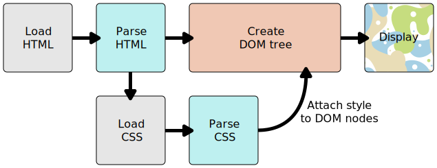

# How CSS works

CSS (Cascading Style Sheets) allows you to create great looking web pages, but how does it work under the hood? This article explains what CSS is, how the browser turns HTML into a Document Object Model (DOM), how CSS is applied to parts of the DOM, some very basic syntax examples, and what code is used to actually include our CSS in our web page.

<hr />

## What is CSS?

As we have mentioned before, CSS is a language for specifying how documents are presented to users — how they are styled, laid out, etc.

A **document** is usually a text file structured using a markup language — HTML is the most common markup language, but you will also come across other markup languages such as SVG or XML.

**Presenting** a document to a user means converting it into a usable form for your audience. Browsers, like Firefox, Chrome or Internet Explorer, are designed to present documents visually, for example, on a computer screen, projector or printer.

<hr />

## How does CSS affect HTML?

Web browsers apply **CSS rules** to a document to affect how they are displayed. A CSS rule is formed from:

* A set of `properties`, which have values set to update how the HTML content is displayed, for example I want my element's width to be 50% of its parent element, and its background to be red.
* A `selector`, which selects the element(s) you want to apply the updated property values to. For example, I want to apply my CSS rule to all the paragraphs in my HTML document.

A set of CSS rules contained within a **stylesheet** determines how a webpage should look.

### A quick CSS example

The above descriptions may or may not have made sense, so let's make sure things are clear by presenting a quick example. First of all, let's take a simple HTML document, containing an `<h1>` and a `<p>` (notice that a stylesheet is applied to the HTML using a `<link>` element):
```
    <!DOCTYPE html>
    <html>
      <head>
        <meta charset="utf-8">
        <title>My CSS experiment</title>
        <link rel="stylesheet" href="style.css">
      </head>
      <body>
        <h1>Hello World!</h1>
        <p>This is my first CSS example</p>
      </body>
    </html>
```
Now let's look at a very simple CSS example containing two rules:
```
    h1 {
      color: blue;
      background-color: yellow;
      border: 1px solid black;
    }

    p {
      color: red;
    }
```
The first rule starts with an `h1` selector, which means that it will apply its property values to the `<h1>` element. It contains three properties and their values (each property/value pair is called a **declaration**):

1. The first one sets the text color to blue.
2. The second sets the background color to yellow.
3. The third one puts a border around the header that is 1 pixel wide, solid (not dotted, or dashed, etc.), and colored black.

The second rule starts with a `p` selector, which means that it will apply its property values to the `<p>` element. It contains one declaration, which sets the text color to red.

In a web browser, the code above would produce the following output:

This isn't too pretty, but at least it starts to give you an idea of how CSS works.

<hr />

## How does CSS actually work?

When a browser displays a document, it must combine the document's content with its style information. It processes the document in two stages:

* The browser converts HTML and CSS into the DOM (Document Object Model). The DOM represents the document in the computer's memory. It combines the document's content with its style.
* The browser displays the contents of the DOM.


<hr />

## About the DOM

A DOM has a tree-like structure. Each element, attribute and piece of text in the markup language becomes a DOM node in the tree structure. The nodes are defined by their relationship to other DOM nodes. Some elements are parents of child nodes, and child nodes have siblings.

Understanding the DOM helps you design, debug and maintain your CSS because the DOM is where your CSS and the document's content meet up.

### DOM representation

Rather than a long, boring explanation, let's take an example to see how the DOM and CSS work together.

Let's assume the following HTML code:
```
    <p>
      Let's use:
      <span>Cascading</span>
      <span>Style</span>
      <span>Sheets</span>
    </p>
```
In the DOM, the node corresponding to our `<p>` element is a parent. Its children are a text node and the nodes corresponding to our `<span>` elements. The `SPAN` nodes are also `parents`, with text nodes as their children:
```
    P
    ├─ "Let's use:"
    ├─ SPAN
    |  └─ "Cascading"
    ├─ SPAN
    |  └─ "Style"
    └─ SPAN
       └─ "Sheets"
```

### Applying CSS to the DOM

Let's say we added some CSS to our document, to style it. Again, the HTML is as follows:
```
    <p>
      Let's use:
      <span>Cascading</span>
      <span>Style</span>
      <span>Sheets</span>
    </p>
```
If we apply the following CSS to it:
```
    span {
      border: 1px solid black;
      background-color: lime;
    }
```
The browser will parse the HTML and create a DOM from it, then parse the CSS. Since the only rule available in the CSS has a `span` selector, it will apply that rule to each one of the three spans.

<hr />

## How to apply your CSS to your HTML

There are three different ways to apply CSS to an HTML document that you'll commonly come across, some more useful than others. Here we'll briefly review each one.

### External stylesheet

You've already seen **external stylesheets** in this article, but not by that name. An external stylesheet is when you have your CSS written in a separate file with a `.css` extension, and you reference it from an HTML `<link>` element. The HTML file looks something like this:
```
    <!DOCTYPE html>
    <html>
      <head>
        <meta charset="utf-8">
        <title>My CSS experiment</title>
        <link rel="stylesheet" href="style.css">
      </head>
      <body>
        <h1>Hello World!</h1>
        <p>This is my first CSS example</p>
      </body>
    </html>
```
And the CSS file:
```
    h1 {
      color: blue;
      background-color: yellow;
      border: 1px solid black;
    }

    p {
      color: red;
    }
```
This method is arguably the best, as you can use one stylesheet to style multiple documents, and would only need to update the CSS in one place if changes were needed.

### Internal stylesheet

An **internal stylesheet** is where you don't have an external CSS file, but instead place your CSS inside a `<style>` element, contained inside the HTML head. So the HTML would look like this:
```
    <!DOCTYPE html>
    <html>
      <head>
        <meta charset="utf-8">
        <title>My CSS experiment</title>
        <style>
          h1 {
            color: blue;
            background-color: yellow;
            border: 1px solid black;
          }

          p {
            color: red;
          }
        </style>
      </head>
      <body>
        <h1>Hello World!</h1>
        <p>This is my first CSS example</p>
      </body>
    </html>
```
This can be useful in some circumstances (maybe you're working with a content management system where you can't modify the CSS files directly), but it isn't quite as efficient as external stylesheets — in a website, the CSS would need to be repeated across every page, and updated in multiple places if changes were required.

### Inline styles

**Inline styles** are CSS declarations that affect one element only, contained within a style attribute:
```
    <!DOCTYPE html>
    <html>
      <head>
        <meta charset="utf-8">
        <title>My CSS experiment</title>
      </head>
      <body>
        <h1 style="color: blue;background-color: yellow;border: 1px solid black;">Hello World!</h1>
        <p style="color:red;">This is my first CSS example</p>
      </body>
    </html>
```
Please don't do this, unless you really have to! It is really bad for maintenance (you might have to update the same information multiple times per document), and it also mixes your presentational CSS information with your HTML structural information, making the CSS harder to read and understand. Keeping your different types of code separated and pure makes for a much easier job for all who work on the code.

The only time you might have to resort to using inline styles is when your working environment is really restrictive (perhaps your CMS only allows you to edit the HTML body.)
