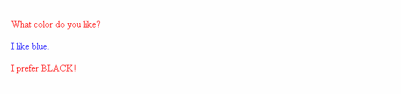
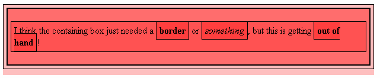

# Simple selectors

They directly match one or more elements of a document, based on the type of element, `class`, or `id`.

<hr />

## Type selectors aka element selectors

This selector is just a case-insensitive match between the selector name and a given HTML element name. This is the simplest way to target all elements of a given type. Let's take a look at an example:

Here is some HTML:
```
    <p>What color do you like?</p>
    <div>I like blue.</div>
    <p>I prefer BLACK!</p>
```
A simple style sheet:
```
    /* All p elements are red */
    p {
      color: red;
    }

    /* All div elements are blue */
    div {
      color: blue;
    }
```
And we get this:


<hr />

## Class selectors

The class selector consists of a dot, `'.'`, followed by a class name. A class name is any value, without spaces, placed within an HTML `class` attribute. It is up to you to choose a name for the class. It is also noteworthy that multiple elements in a document can have the same class value, and a single element can have multiple class names separated by white space. Here's a quick example:

Here is some HTML:
```
    <ul>
      <li class="first done">Create an HTML document</li>
      <li class="second done">Create a CSS style sheet</li>
      <li class="third">Link them all together</li>
    </ul>
```
A simple style sheet:
```
    /* The element with the class "first" is bolded */
    .first {
      font-weight: bold;
    }

    /* All the elements with the class "done" are strike through */
    .done {
      text-decoration: line-through;
    }
```
And we get this result:


<hr />

## ID selectors

The ID selector consists of a hash/pound symbol (`#`), followed by the ID name of a given element. Any element can have a unique ID name set with the `id` attribute. It is up to you to choose an ID name. It's the most efficient way to select a single element.

> **Important :** An ID name must be unique in the document. Behaviors regarding duplicated IDs are unpredictable. For example, in some browsers, only the first instance is counted, and the rest are ignored.

Let's look at a quick example — here is some HTML:
```
    <p id="polite"> — "Good morning."</p>
    <p id="rude"> — "Go away!"</p>
```
A simple style sheet:
```
    #polite {
      font-family: cursive;
    }

    #rude {
      font-family: monospace;
      text-transform: uppercase;
    }
```
And we get this as an output:


<hr />

## Universal selector

The universal selector (`*`) is the ultimate joker. It allows selecting all elements in a page. As it is rarely used to apply a style to every element on a page, it is often used in combination with other selectors.

> **Important :** Take care when using the universal selector. As it applies to all elements, using it in large web pages can have a perceptible impact on performance: web pages display slower than expected. There are not many instances where you'd use this selector.

Now for an example; first some HTML:
```
    <div>
      <p>I think the containing box just needed
      a <strong>border</strong> or <em>something</em>,
      but this is getting <strong>out of hand</strong>!</p>
    </div>
```
And a simple style sheet:
```
    * {
      padding: 5px;
      border: 1px solid black;
      background: rgba(255,0,0,0.25)
    }
```
Together, these give the following result:

