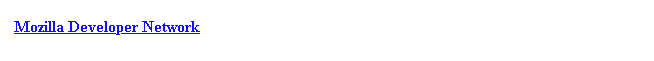
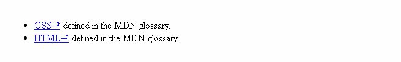

# Pseudo-classes and pseudo-elements

These don't select elements, but rather certain parts of elements, or elements only in certain contexts. They come in two main types: **pseudo-classes** and **pseudo-elements**.

<hr />

## Pseudo-classes

A CSS `pseudo-class` is a keyword added to the end of a selector, preceded by a colon (`:`), which is used to specify that you want to style the selected element but only when it is in a *certain state*. For example, you might want to style a link element only when it is being hovered over by the mouse pointer, or a checkbox when it is disabled or checked, or an element that is the first child of its parent in the DOM tree.

|                |                |                |                |
| :------------- | :------------- |:-------------  |:-------------  |
| :active        | :in-range      | :optional      |                |
| :checked       | :invalid       | :out-of-range  |                |
| :default       | :lang()        | :read-only     |                |
| :dir()         | :last-child    | :read-write    |                |
| :disabled      | :last-of-type  | :required      |                |
| :empty         | :left          | :right         |                |
| :enabled       | :link          | :root          |                |
| :first         | :matches()     | :scope         |                |
| :first-child   | :not()         | :target        |                |
| :first-of-type | :nth-child()   | :valid         |                |
| :fullscreen    | :nth-last-child()|  :visited    |                |
| :focus         | :nth-last-of-type()|            |                |
| :focus-within  | :nth-of-type() |                |                |
| :hover         | :only-child    |                |                |  
| :indeterminate | :only-of-type  |                |                |

We will not dig into every pseudo-class right now, it is not the objective of the Learning Area to teach you everything in exhaustive detail.

### A pseudo-class example

For now, let's just see a simple example of how to use these. First, an HTML snippet:
```
    <a href="https://developer.mozilla.org/" target="_blank">Mozilla Developer Network</a>
```
Then, some CSS rules:
```
    /* These styles will style our link
       in all states */
    a {
      color: blue;
      font-weight: bold;
    }

    /* We want visited links to be the same color
       as non visited links */
    a:visited {
      color: blue;
    }

    /* We highlight the link when it is
       hovered (mouse), activated
       or focused (keyboard) */
    a:hover,
    a:active,
    a:focus {
      color: darkred;
      text-decoration: none;
    }
```


<hr />

## Pseudo-elements

`Pseudo-elements` are very much like pseudo-classes, but they have differences. They are keywords, this time preceded by two colons (`::`), that can be added to the end of selectors to select a certain part of an element.

* `::after`
* `::before`
* `::first-letter`
* `::first-line`
* `::selection`
* `::backdrop`

They all have some very specific behaviors and interesting features.

### A pseudo-element example

Here we'll just show a simple CSS example that selects the space just after all absolute links and adds an arrow in that space:
```
    <ul>
      <li><a href="https://developer.mozilla.org/en-US/docs/Glossary/CSS">CSS</a> defined in the MDN glossary.</li>
      <li><a href="https://developer.mozilla.org/en-US/docs/Glossary/HTML">HTML</a> defined in the MDN glossary.</li>
    </ul>
```
Let's add this CSS rule:
```
    /* All elements with an attribute "href" with values
       starting with "http" will have an arrow added after their
       content (to indicate they are external links) */
    [href^=http]::after {
      content: '⤴';
    }
```


