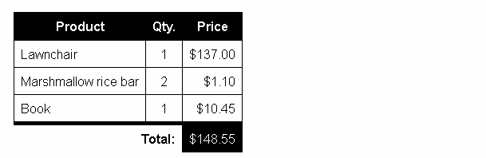

# Combinators and groups of selectors

## Combinators and groups of selectors

Using one selector at a time is useful, but can be inefficient in some situations. CSS selectors become even more useful when you start combining them to perform fine-grained selections. CSS has several ways to select elements based on how they are related to one another. Those relationships are expressed with combinators as follows (A and B represent any selector seen above):

| Name                | Syntax | Selects       |
| :-------------      | :----- |:------------- |
| Group of selectors  |	A, B	| Any element matching A and/or B (**Group of Selectors** is not considered to be a combinator). |
| Descendant selector	| A B	  | Any element matching B that is a **descendant** of an element matching A (that is, a child, or a child of a child, etc.). |
| Child selector	    | A > B	| Any element matching B that is a **direct child** of an element matching A. |
| Adjacent sibling selector |	A + B	| Any element matching B that is the next **sibling** of an element matching A (that is, the next child of the same parent). |
| General sibling selector	 | A ~ B | Any element matching B that is one of the next **siblings** of an element matching A (that is, one of the next children of the same parent). |

### Combinators example

Let's look at an example with all of this working together:
```
    <table lang="en-US" class="with-currency">
      <thead>
        <tr>
          <th scope="col">Product</th>
          <th scope="col">Qty.</th>
          <th scope="col">Price</th>
        </tr>
      </thead>
      <tfoot>
        <tr>
          <th colspan="2" scope="row">Total:</th>
          <td>148.55</td>
        </tr>
      </tfoot>
      <tbody>
        <tr>
          <td>Lawnchair</td>
          <td>1</td>
          <td>137.00</td>
        </tr>
        <tr>
          <td>Marshmallow rice bar</td>
          <td>2</td>
          <td>1.10</td>
        </tr>
        <tr>
          <td>Book</td>
          <td>1</td>
          <td>10.45</td>
        </tr>
      </tbody>
    </table>
```
Then, let's use the following style sheet:
```
    /* Basic table setup */
    table {
      font: 1em sans-serif;
      border-collapse: collapse;
      border-spacing: 0;
    }

    /* All <td>s within a <table> and all <th>s within a <table>
       Comma is not a combinator, it just allows you to target
       several selectors with the same CSS ruleset */
    table td, table th {
      border : 1px solid black;
      padding: 0.5em 0.5em 0.4em;
    }

    /* All <th>s within <thead>s that are within <table>s */
    table thead th {
      color: white;
      background: black;
    }

    /* All <td>s preceded by another <td>,
       within a <tbody>, within a <table> */
    table tbody td + td {
      text-align: center;
    }

    /* All <td>s that are a last child,
       within a <tbody>, within a <table> */
    table tbody td:last-child {
      text-align: right
    }

    /* All <th>s, within a <tfoot>s, within a <table> */
    table tfoot th {
      text-align: right;
      border-top-width: 5px;
      border-left: none;
      border-bottom: none;
    }

    /* All <td>s preceded by a <th>, within a <table> */
    table th + td {
      text-align: right;
      border-top-width: 5px;
      color: white;
      background: black;
    }

    /* All pseudo-elements "before" <td>s that are a last child,
       appearing within elements with a class of "with-currency" that
       also have an attribute "lang" with the value "en-US" */
    .with-currency[lang="en-US"] td:last-child::before {
      content: '$';
    }

    /* All pseudo-elements "after" <td>s that are a last child,
       appearing within elements with the class "with-currency" that
       also have an attribute "lang" with the value "fr" */
    .with-currency[lang="fr"] td:last-child::after {
      content: ' €';
    }
```
This has given us the following rather nice table styles:


<hr />

## Groups of selectors on one rule

You have seen multiple examples of this in action already, but let's spell it out for clarification. You can write groups of selectors separated by commas to apply the same rule to multiple sets of selected elements at once. For example:
```
    p, li {
      font-size: 1.6em;
    }
```
Or this:
```
    h1, h2, h3, h4, h5, h6 {
      font-family: helvetica, 'sans serif';
    }
```
