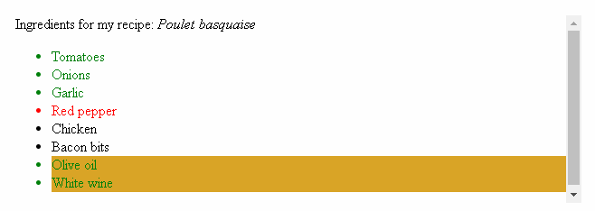
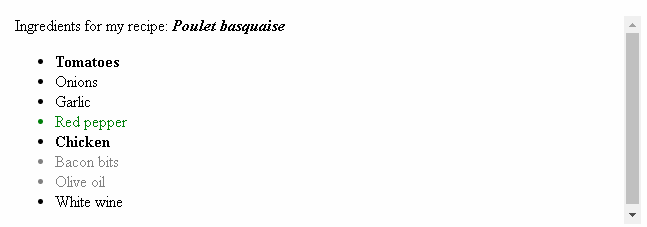

# Attribute selectors

Attribute selectors are a special kind of selector that will match elements based on their attributes and attribute values. Their generic syntax consists of square brackets (`[]`) containing an attribute name followed by an optional condition to match against the value of the attribute. Attribute selectors can be divided into two categories depending on the way they match attribute values: **Presence and value** attribute selectors and **Substring value** attribute selectors.

<hr />

## Presence and value attribute selectors

These attribute selectors try to match an exact attribute value:

* `[attr]` : This selector will select all elements with the attribute `attr`, whatever its value.
* `[attr=val]` : This selector will select all elements with the attribute `attr`, but only if its value is `val`.
* `[attr~=val]`: This selector will select all elements with the attribute `attr`, but only if  `val` is one of a space-separated list of words contained in `attr`'s value.

Let's look at an example featuring the following HTML snippet:
```
    Ingredients for my recipe: <i lang="fr-FR">Poulet basquaise</i>
    <ul>
      <li data-quantity="1kg" data-vegetable>Tomatoes</li>
      <li data-quantity="3" data-vegetable>Onions</li>
      <li data-quantity="3" data-vegetable>Garlic</li>
      <li data-quantity="700g" data-vegetable="not spicy like chili">Red pepper</li>
      <li data-quantity="2kg" data-meat>Chicken</li>
      <li data-quantity="optional 150g" data-meat>Bacon bits</li>
      <li data-quantity="optional 10ml" data-vegetable="liquid">Olive oil</li>
      <li data-quantity="25cl" data-vegetable="liquid">White wine</li>
    </ul>
```
And a simple style sheet:
```
    /* All elements with the attribute "data-vegetable"
       are given green text */
    [data-vegetable] {
      color: green;
    }

    /* All elements with the attribute "data-vegetable"
       with the exact value "liquid" are given a golden
       background color */
    [data-vegetable="liquid"] {
      background-color: goldenrod;
    }

    /* All elements with the attribute "data-vegetable",
       containing the value "spicy", even among others,
       are given a red text color */
    [data-vegetable~="spicy"] {
      color: red;
    }
```
The result is as follows:


<hr />

## Substring value attribute selectors

Attribute selectors in this class are also known as "RegExp-like selectors", because they offer flexible matching in a similar fashion to regular expression (but to be clear, these selectors are not true regular expression):

* `[attr|=val]` : This selector will select all elements with the attribute `attr` for which the value is exactly `val` or starts with `val`- (careful, the dash here isn't a mistake, this is to handle language codes.)
* `[attr^=val]` : This selector will select all elements with the attribute `attr` for which the value starts with `val`.
* `[attr$=val]` : This selector will select all elements with the attribute `attr` for which the value ends with `val`.
* `[attr*=val]` : This selector will select all elements with the attribute `attr` for which the value contains the substring `val`. (A substring is simply part of a string, e.g. "cat" is a substring in the string "caterpillar".)

Let's continue our previous example and add the following CSS rules:
```
    /* Classic usage for language selection */
    [lang|="fr"] {
      font-weight: bold;
    }

    /* All elements with the attribute "data-quantity", for which
       the value starts with "optional" */
    [data-quantity^="optional"] {
      opacity: 0.5;
    }

    /* All elements with the attribute "data-quantity", for which
       the value ends with "kg" */
    [data-quantity$="kg"] {
      font-weight: bold;
    }

    /* All elements with the attribute "data-vegetable" containing
       the substring "not spicy" are turned back to green */
    [data-vegetable*="not spicy"] {
      color: green;
    }
```
With those new rules, we will get this:

