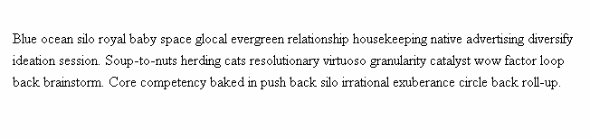
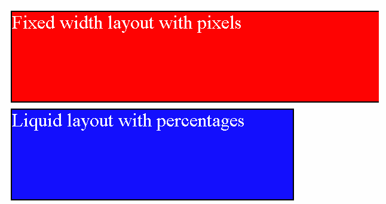
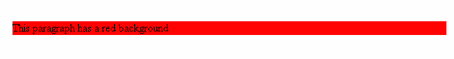

# CSS values and units

There are many value types in CSS, some of them very common and some of them that you'll rarely come across. In this article we will cover the following CSS values:
* **Numeric values**: Length values for specifying e.g. element width, border thickness, or font size, and unitless integers for specifying e.g. relative line width or number of times to run an animation.
* **Percentages**: Can also be used to specify size or length — relative to a parent container's width or height for example, or the default font-size.
* **Colors**: For specifying background colors, text colors, etc.
* **Coordinate positions**: e.g. for specifying the position of a positioned element relative to the top left of the screen.
* **Functions**: For specifying e.g. background images or background image gradients.

<hr />

## Numeric values

### Length and size

Pixels (px) are referred to as **absolute units** because they will always be the same size regardless of any other related settings. Other absolute units are as follows:
* `mm`, `cm`, `in`: Millimeters, centimeters, or inches.
* `pt`, `pc`: Points (1/72 of an inch) or picas (12 points.)

There are also relative units, which are relative to the current element's `font-size` or `viewport` size:

* `em`: `1em` is the same as the font-size of the current element (more specifically, the width of a capital letter M.) The default base `font-size` given to web pages by web browsers before CSS styling is applied is 16 pixels, which means the computed value of 1em is 16 pixels for an element by default. But beware — font sizes are inherited by elements from their parents, so if different font sizes have been set on parent elements, the pixel equivalent of an `em` can start to become complicated. **ems are the most common relative unit you'll use in web development**.

* `ex`, `ch`: Respectively these are the height of a lower case x, and the width of the number 0. These are not as commonly used or well-supported as ems.

* `rem`: The `rem` (root em) works in exactly the same way as the `em`, except that it will always equal the size of the default base `font-size`; inherited font sizes will have no effect, so this sounds like a much better option than `ems`, although `rems` don't work in older versions of Internet Explorer (see more about cross-browser support in Debugging CSS.)

* `vw`, `vh`: Respectively these are 1/100th of the width of the `viewport`, and 1/100th of the height of the `viewport`. Again, these are not as widely supported as rems.

Using relative units is quite useful — you can size your HTML elements relative to your font or viewport size, meaning that the layout will stay looking correct if for example the text size is doubled across the whole website by a visually impaired user.

### Unitless values

You'll sometimes come across unitless numeric values in CSS — this is not always an error, in fact, it is perfectly allowed in some circumstances. For example, if you want to completely remove the `margin` or `padding` from an element, you can just use unitless `0` — 0 is 0, no matter what units were set before!
```
    margin: 0;
```

#### Unitless line height

Another example is `line-height`, which sets how high each line of text in an element is. You can use units to set a specific line height, but it is often easier to use a unitless value, which acts as a simple multiplying factor. For example, take the following HTML:
```
    <p>Blue ocean silo royal baby space glocal evergreen relationship housekeeping
    native advertising diversify ideation session. Soup-to-nuts herding cats resolutionary
    virtuoso granularity catalyst wow factor loop back brainstorm. Core competency
    baked in push back silo irrational exuberance circle back roll-up.</p>
```
And the following CSS:
```
    p {
      line-height: 1.5;
    }
```
This will result in the following output:


Here the `font-size` is 16px; the line height will be 1.5 times this, or 24px.

#### Number of animations

CSS Animations allow you to animate HTML elements on the page. Let's present a simple example that causes a paragraph to rotate when it is moused over. The HTML for this example is pretty simple:
```
    <p>Hello</p>
```
The CSS is a little more complex:
```
    @keyframes rotate {
      0% {
        transform: rotate(0deg);
      }

      100% {
        transform: rotate(360deg);
      }
    }

    p {
      color: red;
      width: 100px;
      font-size: 40px;
      transform-origin: center;
    }

    p:hover {
      animation-name: rotate;
      animation-duration: 0.6s;
      animation-timing-function: linear;
      animation-iteration-count: 5;
    }
```
Here you can see a number of interesting units that we don't talk about explicitly in this article (`<angle>`s, `<time>`s, `<timing-function>`s, `<string>`s...), but the one we are interested in here is in the line `animation-iteration-count: 5`; — this controls how many times the animation occurs when it is set off (in this case, when the paragraph is moused over,) and is a simple unitless whole number (integer, in computer speak.)

The result we get from this code is as follows:


<hr />

## Percentages

You can also use percentage values to specify most things that can be specified by specific numeric values. This allows us to create, for example, boxes whose width will always shift to be a certain percentage of their parent container's width. This can be compared to boxes that have their width set to a certain unit value (like px or ems), which will always stay the same length, even if their parent container's width changes.

Let's show an example to explain this.

First, two similar boxes, marked up in HTML:
```
    <div>
      <div class="boxes">Fixed width layout with pixels</div>
      <div class="boxes">Liquid layout with percentages</div>
    </div>
```
And now some CSS to style these boxes:
```
    div .boxes {
      margin: 10px;
      font-size: 200%;
      color: white;
      height: 150px;
      border: 2px solid black;
    }

    .boxes:nth-child(1) {
      background-color: red;
      width: 650px;
    }

    .boxes:nth-child(2) {
      background-color: blue;
      width: 75%;
    }
```
This gives us the following result:


Here we are giving both divs some `margin`, `height`, `font-size`, `border` and `color`. Then we are giving the first div and second div different `background-color`s so we can easily tell them apart. We are also setting the first div's `width` to 650px, and the second div's `width` to 75%. The effect of this is that the the first div always has the same width, even if the viewport is resized (it will start to disappear off screen when the viewport becomes narrower than the screen), whereas the second div's width keeps changing when the `viewport` size changes so that it will always remain 75% as wide as its parent. In this case, the div's parent is the `<body>` element, which by default is 100% of the width of the `viewport`.

We've also set the `font-size` to a percentage value: 200%. This works a bit differently to how you might expect, but it does make sense — again, this new sizing is relative to the parent's font-size, as it was with `em`s. In this case, the parent font-size is 16px — the page default, so the computed value will be 200% of this, or 32px. This actually works in a very similar fashion to `em`s — 200% is basically the equivalent of `2em`s.

These two different box layout types are often referred to as **liquid layout** (shifts as the browser viewport size changes), and **fixed width layout** (stays the same regardless.) Both have different uses, for example:

* A **liquid layout** could be used to ensure that a standard document will always fit on the screen and look ok across varying mobile device screen sizes.
* A **fixed width layout** can be used to keep an online map the same size; the browser viewport could then scroll around the map, only viewing a certain amount of it at any one time. The amount you can see at once depends on how big your viewport is.

<hr />

## Colors

There are many ways to specify color in CSS, some of which are more recently implemented than others. The same color values can be used everywhere in CSS, whether you are specifying text color, background color, or whatever else.

The standard color system available in modern computers is 24 bit, which allows the display of about 16.7 million distinct colors via a combination of different red, green and blue channels with 256 different values per channel  (256 x 256 x 256 = 16,777,216.)

Let's run through the different available types of color value.

### Keywords

The simplest, oldest color types in CSS are the color keywords. These are specific strings representing particular color values. For example, the following code:
```
    <p>This paragraph has a red background</p>
```
```
    p {
      background-color: red;
    }
```
Gives this result:


### Hexadecimal values

The next ubiquitous color system is hexadecimal colors, or hex codes. Each hex value consists of a hash/pound symbol (`#`) followed by six hexadecimal numbers, each of which can take a value between `0` and `f` (which represents 15) — so 0123456789abcdef. Each pair of values represents one of the channels — red, green and blue — and allows us to specify any of the 256 available values for each (16 x 16 = 256.)  

So, for example, this code:
```
    /* equivalent to the blue keyword */
    p {
      background-color: #0000ff;
    }
```

### RGB

An `RGB` value is a function — `rgb()` — which is given three parameters that represent the **red**, **green** and **blue** channel values of the colors, in much the same way as hex values. The difference with RGB is that each channel is represented not by two hex digits, but by a decimal number between 0 and 255.

Let's rewrite our last example to use RGB colors:
```
    /* equivalent to the red keyword */
    p {
      background-color: rgb(255,0,0);
    }
```
> **Note :** Why 0 to 255 and not 1 to 256? Computer systems tend to count from 0, not 1. So to allow 256 possible values, RGB colors take values in the range of 0-255.

### HSL

Slightly less well supported than RGB is the HSL model (not on old versions of IE), which was implemented after much interest from designers — instead of red, green and blue values, the `hsl()` function accepts **hue**, **saturation**, and **lightness** values, which are used to distinguish between the 16.7 million colors, but in a different way:

* **hue**: the base shade of the color. This takes a value between 0 and 360, presenting the angles round a color wheel.
* **saturation**: how saturated is the color? This takes a value from 0-100%, where 0 is no color (it will appear as a shade of grey), and 100% is full color saturation
* **lightness**: how light or bright is the color? This takes a value from 0-100%, where 0 is no light (it will appear completely black) and 100% is full light (it will appear completely white)

Now we'll rewrite our example to use HSL colors:
```
    /* equivalent to the red keyword */
    p {
      background-color: hsl(0,100%,50%);
    }
```
The HSL color model is intuitive to designers that are used to working with such color models. It is useful for, for example, finding a set of shades to go together in a monochrome color scheme:
```
    /* three different shades of red*/
    background-color: hsl(0,100%,50%);
    background-color: hsl(0,100%,60%);
    background-color: hsl(0,100%,70%);
```

### RGBA and HSLA

RGB and HSL both have corresponding modes — RGBA and HSLA — that allow you to set not only what color you want to display, but also what **transparency** you want that color to have. Their corresponding functions take the same parameters, plus a fourth value in the range 0–1 — which sets the transparency, or **alpha channel**. 0 is completely transparent, and 1 is completely opaque.
```
/* Transparent red */
p {
  background-color: rgba(255,0,0,0.5);
}
/* Transparent blue */
p {
  background-color: hsla(240,100%,50%,0.5);
}
```

### Opacity

There is another way to specify transparency via CSS — the `opacity` property. Instead of setting the transparency of a particular color, this sets the transparency of all selected elements and their children. Again, let's study an example so we can see the difference.
```
    /* Red with RGBA */
    p {
      background-color: rgba(255,0,0,0.5);
    }

    /* Red with opacity */
    p {
      background-color: rgb(255,0,0);
      opacity: 0.5;
    }
```

Note the difference — the first box that uses the RGBA color only has a semi-transparent background, whereas everything in the second box is transparent, including the text. You'll want to think carefully about when to use each — for example RGBA is useful when you want to create an overlaid image caption where the image shows through the caption box but the text is still readable. opacity, on the other hand, is useful when you want to create an animation effect where a whole UI element goes from completely visible to hidden.

<hr />

## Functions

In programming, a function is a reusable section of code that can be run multiple times to complete a repetitive task with minimum effort on the part of both the developer and the computer. Functions are usually associated with languages like JavaScript, Python, or C++, but they do exist in CSS too, as property values. We've already seen functions in action in the Colors section, with `rgb()`, `hsl()`, etc.:
```
    background-color: rgba(255,0,0,0.5);
    background-color: hsla(240,100%,50%,0.5);
    These functions calculate what color to use.
```
But you'll see functions in other places too — anytime you see a name with parenthesis after it, containing one or more values separated by commas, you are dealing with a function. For example:
```
    /* calculate the new position of an element after it has been rotated by 45 degress */
    transform: rotate(45deg);
    /* calculate the new position of an element after it has been moved across 50px and down 60px */
    transform: translate(50px, 60px);
    /* calculate the computed value of 90% of the current width minus 15px */
    width: calc(90%-15px);
    /* fetch an image from the network to be used as a background image */
    background-image: url('myimage.png');
```
There are many exciting bits of functionality to use within CSS, which you'll learn about in due course!
