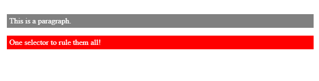
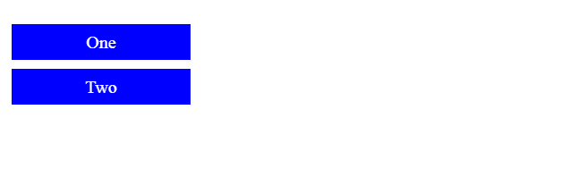
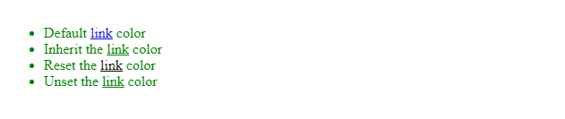

# Cascade and inheritance

## The cascade

CSS is an acronym for *Cascading Style Sheets*, which indicates that the notion of the cascade is important. At its most basic level, it indicates that the order of CSS rules matter, but it's more complex than that. What selectors win out in the cascade depends on three factors (these are listed in order of weight — earlier ones will overrule later ones):

* Importance
* Specificity
* Source order

### Importance

In CSS, there is a special piece of syntax you can use to make sure that a certain declaration will always win over all others: `!important`.

Let's look at an example:
```
    <p class="better">This is a paragraph.</p>
    <p class="better" id="winning">One selector to rule them all!</p>
```
```
    #winning {
      background-color: red;
      border: 1px solid black;
    }

    .better {
      background-color: gray;
      border: none !important;
    }

    p {
      background-color: blue;
      color: white;
      padding: 5px;
    }
```
This produces the following:



> **Note :** The only way to override this `!important` declaration would be to include another `!important` declaration of the **same specificity** later in the source order, or one with a higher specificity.

It is useful to know that `!important` exists so that you know what it is when you come across it in other people's code. **However**, we strongly recommend that you never use it unless you absolutely have to. One situation in which you may have to use it is when you are working on a CMS where you can't edit the core CSS modules, and you really want to override a style that can't be overridden in any other way. But really, don't use it if you can avoid it, because `!important` changes the way the cascade normally works, so it can make debugging CSS problems really hard to work out, especially in a large stylesheet.

### Specificity

**Specificity** is basically a measure of how specific a selector is — how many elements it could match. As shown in the example seen above, element selectors have low specificity. Class selectors have a higher specificity, so will win against element selectors. ID selectors have an even higher specificity, so will win against class selectors. The only way to win against an ID selector is to use `!important`.

The amount of specificity a selector has is measured using four different values (or components), which can be thought of as thousands, hundreds, tens and ones — four single digits in four columns:

1. Thousands: Score one in this column if the declaration is inside a style attribute (such declarations don't have selectors, so their specificity is always simply 1000.) Otherwise 0.
2. Hundreds: Score one in this column for each ID selector contained inside the overall selector.
3. Tens: Score one in this column for each class selector, attribute selector, or pseudo-class contained inside the overall selector.
4. Ones: Score one in this column for each element selector or pseudo-element contained inside the overall selector.

> **Note :** Universal selector (`*`), combinators (`+`,` >`,` ~`, `' '`) and negation pseudo-class (`:not`) have no effect on specificity.

The following table shows a few isolated examples to get you in the mood. Try going through these, and making sure you understand why they have the specificity that we have given them.

|Selector	                                                      | Thousands	| Hundreds |Tens|	Ones|	Total specificity |
| :-------------------------------------------------------------|:----------|:---------|:---|:----|:------------------|
| h1	                                                          | 0	        | 0        |	0	|  1	| 0001              |
| h1 + p::first-letter	                                        |0	        |0	       |0   |	3	  |0003               |
| li > a[href*="en-US"] > .inline-warning	                      |0	        |0         |	2	|2	  |0022               |
| #identifier	                                                  |0	        |1	       |0	  |0	  |0100               |
|No selector, with a rule inside an element's `style` attribute |	1	         | 0       |0	  |0	  |1000               |

> **Note :** If multiple selectors have the same importance and specificity, which selector wins is decided by which comes later in the `Source order`.

Before we move on, let's look at an example in action. Here is the HTML we are going to use:
```
    <div id="outer" class="container">
      <div id="inner" class="container">
        <ul>
          <li class="nav"><a href="#">One</a></li>
          <li class="nav"><a href="#">Two</a></li>
        </ul>
      </div>
    </div>
```
And here is the CSS for the example:
```
    /* specificity: 0101 */
    #outer a {
      background-color: red;
    }

    /* specificity: 0201 */
    #outer #inner a {
      background-color: blue;
    }

    /* specificity: 0104 */
    #outer div ul li a {
      color: yellow;
    }

    /* specificity: 0113 */
    #outer div ul .nav a {
      color: white;
    }

    /* specificity: 0024 */
    div div li:nth-child(2) a:hover {
      border: 10px solid black;
    }

    /* specificity: 0023 */
    div li:nth-child(2) a:hover {
      border: 10px dashed black;
    }

    /* specificity: 0033 */
    div div .nav:nth-child(2) a:hover {
      border: 10px double black;
    }

    a {
      display: inline-block;
      line-height: 40px;
      font-size: 20px;
      text-decoration: none;
      text-align: center;
      width: 200px;
      margin-bottom: 10px;
    }

    ul {
      padding: 0;
    }

    li {
      list-style-type: none;
    }
```


### Source order

As mentioned above, if multiple competing selectors have the same importance and specificity, the third factor that comes into play to help decide which rule wins is source order — later rules will win over earlier rules. For example:
```
    p {
      color: blue;
    }

    /* This rule will win over the first one */
    p {
      color: red;
    }
```
Whereas in this example the first rule wins because source order is overruled by specificity:
```
    /* This rule will win */
    .footnote {
      color: blue;
    }

    p {
      color: red;
    }
```

<hr />

## Inheritance

CSS inheritance is the last piece we need to investigate to get all the information and understand what style is applied to an element. The idea is that some property values applied to an element will be inherited by that element's children, and some won't.

* For example, it makes sense for `font-family` and `color` to be inherited, as that makes it easy for you to set a site-wide base font by applying a font-family to the `<html>` element; you can then override the fonts on individual elements where needed. It would be really annoying to have to set the base font separately on every element.
* As another example, it makes sense for `margin`, `padding`, `border`, and `background-image` to NOT be inherited. Imagine the styling/layout mess that would occur if you set these properties on a container element and had them inherited by every single child element, and then had to unset them all on each individual element!

Which properties are inherited by default and which aren't is largely down to common sense? If you want to be sure, however, you can consult the [CSS Reference](https://developer.mozilla.org/en-US/docs/Web/CSS/Reference) — each separate property page contains a summary table including various details about that element, including whether it is inherited or not.

### Controlling inheritance

CSS provides four special universal property values for specifying inheritance:

`inherit`
<br />&nbsp;&nbsp;&nbsp;&nbsp; Sets the property value applied to a selected element to be the same as that of its parent element.

`initial`
<br />&nbsp;&nbsp;&nbsp;&nbsp; Sets the property value applied to a selected element to be the same as the value set for that element in the browser's default style sheet. If no value is set by the browser's default style sheet and the property is naturally inherited, then the property value is set to inherit instead.

`unset`
<br />&nbsp;&nbsp;&nbsp;&nbsp; Resets the property to its natural value, which means that if the property is naturally inherited it acts like inherit, otherwise it acts like initial.

`revert`
<br />&nbsp;&nbsp;&nbsp;&nbsp; Reverts the property to the value it would have had if the current origin had not applied any styles to it. In other words, the property's value is set to the user stylesheet's value for the property (if one is set), otherwise, the property's value is taken from the user agent's default stylesheet.

> **Note :** `initial` and `unset` are not supported in Internet Explorer.

Of these, `inherit` is frequently the most interesting — it allows us to explicitly make an element inherit a property value from its parent.

Let's take a look at an example. First some HTML:
```
    <ul>
      <li>Default <a href="#">link</a> color</li>
      <li class="my-class-1">Inherit the <a href="#">link</a> color</li>
      <li class="my-class-2">Reset the <a href="#">link</a> color</li>
      <li class="my-class-3">Unset the <a href="#">link</a> color</li>
    </ul>
```
Now some CSS for styling:
```
    body {
      color: green;
    }

    .my-class-1 a {
      color: inherit;
    }

    .my-class-2 a {
      color: initial;
    }

    .my-class-3 a {
      color: unset;
    }
```
Result:


Let's explain what's going on here:

* We first set the `color` of the `<body>` to green.
* As the `color` property is naturally inherited, all child elements of body will have the same green color. It's worth noting that browsers set the color of links to blue by default instead of allowing the natural inheritance of the color property, so the first link in our list is blue.
* The second rule sets links within an element with the class `my-class-1` to `inherit` its color from its parent. In this case, it means that the link inherits its color from its `<li>` parent, which, by default inherits its color from its own `<ul>` parent, which ultimately inherits its color from the `<body>` element, which had its `color` set to green by the first rule.
* The third rule selects any links within an element with the class `my-class-2` and sets their `color` to `initial`. Usually, the initial value set by browsers for the text color is `black`, so this link is set to black.
* The last rule selects all links within an element with the class `my-class-3` and sets their `color` to `unset` — we unset the value. Because the color property is a naturally inherited property it acts exactly like setting the value to `inherit`. As a consequence, this link is set to the same color as the body — green.

### Resetting all property values

The CSS shorthand property `all` can be used to apply one of these inheritance values to (almost) all properties at once. Its value can be any one of the inheritance values (`inherit`, `initial`, `unset`, or `revert`). It's a convenient way to undo changes made to styles so that you can get back to a known starting point before beginning new changes.
