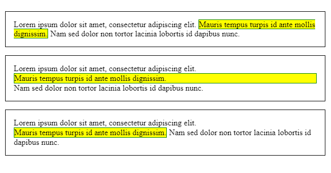

# The box model

The CSS box model is the foundation of layout on the Web — each element is represented as a rectangular box, with the box's content, padding, border, and margin built up around one another like the layers of an onion. As a browser renders a web page layout, it works out what styles are applied to the content of each box, how big the surrounding onion layers are, and where the boxes sit in relation to one another. Before understanding how to create CSS layouts, you need to understand the box model.

<hr />

## Box properties

Every element within a document is structured as a rectangular box inside the document layout, the size and "onion layers" of which can be tweaked using some specific CSS properties. The relevant properties are as follows:


* `width` and `height`
<br /> The width and height properties set the width and height of the **content box**, which is the area in which the content of the box is displayed — this content includes both text content set inside the box, and other boxes representing nested child elements.

> **Note :** Other properties exist that allow more subtle ways of handling content box size — setting size constraints rather than an absolute size. This can be done with the properties `min-width`, `max-width`, `min-height`, and `max-height`.

* `padding`
<br /> **Padding** refers to the *inner margin* of a CSS box — between the outer edge of the content box and the inner edge of the border. The size of this layer can be set on all four sides at once with the `padding` shorthand property, or one side at a time with the `padding-top`, `padding-right`, `padding-bottom` and `padding-left` properties.

* `border`
<br /> The **border** of a CSS box sits between the outer edge of the padding and the inner edge of the margin. By default the border has a size of 0 — making it invisible — but you can set the thickness, style and color of the border to make it appear. The `border` shorthand property allows you to set all of these on all four sides at once, for example `border: 1px solid black`. This can be broken down into numerous different longhand properties for more specific styling needs:
    * `border-top`, `border-right`, `border-bottom`, `border-left`: Set the thickness, style and color of one side of the border.
    * `border-width`, `border-style`, `border-color`: Set only the thickness, style, or color individually, but for all four sides of the border.
    * You can also set one of the three properties of a single side of the border individually, using `border-top-width`, `border-top-style`, `border-top-color`, etc.

* `margin`
<br /> The margin surrounds a CSS box, and pushes up against other CSS boxes in the layout. It behaves rather like padding; the shorthand property is `margin` and the individual properties are `margin-top`, `margin-right`, `margin-bottom`, and `margin-left`.

<hr />

## Advanced box manipulation

Beyond setting the width, height, border, padding and margin of boxes, there are some other properties available to change how they behave.

### Overflow

When you set the size of a box with absolute values (e.g. a fixed pixel width/height), the content may not fit within the allowed size, in which case the content overflows the box. To control what happens in such cases, we can use the `overflow` property. It takes several possible values, but the most common are:

* `auto`: If there is too much content, the overflowing content is hidden and scroll bars are shown to let the user scroll to see all the content.
* `hidden`: If there is too much content, the overflowing content is hidden.
* `visible`: If there is too much content, the overflowing content is shown outside of the box (this is usually the default behavior.)

Here is a simple example to show how these settings work:

First, some HTML:
```
    <p class="autoscroll">
       Lorem ipsum dolor sit amet, consectetur adipiscing elit.
       Mauris tempus turpis id ante mollis dignissim. Nam sed
       dolor non tortor lacinia lobortis id dapibus nunc. Praesent
       iaculis tincidunt augue. Integer efficitur sem eget risus
       cursus, ornare venenatis augue hendrerit. Praesent non elit
       metus. Morbi vel sodales ligula.
    </p>

    <p class="clipped">
       Lorem ipsum dolor sit amet, consectetur adipiscing elit.
       Mauris tempus turpis id ante mollis dignissim. Nam sed
       dolor non tortor lacinia lobortis id dapibus nunc. Praesent
       iaculis tincidunt augue. Integer efficitur sem eget risus
       cursus, ornare venenatis augue hendrerit. Praesent non elit
       metus. Morbi vel sodales ligula.
    </p>

    <p class="default">
       Lorem ipsum dolor sit amet, consectetur adipiscing elit.
       Mauris tempus turpis id ante mollis dignissim. Nam sed
       dolor non tortor lacinia lobortis id dapibus nunc. Praesent
       iaculis tincidunt augue. Integer efficitur sem eget risus
       cursus, ornare venenatis augue hendrerit. Praesent non elit
       metus. Morbi vel sodales ligula.
    </p>
```
```
    p {
      width  : 400px;
      height : 2.5em;
      padding: 1em 1em 1em 1em;
      border : 1px solid black;
    }

    .autoscroll { overflow: auto;    }
    .clipped    { overflow: hidden;  }
    .default    { overflow: visible; }
```


### Background clip

Box backgrounds are made up of colors and images, stacked on top of each other (`background-color`, `background-image`.) They are applied to a box and drawn under that box. By default, backgrounds extend to the outer edge of the border. This is often fine, but in some cases it can be annoying (what if you have a tiled background image that you want to only extend to the edge of the content?) This behaviour can be adjusted by setting the `background-clip` property on the box.

Let's have a look at an example, to see how this works. First, our HTML:
```
    <div class="default"></div>
    <div class="padding-box"></div>
    <div class="content-box"></div>
```
```
    div {
      width  : 60px;
      height : 60px;
      border : 20px solid rgba(0, 0, 0, 0.5);
      padding: 20px;
      margin : 20px 0;

      background-size    : 140px;
      background-position: center;
      background-image   : url('https://mdn.mozillademos.org/files/11947/ff-logo.png');
      background-color   : gold;
    }

    .default     { background-clip: border-box;  }
    .padding-box { background-clip: padding-box; }
    .content-box { background-clip: content-box; }
```


### Outline

Last but not least, the `outline` of a box is something that looks like a border but which is not part of the box model. It behaves like the border but is drawn on top of the box without changing the size of the box (to be specific, the outline is drawn outside the border box, inside the margin area.)

> **Note :** Beware when using the outline property. It is used in some cases for accessibility reasons to highlight active parts of a web page such as links when a user clicks on them. If you do find a use for outlines, make sure you don't make them look just like link highlights as this could confuse users.

<hr />

## Types of CSS boxes

Everything we've said so far applies to boxes that represent block level elements. However, CSS has other types of boxes that behave differently. The type of box applied to an element is specified by the `display` property. There are many different values available for `display`, but in this article we will focus on the three most common ones; `block`, `inline`, and `inline-block`.

* A `block` box is defined as a box that's stacked upon other boxes (i.e. content before and after the box appears on a separate line), and can have width and height set on it. The whole box model as described above applies to block boxes.

* An `inline` box is the opposite of a block box: it flows with the document's text (i.e. it will appear on the same line as surrounding text and other `inline` elements, and its content will break with the flow of the text, like lines of text in a paragraph.) Width and height settings have no effect on `inline` boxes; any padding, margin and border set on `inline` boxes will update the position of surrounding text, but will not affect the position of surrounding `block` boxes.

* An `inline-block` box is something in between the first two: It flows with surrounding text and other `inline` elements without creating line breaks before and after it unlike a `block` box, but it can be sized using width and height and maintains its block integrity like a `block` box. It won't be broken across paragraph lines like an `inline` box. In the below example the `inline-block` box goes onto the 2nd line of text while keeping the shape of a box as there is not enough space for it on the first line, whereas `inline` box does break on multiple lines if there is not enough space — it loses the shape of a box.

> **Note :** By default, block level elements have `display: block;` set on them, and inline elements have `display: inline;` set on them.

First, the HTML:
```
    <p>
       Lorem ipsum dolor sit amet, consectetur adipiscing elit.
       <span class="inline">Mauris tempus turpis id ante mollis dignissim.</span>
       Nam sed dolor non tortor lacinia lobortis id dapibus nunc.
    </p>

    <p>
      Lorem ipsum dolor sit amet, consectetur adipiscing elit.
      <span class="block">Mauris tempus turpis id ante mollis dignissim.</span>
      Nam sed dolor non tortor lacinia lobortis id dapibus nunc.
    </p>

    <p>
      Lorem ipsum dolor sit amet, consectetur adipiscing elit.
      <span class="inline-block">Mauris tempus turpis id ante mollis dignissim.</span>
      Nam sed dolor non tortor lacinia lobortis id dapibus nunc.
    </p>
```
Now let's add some CSS:
```
    p {
      padding : 1em;
      border  : 1px solid black;
    }

    span {
      border  : 1px solid green;
      /* That makes the box visible, regardless of its type */
      background-color: yellow;
    }

    .inline       { display: inline;       }
    .block        { display: block;        }
    .inline-block { display: inline-block; }
```

