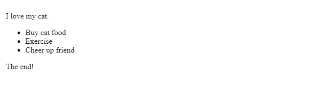
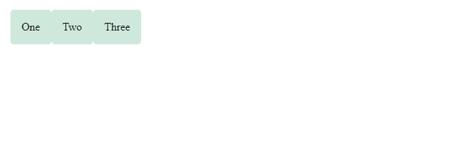
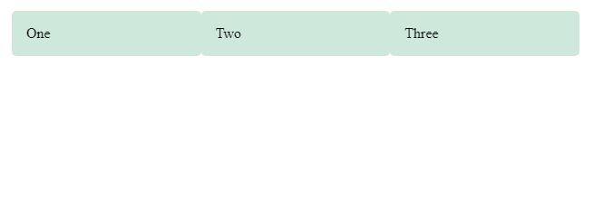
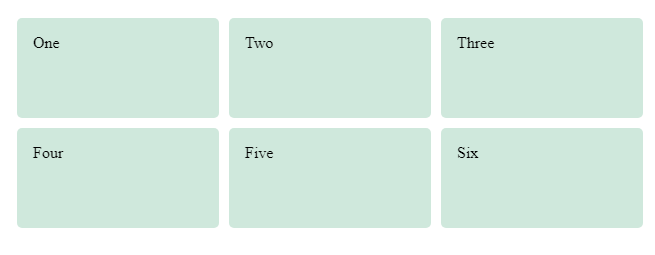
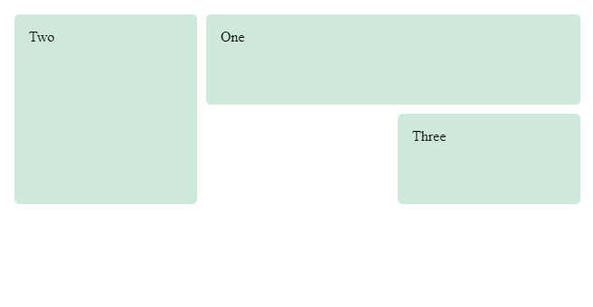
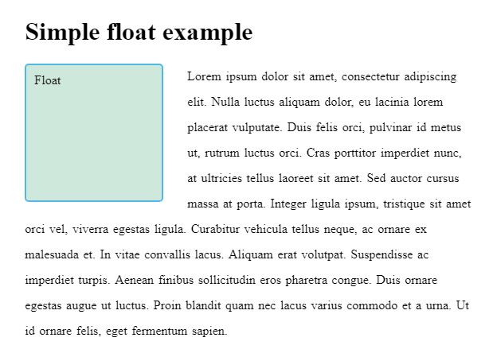

# Introduction to CSS layout

CSS page layout techniques allow us to take elements contained in a web page and control where they are positioned relative to their default position in normal layout flow, the other elements around them, their parent container, or the main viewport/window. The page layout techniques we'll be covering in more detail in this module are

* Normal flow
* The `display` property
* Flexbox
* Grid
* Floats
* Positioning
* Table layout
* Multiple-column layout

<hr />

## Normal flow

Normal flow is how the browser lays out HTML pages by default when you do nothing to control page layout. Let's look at a quick HTML example:
```
    <p>I love my cat.</p>

    <ul>
      <li>Buy cat food</li>
      <li>Exercise</li>
      <li>Cheer up friend</li>
    </ul>

    <p>The end!</p>
```
By default, the browser will display this code as follows:


Note here how the HTML is displayed in the exact order in which it appears in the source code, with elements stacked up on top of one another — the first paragraph, followed by the unordered list, followed by the second paragraph.

The elements that appear one below the other are described as *block* elements, in contrast to *inline* elements, which appear one beside the other, like the individual words in a paragraph.

> **Note:** The direction in which block element contents are laid out is described as the `Block Direction`. The Block Direction runs vertically in a language such as English, which has a horizontal writing mode. It would run horizontally in any language with a Vertical Writing Mode, such as Japanese. The corresponding `Inline Direction` is the direction in which inline contents (such as a sentence) would run.

The methods that can change how elements are laid out in CSS are as follows:

* **The `display` property** — Standard values such as `block`, `inline` or `inline-block` can change how elements behave in normal flow. We then have entire layout methods that are switched on via a value of `display`, for example CSS Grid and Flexbox.

* **Floats** — Applying a `float` value such as `left` can cause block level elements to wrap alongside one side of an element, like the way images sometimes have text floating around them in magazine layouts.

* **The `position` property** — Allows you to precisely control the placement of boxes inside other boxes. static positioning is the default in normal flow, but you can cause elements to be laid out differently using other values, for example always fixed to the top left of the browser viewport.

* **Table layout** — features designed for styling the parts of an HTML table can be used on non-table elements using display: table and associated properties..

* **Multi-column layout** — The Multi-column layout properties can cause the content of a block to layout in columns, as you might see in a newspaper.

<hr />

## The display property

The main methods of achieving page layout in CSS are all values of the `display` property. This property allows us to change the default way something displays. Everything in normal flow has a value of `display`, used as the default way that elements they are set on behave. For example, the fact that paragraphs in English display one below the other is due to the fact that they are styled with `display: block`. If you create a link around some text inside a paragraph, that link remains `inline` with the rest of the text, and doesn’t break onto a new line. This is because the `<a>` element is `display: inline` by default.

You can change this default display behaviour. For example, the `<li>` element is `display: block` by default, meaning that list items display one below the other in our English document. If we change the `display` value to `inline` they now display next to each other, as words would do in a sentence. The fact that you can change the value of `display` for any element means that you can pick HTML elements for their semantic meaning, without being concerned about how they will look. The way they look is something that you can change.

In addition to being able to change the default presentation by turning an item from `block` to `inline` and vice versa, there are some bigger layout methods that start out as a value of `display`. However when using these you will generally need to invoke additional properties. The two values most important for our purposes when discussing layout are `display: flex` and `display: grid`.

## Flexbox

Flexbox is the short name for the `Flexible Box Layout` Module, designed to make it easy for us to lay things out in one dimension — either as a row or as a column. To use flexbox, you apply `display: flex` to the parent element of the elements you want to lay out; all its direct children then become flex items. We can see this in a simple example.

The HTML markup below gives us a containing element, with a class of wrapper, inside which are three `<div>` elements. By default these would display as block elements, below one another, in our English language document.

However, if we add `display: flex` to the parent, the three items now arrange themselves into `columns`. This is due to them becoming flex items and using some initial values that `flexbox` gives them. They are displayed as a row, because the initial value of `flex-direction` is `row`. They all appear to **stretch to the height of the tallest item**, because the initial value of the `align-items` property is `stretch`. This means that the items stretch to the height of the flex container, which in this case is defined by the tallest item. The items all line up at the start of the container, leaving any extra space at the end of the row.
```
    .wrapper {
      display: flex;
    }
```
```
    <div class="wrapper">
      <div class="box1">One</div>
      <div class="box2">Two</div>
      <div class="box3">Three</div>
    </div>
```


In addition to the above properties that can be applied to the flex container, there are properties that can be applied to the flex items. These properties, among other things, can change the way that the items flex, enabling them to expand and contract to fit into the available space.

As a simple example of this, we can add the `flex` property to all of our child items, with a value of `1`. This will cause all of the items to grow and fill the container, rather than leaving space at the end. If there is more space then the items will become wider; if there is less space they will become narrower. In addition, if you add another element to the markup the items will all become smaller to make space for it — they will adjust size to take up the same amount of space, whatever that is.
```
    .wrapper {
        display: flex;
    }
    .wrapper > div {
        flex: 1;
    }
```
```
    <div class="wrapper">
        <div class="box1">One</div>
        <div class="box2">Two</div>
        <div class="box3">Three</div>
    </div>
```


> **Note:** This has been a very short introduction to what is possible in Flexbox, to find out more, see our [Flexbox](../07_CSS_Layout/03_Flexbox) article.

<hr />

## Grid Layout

While flexbox is designed for one-dimensional layout, Grid Layout is designed for two dimensions — lining things up in rows and columns.

Once again, you can switch on Grid Layout with a specific value of display — `display: grid`. The below example uses similar markup to the flex example, with a container and some child elements. In addition to using `display: grid`, we are also defining some row and column tracks on the parent using the `grid-template-rows` and `grid-template-columns` properties respectively. We've defined three columns each of `1fr` and two rows of `100px`. I don’t need to put any rules on the child elements; they are automatically placed into the cells our grid has created.
```
    .wrapper {
        display: grid;
        grid-template-columns: 1fr 1fr 1fr;
        grid-template-rows: 100px 100px;
        grid-gap: 10px;
    }
```
```
    <div class="wrapper">
        <div class="box1">One</div>
        <div class="box2">Two</div>
        <div class="box3">Three</div>
        <div class="box4">Four</div>
        <div class="box5">Five</div>
        <div class="box6">Six</div>
    </div>
```


Once you have a grid, you can explicitly place your items on it, rather than relying on the auto-placement behavior seen above. In the second example below we have defined the same grid, but this time with three child items. We've set the start and end line of each item using the `grid-column` and `grid-row` properties. This causes the items to span multiple tracks.
```
    .wrapper {
        display: grid;
        grid-template-columns: 1fr 1fr 1fr;
        grid-template-rows: 100px 100px;
        grid-gap: 10px;
    }
    .box1 {
        grid-column: 2 / 4;
        grid-row: 1;
    }
    .box2 {
        grid-column: 1;
        grid-row: 1 / 3;
    }
    .box3 {
        grid-row: 2;
        grid-column: 3;
    }
```
```
    <div class="wrapper">
        <div class="box1">One</div>
        <div class="box2">Two</div>
        <div class="box3">Three</div>
    </div>
```


> **Note:** These two examples are just a small part of the power of Grid layout; to find out more see our [Grid Layout](../07_CSS_Layout/04_Grids) article.

<hr />

## Floats

Floating an element changes the behavior of that element and the block level elements that follow it in normal flow. The element is moved to the left or right and removed from normal flow, and the surrounding content floats around the floated item.

The `float` property has four possible values:

* `left` — Floats the element to the left.
* `right` — Floats the element to the right.
* `none` — Specifies no floating at all. This is the default value.
* `inherit` — Specifies that the value of the float property should be inherited from the element's parent element.

In the example below we float a `<div>` left, and give it a `margin` on the right to push the text away from the element. This gives us the effect of text wrapped around that box, and is most of what you need to know about floats as used in modern web design.
```
    <h1>Simple float example</h1>

    <div class="box">Float</div>

    <p> Lorem ipsum dolor sit amet, consectetur adipiscing elit. Nulla luctus aliquam dolor, eu lacinia lorem placerat vulputate. Duis felis orci, pulvinar id metus ut, rutrum luctus orci. Cras porttitor imperdiet nunc, at ultricies tellus laoreet sit amet. Sed auctor cursus massa at porta. Integer ligula ipsum, tristique sit amet orci vel, viverra egestas ligula. Curabitur vehicula tellus neque, ac ornare ex malesuada et. In vitae convallis lacus. Aliquam erat volutpat. Suspendisse ac imperdiet turpis. Aenean finibus sollicitudin eros pharetra congue. Duis ornare egestas augue ut luctus. Proin blandit quam nec lacus varius commodo et a urna. Ut id ornare felis, eget fermentum sapien.</p>
```
```
    .box {
        float: left;
        width: 150px;
        height: 150px;
        margin-right: 30px;
    }
```


<hr />

## Positioning techniques
