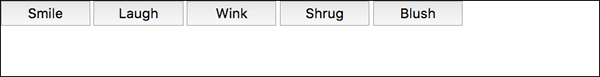

# Flexbox

Flexbox is a one-dimensional layout method for laying out items in rows or columns. Items flex to fill additional space and shrink to fit into smaller spaces.

<hr />

## Why Flexbox?

For a long time, the only reliable cross browser-compatible tools available for creating CSS layouts were things like *floats* and *positioning*. These are fine and they work, but in some ways they are also rather limiting and frustrating.

The following simple layout requirements are either difficult or impossible to achieve with such tools, in any kind of convenient, flexible way:

* Vertically centering a block of content inside its parent.
* Making all the children of a container take up an equal amount of the available width/height, regardless of how much width/height is available.
* Making all columns in a multiple column layout adopt the same height even if they contain a different amount of content.

<hr />

## Introducing a simple example

In this article we are going to get you to work through a series of exercises to help you understand how flexbox works.

```
    html {
        font-family: sans-serif;
    }

    body {
        margin: 0;
    }

    header {
        background: purple;
        height: 100px;
    }

    h1 {
        text-align: center;
        color: white;
        line-height: 100px;
        margin: 0;
    }

    article {
        padding: 10px;
        margin: 10px;
        background: aqua;
    }
```
```
    <body>
        <header>
            <h1>Sample flexbox example</h1>
        </header>

        <section>
            <article>
                <h2>First article</h2>

                <p>Tacos actually microdosing, pour-over semiotics banjo chicharrones retro fanny pack portland everyday
                    carry vinyl typewriter. Tacos PBR&B pork belly, everyday carry ennui pickled sriracha normcore hashtag
                    polaroid single-origin coffee cold-pressed. PBR&B tattooed trust fund twee, leggings salvia iPhone photo
                    booth health goth gastropub hammock.</p>
            </article>

            <article>
                <h2>Second article</h2>

                <p>Tacos actually microdosing, pour-over semiotics banjo chicharrones retro fanny pack portland everyday
                    carry vinyl typewriter. Tacos PBR&B pork belly, everyday carry ennui pickled sriracha normcore hashtag
                    polaroid single-origin coffee cold-pressed. PBR&B tattooed trust fund twee, leggings salvia iPhone photo
                    booth health goth gastropub hammock.</p>
            </article>

            <article>
                <h2>Third article</h2>

                <p>Tacos actually microdosing, pour-over semiotics banjo chicharrones retro fanny pack portland everyday
                    carry vinyl typewriter. Tacos PBR&B pork belly, everyday carry ennui pickled sriracha normcore hashtag
                    polaroid single-origin coffee cold-pressed. PBR&B tattooed trust fund twee, leggings salvia iPhone photo
                    booth health goth gastropub hammock.</p>

                <p>Cray food truck brunch, XOXO +1 keffiyeh pickled chambray waistcoat ennui. Organic small batch paleo
                    8-bit. Intelligentsia umami wayfarers pickled, asymmetrical kombucha letterpress kitsch leggings
                    cold-pressed squid chartreuse put a bird on it. Listicle pickled man bun cornhole heirloom art party.
                </p>
            </article>
        </section>
    </body>
```

You'll see that we have a ```<header>``` element with a top level heading inside it, and a ```<section>``` element containing three ```<article>```s. We are going to use these to create a fairly standard three column layout.


<hr />

## Specifying what elements to lay out as flexible boxes

To start with, we need to select which elements are to be laid out as flexible boxes. To do this, we set a special value of ```display``` on the parent element of the elements you want to affect. In this case we want to lay out the ```<article>``` elements, so we set this on the ```<section>``` (which becomes a flex container):
```
    section {
        display: flex;
    }
```
The result of this should be something like so:


So, this single declaration gives us everything we need — incredible, right? We have our multiple column layout with equal sized columns, and the columns are all the same height. This is because the default values given to flex items (the children of the flex container) are set up to solve common problems such as this.

> **Note:** You can also set a ```display``` value of ```inline-flex``` if you wish to lay out inline items as flexible boxes.

<hr />

## An aside on the flex model

When elements are laid out as flexible boxes, they are laid out along two axes:


* The **main axis** is the axis running in the direction the flex items are being laid out in (e.g. as rows across the page, or columns down the page.) The start and end of this axis are called the **main start** and **main end**.
* The **cross axis** is the axis running perpendicular to the direction the flex items are being laid out in. The start and end of this axis are called the **cross start** and **cross end**.
* The parent element that has **```display: flex```** set on it (the ```<section>``` in our example) is called the **flex container**.
* The items being laid out as flexible boxes inside the flex container are called **flex items** (the ```<article>``` elements in our example).

<hr />

## Columns or rows?

Flexbox provides a property called ```flex-direction``` that specifies what direction the main axis runs in (what direction the flexbox children are laid out in) — by default this is set to ```row```, which causes them to be laid out in a row in the direction your browser's default language works in (left to right, in the case of an English browser).

Try adding the following declaration to your ```<section>``` rule:
```
    flex-direction: column;
```
You'll see that this puts the items back in a column layout, much like they were before we added any CSS. Before you move on, delete this declaration from your example.

> **Note:** You can also lay out flex items in a reverse direction using the ```row-reverse``` and ```column-reverse``` values.

## Wrapping

One issue that arises when you have a fixed amount of width or height in your layout is that eventually your flexbox children will overflow their container, breaking the layout. Have a look at [flexbox_wrap.html](flexbox_wrap.html) example,


Here we see that the children are indeed breaking out of their container. One way in which you can fix this is to add the following declaration to your ```<section>``` rule:
```
    flex-wrap: wrap;
```
Also, add the following declaration to your ```<article>``` rule:
```
    flex: 200px;
```
Try this now; you'll see that the layout looks much better with this included:


We now have multiple rows — as many flexbox children are fitted onto each row as makes sense, and any overflow is moved down to the next line. The ```flex: 200px``` declaration set on the articles means that each will be at least 200px wide. You might also notice that the last few children on the last row are each made wider so that the entire row is still filled.

<hr />

## flex-flow shorthand

At this point it is worth noting that a shorthand exists for ```flex-direction``` and ```flex-wrap``` — ```flex-flow```. So for example, you can replace
```
    flex-direction: row;
    flex-wrap: wrap;
```
with
```
    flex-flow: row wrap;
```

<hr />

## Flexible sizing of flex items

Have a look at [flex_items.html](flex_items.html),

First, add the following rule to the bottom of your CSS:
```
    article {
        flex: 1;
    }
```
This is a unitless proportion value that dictates how much of the available space along the main axis each flex item will take up. In this case, we are giving each ```<article>``` element a value of ```1```, which means they will all take up an equal amount of the spare space left after things like padding and margin have been set. It is a proportion, meaning that giving each flex item a value of 400000 would have exactly the same effect.

Now add the following rule below the previous one:
```
    article:nth-of-type(3) {
        flex: 2;
    }
```
Now when you refresh, you'll see that the third ```<article>``` takes up twice as much of the available width as the other two — there are now four proportion units available in total. The first two flex items have one each so they take 1/4 of the available space each. The third one has two units, so it takes up 2/4 of the available space (or 1/2).

You can also specify a minimum size value inside the flex value. Try updating your existing article rules like so:
```
    article {
        flex: 1 200px;
    }

    article:nth-of-type(3) {
        flex: 2 200px;
    }
```
This basically states "Each flex item will first be given 200px of the available space. After that, the rest of the available space will be shared out according to the proportion units." Try refreshing and you'll see a difference in how the space is shared out.

The real value of flexbox can be seen in its flexibility/responsiveness — if you resize the browser window, or add another ```<article>``` element, the layout continues to work just fine.

<hr />

## flex: shorthand versus longhand

flex is a shorthand property that can specify up to three different values:

* The unitless proportion value we discussed above. This can be specified individually using the **```flex-grow```** longhand property.
* A second unitless proportion value — **```flex-shrink```** — that comes into play when the flex items are overflowing their container. This specifies how much of the overflowing amount is taken away from each flex item's size, to stop them overflowing their container.
* The minimum size value we discussed above. This can be specified individually using the **```flex-basis```** longhand value.

<hr />

## Horizontal and vertical alignment

We can also use flexbox features to align flex items along the main or cross axis. Let's explore this by looking at a new example — [flex-align.html](flex_align.html).


Now, add the following to the bottom of the example's CSS:
```
    div {
        display: flex;
        align-items: center;
        justify-content: space-around;
    }
```
Refresh the page and you'll see that the buttons are now nicely centered, horizontally and vertically. We've done this via two new properties.

#### ```align-items``` 

```align-items```controls where the flex items sit on the cross axis.

* By default, the value is **```stretch```**, which stretches all flex items to fill the parent in the direction of the cross axis. If the parent hasn't got a fixed width in the cross axis direction, then all flex items will become as long as the longest flex items. This is how our first example got equal height columns by default.
* The **```center```** value that we used in our above code causes the items to maintain their intrinsic dimensions, but be centered along the cross axis. This is why our current example's buttons are centered vertically.
* You can also have values like **```flex-start```** and **```flex-end```**, which will align all items at the start and end of the cross axis respectively.

You can override the ```align-items``` behavior for individual flex items by applying the ```align-self``` property to them. For example, try adding the following to your CSS:
```
    button:first-child {
        align-self: flex-end;
    }
```
Have a look at what effect this has, and remove it again when you've finished.

#### ```justify-content```

```justify-content``` controls where the flex items sit on the main axis.

* The default value is **```flex-start```**, which makes all the items sit at the start of the main axis.
* **```flex-end```** to make them sit at the end.
* **```center```** is also a value for ```justify-content```, and will make the flex items sit in the center of the main axis.
* The value we've used above, **```space-around```**, is useful — it distributes all the items evenly along the main axis, with a bit of space left at either end.
* There is another value, **```space-between```**, which is very similar to ```space-around``` except that it doesn't leave any space at either end.

<hr />

## Ordering flex items

Flexbox also has a feature for changing the layout order of flex items, without affecting the source order. This is another thing that is impossible to do with traditional layout methods.

The code for this is simple: try adding the following CSS to your button bar example code:
```
    button:first-child {
        order: 1;
    }
```
Refresh, and you'll now see that the "Smile" button has moved to the end of the main axis. Let's talk about how this works in a bit more detail:
* By default, all flex items have an **```order```** value of 0.
* Flex items with higher order values set on them will appear later in the display order than items with lower order values.
* Flex items with the same order value will appear in their source order. So if you have four items with order values of 2, 1, 1, and 0 set on them respectively, their display order would be 4th, 2nd, 3rd, then 1st.
* The 3rd item appears after the 2nd because it has the same order value and is after it in the source order.

You can set negative order values to make items appear earlier than items with 0 set. For example, you could make the "Blush" button appear at the start of the main axis using the following rule:
```
    button:last-child {
        order: -1;
    }
```

<hr />

## Nested flex boxes

It is possible to create some pretty complex layouts with flexbox. It is perfectly ok to set a flex item to also be a flex container, so that its children are also laid out like flexible boxes. Have a look at [complex-flexbox.html](complex-flexbox.html).

The HTML for this is fairly simple. We've got a ```<section>``` element containing three ```<article>```s. The third ```<article>``` contains three ```<div>```s. :
 ```
     section - article
              article
              article - div - button   
                        div   button
                        div   button
                              button
                              button
 ```
 
 First of all, we set the children of the ```<section>``` to be laid out as flexible boxes.
 ```
     section {
        display: flex;
    }
 ```
 Next, we set some flex values on the ```<article>```s themselves. Take special note of the 2nd rule here — we are setting the third ```<article>``` to have its children laid out like flex items too, but this time we are laying them out like a column.
```
     article {
        flex: 1 200px;
    }

    article:nth-of-type(3) {
        flex: 3 200px;
        display: flex;
        flex-flow: column;
    }
```
Next, we select the first ```<div>```. We first use ```flex:1 100px;``` to effectively give it a minimum height of 100px, then we set its children (the ```<button>``` elements) to also be laid out like flex items. Here we lay them out in a wrapping row, and align them in the center of the available space like we did in the individual button example we saw earlier.
```
    article:nth-of-type(3) div:first-child {
        flex: 1 100px;
        display: flex;
        flex-flow: row wrap;
        align-items: center;
        justify-content: space-around;
    }
```
Finally, we set some sizing on the button, but more interestingly we give it a flex value of 1 auto. This has a very interesting effect, which you'll see if you try resizing your browser window width. The buttons will take up as much space as they can and sit as many on the same line as they can, but when they can no longer fit comfortably on the same line, they'll drop down to create new lines.
```
    button {
        flex: 1 auto;
        margin: 5px;
        font-size: 18px;
        line-height: 1.5;
    }
```
 
 
 
