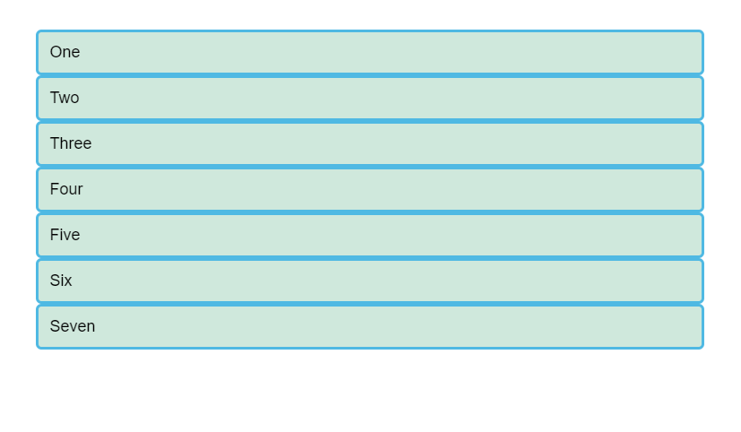
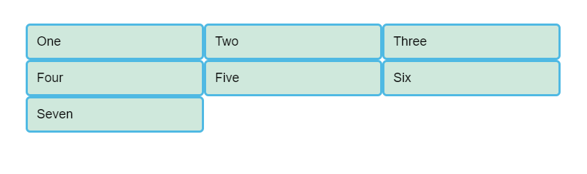
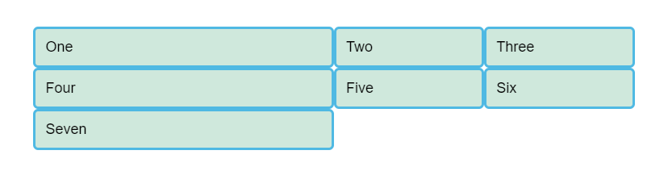
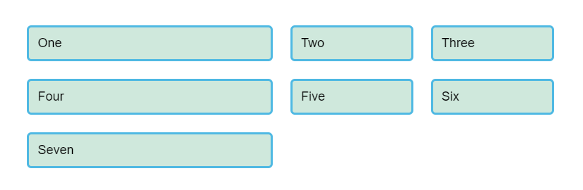
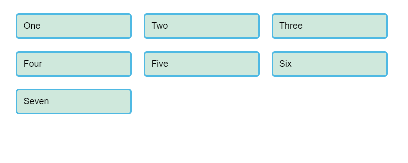
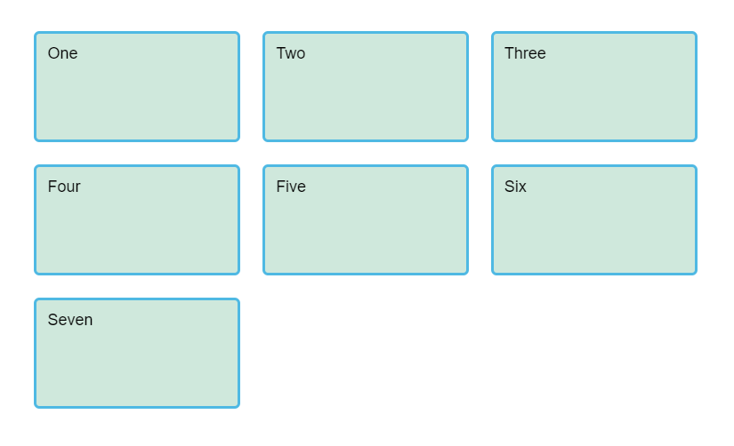
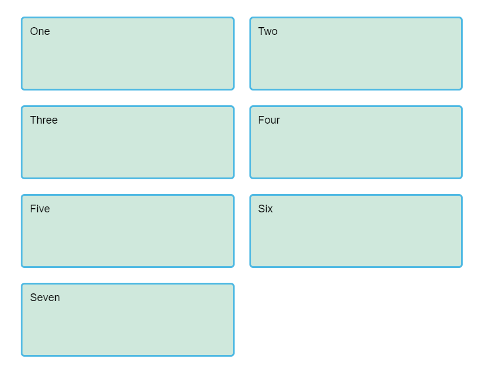
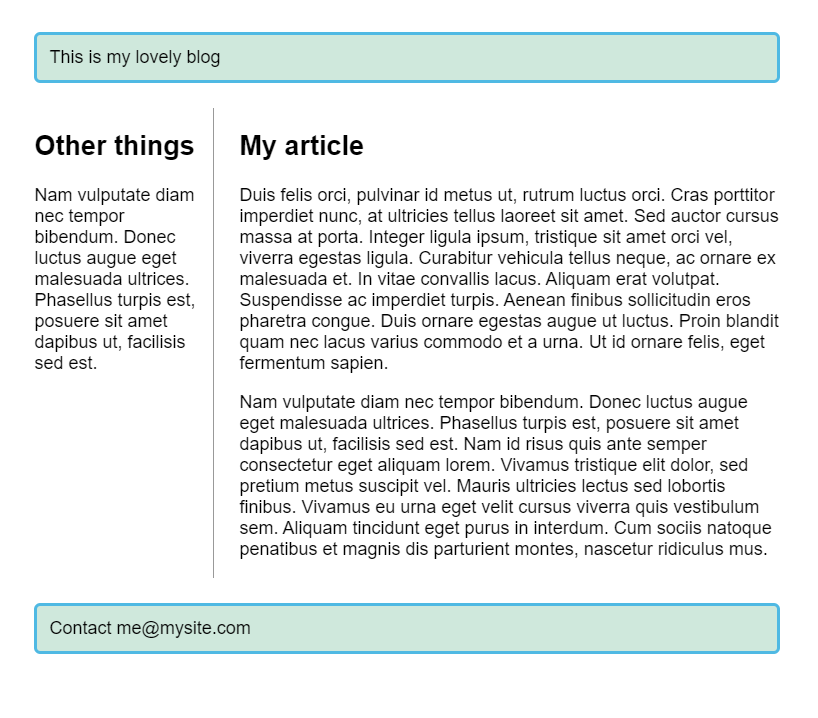

# Grids

CSS Grid Layout is a two-dimensional layout system for the web. It lets you lay content out in rows and columns, and has many features that make building complex layouts straightforward.

<hr />

## What is grid layout?

A grid is a collection of horizontal and vertical lines creating a pattern against which we can line up our design elements. They help us to create designs where elements don’t jump around or change width as we move from page to page, providing greater consistency on our websites.

A grid will typically have **columns**, **rows**, and then gaps between each row and column — commonly referred to as **gutters**.


<hr />

## Creating your grid in CSS

Have a look at the [starting point file](grid0.html), we will see an example with a container, which has some child items. By default these display in normal flow so the boxes display one below the other. We will be working with this file for the first part of this lesson, making changes to see how grid behaves.



### Defining a grid

To define a grid we use the **```grid```** value of the **```display```** property. As with Flexbox, this switches on Grid Layout, and all of the direct children of the container become grid items. Add this to the CSS inside your file:
```
    .container {
        display: grid;
    }
```
Unlike flexbox, the items will not immediately look any different. Declaring **```display: grid```** gives you a one column grid, so your items will continue to display one below the other as they do in normal flow.

To see something that looks more grid-like, we will need to add some columns to the grid. Let's add three 200-pixel columns here. You can use any length unit, or percentages to create these column tracks.
```
    .container {
        display: grid;
        grid-template-columns: 200px 200px 200px;
    }
```
Add the 2nd declaration to your CSS rule, then reload the page, and you should see that the items have rearranged themselves one into each cell of the created grid.


### Flexible grids with the fr unit

In addition to creating grids using lengths and percentages, we can use the ```fr``` unit to flexibly size grid rows and columns. This unit represents one fraction of the available space in the grid container.

Change your track listing to the following definition, creating three ```1fr``` tracks.
```
    .container {
        display: grid;
        grid-template-columns: 1fr 1fr 1fr;
    }
```
You should now see that you have flexible tracks. The ```fr``` unit distributes space in proportion, therefore you can give different positive values to your tracks, for example if you change the definition like so:
```
    .container {
        display: grid;
        grid-template-columns: 2fr 1fr 1fr;
    }
```
The first track now gets ```2fr``` of the available space and the other two tracks get ```1fr```, making the first track larger. 

You can mix ```fr``` units and fixed length tracks — in such a case the space needed for the fixed tracks is taken away before the space is distributed to the other tracks.


> **Note:** The ```fr``` unit distributes available space, not all space. Therefore if one of your tracks has something large inside it there will be less free space to share out.

### Gaps between tracks

To create gaps between tracks we use the properties **```grid-column-gap```** for gaps between columns, **```grid-row-gap```** for gaps between rows, and **```grid-gap```** to set both at once.
```
    .container {
        display: grid;
        grid-template-columns: 2fr 1fr 1fr;
        grid-gap: 20px;
    }
```
These gaps can be any length unit or a percentage, but not an ```fr``` unit.



> **Note:** The ```*gap``` properties used to be prefixed by ```grid-```, but this has been changed in the spec, as the intention is to make them usable in multiple layout methods. The prefixed versions will be maintained as an alias so will be safe to use for some time. To be on the safe side, you could double up and add both properties to make your code more bulletproof.
```
    .container {
        display: grid;
        grid-template-columns: 2fr 1fr 1fr;
        grid-gap: 20px;
        gap: 20px;
    }
```

### Repeating track listings

You can repeat all, or a section of, your track listing using repeat notation. 

Change your track listing to the following:
```
    .container {
        display: grid;
        grid-template-columns: repeat(3, 1fr);
        grid-gap: 20px;
    }
```
You will now get 3 ```1fr``` tracks just as before. The first value passed to the repeat function is how many times you want the listing to repeat, while the second value is a track listing, which may be one or more tracks that you want to repeat.


### The implicit and explicit grid

We have only specified column tracks so far, and yet rows are being created to hold our content. This is an example of the explicit versus the implicit grid. 

* The **explicit grid** is the one that you create using **```grid-template-columns```** or **```grid-template-rows```**. 

* The **implicit grid** is created when content is placed outside of that grid — such as into our rows. 

The explicit and implicit grids are analogous to the main and cross flexbox axes.

By default, tracks created in the implicit grid are ```auto``` sized, which in general means that they are large enough to fit their content. If you wish to give implicit grid tracks a size you can use the **```grid-auto-rows```** and **```grid-auto-columns```** properties. If you add **```grid-auto-rows```** with a value of ```100px``` to your CSS, you will see that those created rows are now 100 pixels tall.
```
    .container {
        display: grid;
        grid-template-columns: repeat(3, 1fr);
        grid-gap: 20px;
        grid-auto-rows: 100px;
    }
```


### The minmax() function

Our 100-pixel tall tracks won’t be very useful if we add content into those tracks that is taller than 100 pixels, in which case it would cause an overflow. 

The **```minmax```** function lets us set a minimum and maximum size for a track, for example **```minmax(100px, auto)```**. The minimum size is 100 pixels, but the maximum is ```auto```, which will expand to fit the content. Try changing **```grid-auto-rows```** to use a minmax value:
```
    .container {
        display: grid;
        grid-template-columns: repeat(3, 1fr);
        grid-gap: 20px;
        grid-auto-rows: minmax(100px, auto);
    }
```


If you add extra content you will see that the track expands to allow it to fit. Note that the expansion happens right along the row.

### As many columns as will fit

We can combine some of the things we have learned about track listing, **```repeat```** notation and **```minmax()```** to create a useful pattern. Sometimes it is helpful to be able to ask grid to create as many columns as will fit into the container. We do this by setting the value of **```grid-template-columns```** using **```repeat()```** notation, but instead of passing in a number, pass in the keyword **```auto-fill```**. For the second parameter of the function we use **```minmax()```**, with a minimum value equal to the minimum track size that we would like to have, and a maximum of ```1fr```.

Try this in your file now, using the below CSS:
```
    .container {
        display: grid;
        grid-template-columns: repeat(auto-fill, minmax(200px, 1fr));
        grid-gap: 20px;
        grid-auto-rows: minmax(100px, auto);
    }
```


This works because grid is creating as many 200 pixel columns as will fit into the container, then sharing whatever space is leftover between all of the columns — the maximum is 1fr which, as we already know, distributes space evenly between tracks.

<hr />

## Line-based placement

We now move on from creating a grid, to placing things on the grid. Our grid always has lines, these lines start at 1 and relate to the Writing Mode of the document. Therefore in English, column line 1 is on the left hand side of the grid and row line 1 at the top. In Arabic column line 1 would be on the right hand side, as Arabic is written right to left.

We can place things according to these lines by specifying the start and end line. 

We do this using the following properties:
* ```grid-column-start```
* ```grid-column-end```
* ```grid-row-start```
* ```grid-row-end```
These properties can all have a line number as the value. 

You can also use the shorthand properties:
* ```grid-column```
* ```grid-row```

These let you specify the start and end lines at once, separated by a ```/``` — a forward slash character.

Have look at [starting point file](grid1.html), it has a grid defined already, and a simple article outlined. You can see that auto-placement is placing items one into each cell of the grid that we have created.

We will instead place all of the elements for our site on the grid, using the grid lines. Add the following rules to the bottom of your CSS:
```
    header {
        grid-column: 1 / 3;
        grid-row: 1;
    }

    article {
        grid-column: 2;
        grid-row: 2;
    }

    aside {
        grid-column: 1;
        grid-row: 2;
    }

    footer {
        grid-column: 1 / 3;
        grid-row: 3;
    }
```


> **Note:** you can also use the value ```-1``` to target the end column or row line, and count inwards from the end using negative values. However this only works for the Explicit Grid. The value ```-1``` will not target the end line of the implicit grid.

<hr />

## Positioning with grid-template-areas