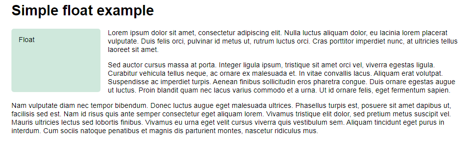
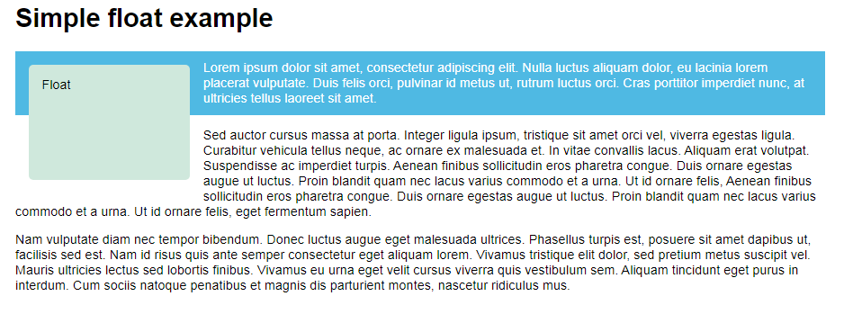
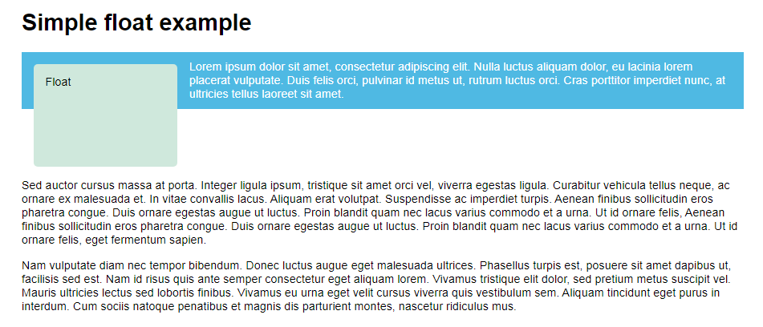

# Floats

Originally for floating images inside blocks of text, the ```float``` property became one of the most commonly used tools for creating multiple column layouts on webpages. With the advent of flexbox and grid it has now returned to its original purpose.

<hr />

## The background of floats

The ```float``` property was introduced to allow web developers to implement simple layouts involving an image floating inside a column of text, with the text wrapping around the left or right of it. The kind of thing you might get in a newspaper layout.

But web developers quickly realized that you can float anything, not just images, so the use of float broadened.

Floats have commonly been used to create entire web site layouts featuring multiple columns of information floated so they sit alongside one another (the default behavior would be for the columns to sit below one another, in the same order as they appear in the source). There are newer, better layout techniques available and so use of floats in this way should be regarded as a legacy technique.

<hr />

## A simple float example

Add the following to the HTML body
```
    <h1>Simple float example</h1>

    <div class="box">Float</div>

    <p>Lorem ipsum dolor sit amet, consectetur adipiscing elit. Nulla luctus aliquam dolor, eu lacinia lorem placerat vulputate. Duis felis orci, pulvinar id metus ut, rutrum luctus orci. Cras porttitor imperdiet nunc, at ultricies tellus laoreet sit amet. </p>

    <p>Sed auctor cursus massa at porta. Integer ligula ipsum, tristique sit amet orci vel, viverra egestas ligula. Curabitur vehicula tellus neque, ac ornare ex malesuada et. In vitae convallis lacus. Aliquam erat volutpat. Suspendisse ac imperdiet turpis. Aenean finibus sollicitudin eros pharetra congue. Duis ornare egestas augue ut luctus. Proin blandit quam nec lacus varius commodo et a urna. Ut id ornare felis, eget fermentum sapien.</p>

    <p>Nam vulputate diam nec tempor bibendum. Donec luctus augue eget malesuada ultrices. Phasellus turpis est, posuere sit amet dapibus ut, facilisis sed est. Nam id risus quis ante semper consectetur eget aliquam lorem. Vivamus tristique elit dolor, sed pretium metus suscipit vel. Mauris ultricies lectus sed lobortis finibus. Vivamus eu urna eget velit cursus viverra quis vestibulum sem. Aliquam tincidunt eget purus in interdum. Cum sociis natoque penatibus et magnis dis parturient montes, nascetur ridiculus mus.</p>
```

Now apply the following CSS to your HTML
```
    body {
        width: 90%;
        max-width: 900px;
        margin: 0 auto;
        font: .9em/1.2 Arial, Helvetica, sans-serif
    }

    .box {
        width: 150px;
        height: 100px;
        border-radius: 5px;
        background-color: rgb(207, 232, 220);
        padding: 1em;
    }
```
If you save and refresh now, you'll see something much like what you'd expect — the box is sitting above the text, in normal flow. To float the text around it add two properties to the ```.box``` rule:
```
    .box {
        float: left;
        margin-right: 15px;
        width: 150px;
        height: 100px;
        border-radius: 5px;
        background-color: rgb(207, 232, 220);
        padding: 1em;
    }
```
Now if you save and refresh you'll see something like the following:


So let's think about how the float works — the element with the float set on it (the ```<div>``` element in this case) is taken out of the normal layout flow of the document and stuck to the left-hand side of its parent container (```<body>```, in this case). Any content that comes below the floated element in the normal layout flow will now wrap around it, filling up the space to the right-hand side of it as far up as the top of the floated element. There, it will stop.

Floating the content to the right has exactly the same effect, but in reverse — the floated element will stick to the right, and the content will wrap around it to the left. Try changing the float value to ```right``` and replace ```margin-right``` with ```margin-left``` in the last ruleset to see what the result is.

While we can add a margin to the float to push the text away, we can't add a margin to the text to move it away from the float. This is because a floated element is taken out of normal flow, and the boxes of the following items actually run behind the float. You can demonstrate this by making some changes to your example.

Add a class of ```special``` to the first paragraph of text, the one immediately following the floated box, then in your CSS add the following rules. These will give our following paragraph a background color.
```
    .special {
        background-color: rgb(79, 185, 227);
        padding: 10px;
        color: #fff;
    }
```
To make the effect easier to see, change the ```margin-right``` on your float to ```margin```, so you get space all around the float. You will be able to see the background on the paragraph running right underneath the floated box, as in the example below.



The line boxes of our following element have been shortened so the text runs around the float, but due to the float being removed from normal flow the box around the paragraph still remains full width.

<hr />

## Clearing floats

We have seen that the float is removed from normal flow and that other elements will display beside it, therefore if we want to stop the following element from moving up we need to clear it; this is achieved with the ```clear``` property.

In your HTML from the previous example, add a class of ```cleared``` to the second paragraph below the floated item. Then add the following to your CSS:
```
    .cleared {
        clear: left;
    }
```


The ```clear``` property accepts the following values:

* **```left```**: Clear items floated to the left.
* **```right```**: Clear items floated to the right.
* **```both```**: Clear any floated items, left or right.

<hr />

## 