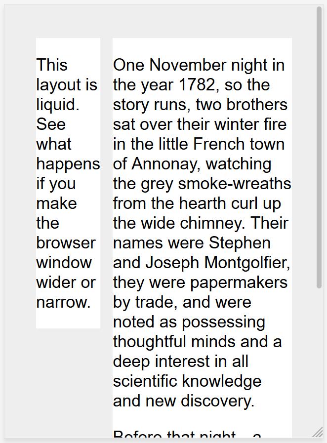
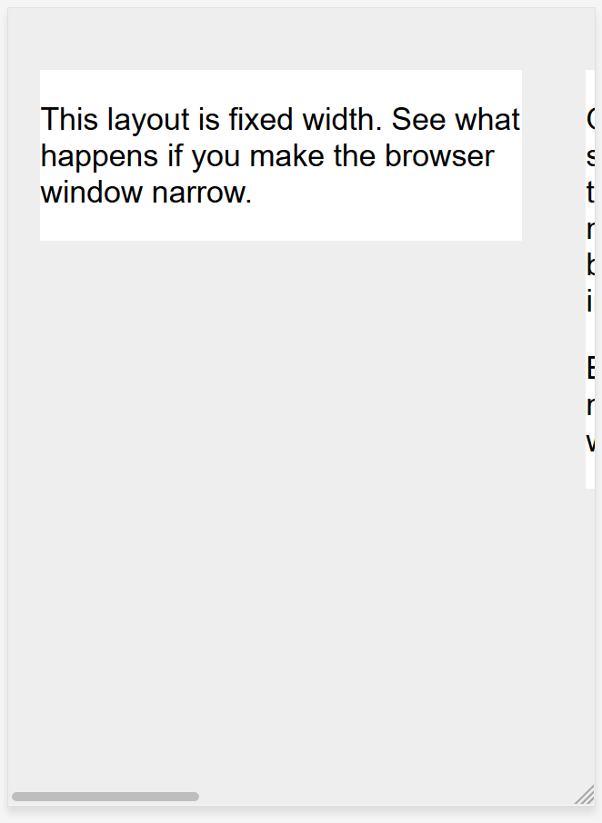

# Responsive design

In the early days of web design, pages were built to target a particular screen size. If the user had a larger or smaller screen than the designer expected results ranged from unwanted scrollbars, to overly long line lengths, and poor use of space. As more diverse screen sizes became available, the concept of ***responsive web design (RWD)*** appeared, a set of practices that allows web pages to alter their layout and appearance to suit different screen widths, resolutions, etc. It is an idea that changed the way we design for a multi-device web, and in this help you understand the main techniques you need to know.

## Historic website layouts

At one point in history you had two options when designing a website:

* You could create a liquid site, which would stretch to fill the browser window
* or a fixed width site, which would be a fixed size in pixels.

These two approaches tended to result in a website that looked its best on the screen of the person designing the site! 

The liquid site resulted in a squashed design on smaller screens (as seen below) and unreadably long line lengths on larger ones.

> **Note:** See this simple liquid layout: [source code](liquid-width.html).

The fixed width site risked a horizontal scrollbar on screens smaller than the site width (as seen below), and lots of white space at the edges of the design on larger screens.

> **Note:** See this simple fixed width layout: [source code](fixed-width.html). 

As the mobile web started to become a reality with the first feature phones, companies who wished to embrace mobile would generally create a special mobile version of their site, with a different URL (often something like m.example.com, or example.mobi). This meant that two separate versions of the site had to be developed and kept up-to-date.

In addition, these mobile sites often offered a very cut down experience. As mobile devices became more powerful and able to display full websites, this was frustrating to mobile users who found themselves trapped in the site's mobile version and unable to access information they knew was on the full-featured desktop version of the site.