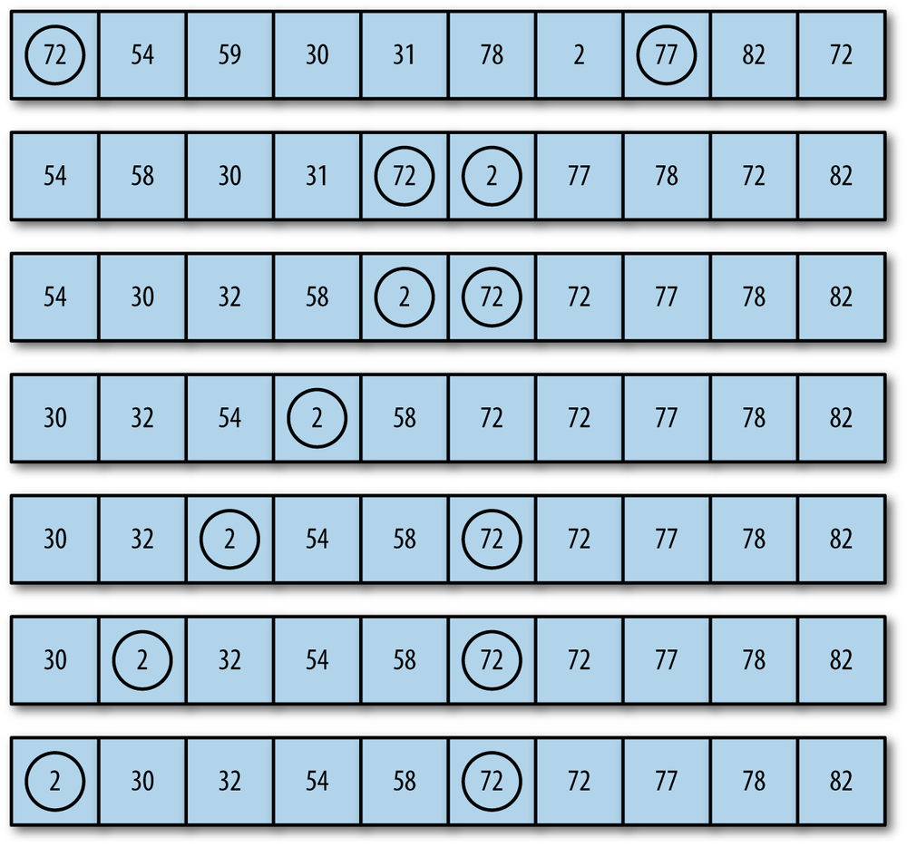

## BUBBLE SORT

The *bubble sort* is one of the slowest sorting algorithms, but it is also one of the easiest sorts to implement.

The bubble sort gets its name because when data are sorted using the algorithm, values float like a bubble from one end of the array to the other. Assuming you are sorting a set of numbers into ascending order, larger values float to the right of the array and lower values float to the left. This behavior is the result of the algorithm moving through the array many times, comparing adjacent values, and swapping them if the value to the left is greater than the value to the right.

Here is a simple example of the bubble sort. We start with the following list:

  E A D B H

The first pass of the sort yields the following list:

  A E D B H

The first and second elements are swapped. The next pass of the sort leads to:

  A D E B H

The second and third elements are swapped. The next pass leads to the following order:

  A D B E H

as the third and fourth elements are swapped. And finally, the second and third elements are swapped again, leading to the final order:

  A B D E H



The above figure illustrates how the bubble sort works with a larger data set of numbers. In the figure, we examine two particular values inserted into the array: 2 and 72. Each number is circled. You can watch how 72 moves from the beginning of the array to the middle of the array, and you can watch how 2 moves from just past the middle of the array to the beginning of the array.


Here is the definition of **bubbleSort()** function
```
    function bubbleSort() {
        var numElements = this.dataStore.length;
        var temp;
        for (var outer = numElements; outer >= 2; outer--) {
            for (var inner = 0; inner <= outer-1; inner++) {
                if(this.dataStore[inner] > this.dataStore[inner+1]){
                    swap(this.dataStore, inner, inner+1);
                }
            }
        }
    }
```

A short program that sorts 10 numbers using the bubbleSort() function.
```
    var numElements = 10;
    var myNums = new CArray(numElements);
    myNums.setData();
    print(myNums.toString());
    myNums.bubbleSort();
    print("<br />");
    print(myNums.toString());
```

The output from this program is:
```
    10 6 1 1 0 6 0 3 3 1
    0 0 1 1 1 3 3 6 6 10
```

We can see that the bubble sort algorithm works, but it would be nice to view the intermediate results of the algorithm, since a record of the sorting process is useful in helping us understand how the algorithm works. We can do that by the careful placement of the toString() function into the bubbleSort() function, which will display the current state of the array as the function proceeds
```
    function bubbleSort() {
        var numElements = this.dataStore.length;
        var temp;
        for (var outer = numElements; outer >= 2; outer--) {
            for (var inner = 0; inner <= outer-1; inner++) {
                if(this.dataStore[inner] > this.dataStore[inner+1]){
                    swap(this.dataStore, inner, inner+1);
                }
            }
            print(this.toString() + "<br />");
        }
    }
```
When we rerun the preceding program with the toString() function included, we get the following output:
```
    0 5 3 7 5 9 7 3 10 0
    0 3 5 5 7 7 3 9 0 10
    0 3 5 5 7 3 7 0 9 10
    0 3 5 5 3 7 0 7 9 10
    0 3 5 3 5 0 7 7 9 10
    0 3 3 5 0 5 7 7 9 10
    0 3 3 0 5 5 7 7 9 10
    0 3 0 3 5 5 7 7 9 10
    0 0 3 3 5 5 7 7 9 10
    0 0 3 3 5 5 7 7 9 10

    0 0 3 3 5 5 7 7 9 10
```
With this output, you can more easily see how the lower values work their way to the beginning of the array and how the higher values work their way to the end of the array.

## Complexity

| Name                  | Best            | Average             | Worst               | Memory    | Stable    | Comments  |
| --------------------- | :-------------: | :-----------------: | :-----------------: | :-------: | :-------: | :-------- |
| **Bubble sort**       | n               | n<sup>2</sup>       | n<sup>2</sup>       | 1         | Yes       |           |
