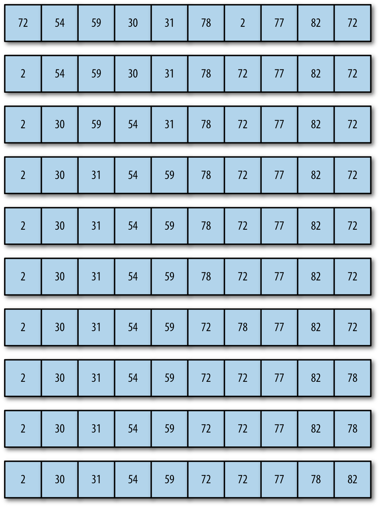

## SELECTION SORT

The next sorting algorithm is the **selection sort**. This sort works by starting at the beginning of the array and comparing the first element with the remaining elements. After examining all the elements, the smallest element is placed in the first position of the array, and the algorithm moves to the second position. This process continues until the algorithm arrives at the next to last position in the array, at which point all the data is sorted.

Nested loops are used in the selection sort algorithm. The outer loop moves from the first element in the array to the next to last element; the inner loop moves from the second array element to the last element, looking for values that are smaller than the element currently being pointed to by the outer loop. After each iteration of the inner loop, the smallest value in the array is assigned its proper place in the array.

Here is a simple example of how selection sort works on a list of five items. The original list is:

  E A D H B

The first pass looks for the minimal value and swaps it with the value at the front of the list:

  A E D H B

The next pass finds the minimal value after the first element (which is now in place) and swaps it:

  A B D H E

The D is in place so the next step swaps the E and the H, leading to the list being in order:

  A B D E H



The above figure shows how selection sort works on a larger data set of numbers.


Here is the definition of **selectionSort()** function:
```
    function selectionSort() {
        var min, temp;
        for (var outer = 0; outer <= this.dataStore.length-2; outer++) {
            min = outer;
            for (var inner = 0; inner <= this.dataStore.length-1; inner++) {
                if (this.dataStore[inner] < this.dataStore[min]) {
                    min = inner;
                }
            }
            swap(this.dataStore, outer, min);
            print(this.toString() + "<br />");
        }
    }
```

The output is
```
    1 4 2 3 4 0 1 6 8 3
    0 4 2 3 4 1 1 6 8 3
    0 1 2 3 4 4 1 6 8 3
    0 1 1 3 4 4 2 6 8 3
    0 1 1 2 4 4 3 6 8 3
    0 1 1 2 3 4 4 6 8 3
    0 1 1 2 3 3 4 6 8 4
    0 1 1 2 3 3 4 6 8 4
    0 1 1 2 3 3 4 4 8 6
    0 1 1 2 3 3 4 4 6 8

    0 1 1 2 3 3 4 4 6 8
```

## Complexity

| Name                  | Best            | Average             | Worst               | Memory    | Stable    | Comments  |
| --------------------- | :-------------: | :-----------------: | :-----------------: | :-------: | :-------: | :-------- |
| **Selection sort**    | n<sup>2</sup>   | n<sup>2</sup>       | n<sup>2</sup>       | 1         | No        |           |
