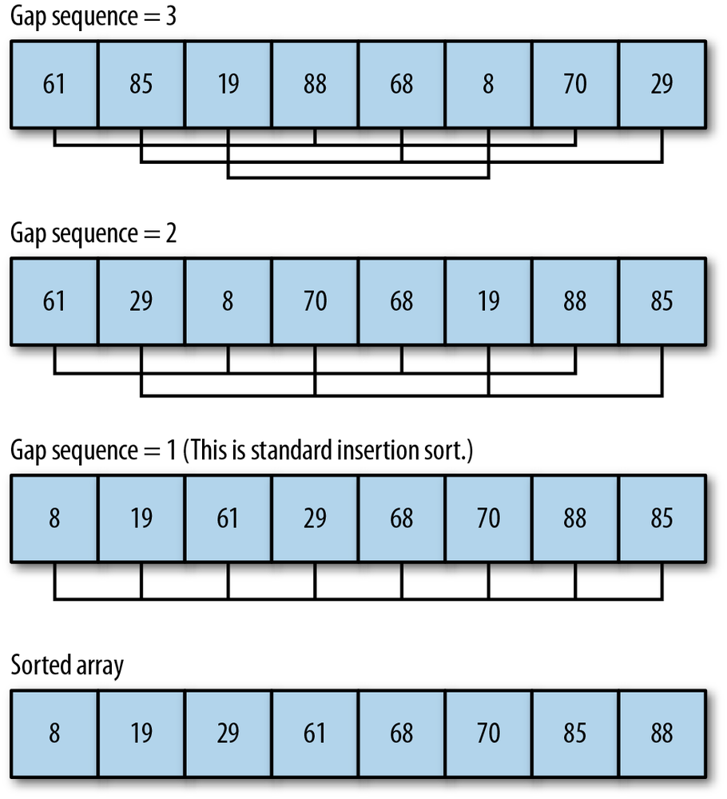

## THE SHELLSORT ALGORITHM

**Shellsort** is named after its inventor, Donald Shell. This algorithm is based on the *insertion sort* but is a big improvement over that basic sorting algorithm. Shellsort’s key concept is that it compares distant elements first, rather than adjacent elements, as is done in the insertion sort. Elements that are far out of place can be put into place more efficiently using this scheme than by simply comparing neighboring elements. As the algorithm loops through the data set, the distance between each element decreases until, when at the end of the data set, the algorithm is comparing elements that are adjacent.

Shellsort works by defining *a gap sequence* that indicates how far apart compared elements are when starting the sorting process. The gap sequence can be defined dynamically, but for most practical applications, you can predefine the gap sequence the algorithm will use. There are several published gap sequences that produce different results. We are going to use the sequence defined by Marcin Ciura in his paper on best increments for average case of Shellsort (“Best Increments for the Average Case of Shell Sort”, 2001). The gap sequence is: 701, 301, 132, 57, 23, 10, 4, 1. However, before we write code for the average case, we are going to examine how the algorithm works with a small data set.


*The Shellsort algorithm with an initial gap sequence of 3*

Let’s start with a look at the code for the **Shellsort algorithm**:
```
    function shellsort() {
        for (var g = 0; g < this.gaps.length; g++) {

            for (var i = this.gaps[g]; i < this.dataStore.length; i++) {
                var temp = this.dataStore[i];

                for (var j = i; j >= this.gaps[g] && this.dataStore[j - this.gaps[g]] > temp; j -= this.gaps[g]) {
                    this.dataStore[j] = this.dataStore[j - this.gaps[g]];
                }
                this.dataStore[j] = temp;
            }
        }
    }
```

For this program to work with our CArray class test bed, we need to add a definition of the gap sequence to the class definition. Add the following code into the constructor function for CArray:
```
    this.gaps = [5,3,1];
```

And add this function to the code:
```
    function setGaps(arr) {
        this.gaps = arr;
    }
```
Finally, add a reference to the shellsort() function to the CArray class constructor as well as the shellsort() code itself.

The outer loop controls the movement within the gap sequence. In other words, for
  * the first pass through the data set, the algorithm is going to examine elements that are five elements away from each other.
  * The next pass will examine elements that are three elements away from each other.
  * The last pass performs a standard insertion sort on element that are one place away, which means they are adjacent.
By the time this last pass begins, many of the elements will already be in place, and the algorithm won’t have to exchange many elements. This is where the algorithm gains efficiency over insertion sort. Figure illustrates how the Shellsort algorithm works on a data set of 10 random numbers with a gap sequence of 5, 3, 1.

Now let’s put the algorithm to work on a real example. We add a print() statement to shellsort() so that we can follow the progress of the algorithm while it sorts the data set. Each gap pass is noted, followed by the order of the data set after sorting with that particular gap. The program is shown below:
```
    var nums = new CArray(10);
    nums.setData();
    print("Before Shellsort: <br />");
    print(nums.toString());
    print("<br /><br />During Shellsort: <br />");
    nums.shellsort();
    print("<br />After Shellsort: <br />");
    print(nums.toString());
```

The output from this program is:
```
    Before Shellsort:
    5 9 1 2 4 10 3 3 6 4

    During Shellsort:
    5 3 1 2 4 10 9 3 6 4 // gap 5
    2 3 1 4 3 6 5 4 10 9 // gap 3
    1 2 3 3 4 4 5 6 9 10 // gap 1

    After Shellsort:
    1 2 3 3 4 4 5 6 9 10
```

To understand how Shellsort works, compare the initial state of the array with its state after the gap sequence of 5 was sorted. The second element of the initial array, 9, was swapped with the fifth element after it, 3, because 3 < 9.

Now compare the gap 5 line with the gap 3 line. The first element, 5, in the gap 5 line is swapped with the 2 because 2 < 5 and 2 is the third element after the 5. By simply counting the current gap sequence number down from the current element in the loop, and comparing the two numbers, you can trace any run of the Shellsort algorithm.

Having now seen some details of how the Shellsort algorithm works, let’s use a larger gap sequence and run it with a larger data set (100 elements). Here is the output:
```
    Before Shellsort:
    67 93 8 38 83 77 65 87 96 48 47
    18 87 7 73 52 78 8 26 74 60
    91 3 44 65 28 55 0 83 61 38
    47 39 42 74 12 22 36 84 96 47
    3 98 12 9 21 30 53 38 43 39
    10 45 18 50 19 56 5 19 68 35
    73 29 81 4 91 3 30 63 29 72
    99 63 86 72 72 57 41 95 22 4
    36 100 22 4 51 82 45 28 9 63
    6 31 62 4 39 95 91 55 75

    After Shellsort:
    0 3 3 3 4 4 4 4 5 6 7
    8 8 9 9 10 12 12 18 18 19
    19 21 22 22 22 26 28 28 29 29
    30 30 31 35 36 36 38 38 38 39
    39 39 41 42 43 44 45 45 47 47
    47 48 50 51 52 53 55 55 56 57
    60 61 62 63 63 63 65 65 67 68
    72 72 72 73 73 74 74 75 77 78
    81 82 83 83 84 86 87 87 91 91
    91 93 95 95 96 96 98 99 100
```

### Computing a dynamic gap sequence

Robert Sedgewick, defines a *shellsort()* function that uses a formula to dynamically compute the gap sequence to use with Shellsort. Sedgewick’s algorithm determines the initial gap value using the following code fragment:
```
    var N = this.dataStore.length;
    var h = 1;
    while(h < N/3){
        h = 3 * h + 1;
    }
```

Once the gap value is determined, the function works like our previous shellsort() function, except the last statement before going back into the outer loop computes a new gap value:
```
    h = (h-1)/3;
```

Here is the definition of **shellsort1()** function:
```
    function shellsort1() {
        var N = this.dataStore.length,
            h = 1;

        while (h < N/3) {
            h = 3 * h + 1;
        }

        while (h >= 1) {
            for (var i = h; i < N; i++) {
                for (var j = i; j >= h && this.dataStore[j] < this.dataStore[j - h]; j -= h) {
                    swap(this.dataStore, j , j-h);
                }
            }
            h = (h-1)/3;
        }
    }
```

Test program:
```
    var nums = new CArray(100);
    nums.setData();
    print("Before Shellsort1: <br />");
    print(nums.toString());
    nums.shellsort1();
    print("<br />After Shellsort1: <br />");
    print(nums.toString());
```

The output from this program is:
```
    Before Shellsort1:
    50 16 49 39 2 9 67 59 37 58 72
    91 91 95 9 95 58 99 60 79 77
    10 87 59 4 24 9 78 17 37 46
    96 57 38 61 75 16 74 57 23 30
    44 69 24 48 9 87 80 54 2 61
    10 97 88 98 52 0 81 81 4 6
    57 51 47 16 5 22 27 68 8 56
    90 96 65 30 73 2 10 91 84 49
    46 55 62 10 24 75 11 44 37 22
    71 10 61 35 50 24 31 19 39

    After Shellsort1:
    0 2 2 2 4 4 5 6 8 9 9
    9 9 10 10 10 10 10 11 16 16
    16 17 19 22 22 23 24 24 24 24
    27 30 30 31 35 37 37 37 38 39
    39 44 44 46 46 47 48 49 49 50
    50 51 52 54 55 56 57 57 57 58
    58 59 59 60 61 61 61 62 65 67
    68 69 71 72 73 74 75 75 77 78
    79 80 81 81 84 87 87 88 90 91
    91 91 95 95 96 96 97 98 99
```

we need to compare the efficiency of our two shellsort() functions. A program that compares running times of the two functions is shown below:
```
    var nums = new CArray(10000);
    nums.setData();
    var start = new Date().getTime();
    nums.shellsort();
    var stop = new Date().getTime();
    var elapsed = stop - start;
    print("Shellsort with hard-coded gap sequence: " + elapsed + " ms.");
    nums.clear();
    nums.setData();
    start = new Date().getTime();
    nums.shellsort1();
    stop = new Date().getTime();
    print("Shellsort with dynamic gap sequence: " + elapsed + " ms.");
```

The results from this program are:
```
    Shellsort with hard-coded gap sequence: 20 ms.
    Shellsort with dynamic gap sequence: 20 ms.
```

Both algorithms sorted the data in the same amount of time. Here is the output from running the program with 100,000 data elements:
```
    Shellsort with hard-coded gap sequence: 1189 ms.
    Shellsort with dynamic gap sequence: 1189 ms.
```
Clearly, both of these algorithms sort data with the same efficiency, so you can use either of them with confidence.

## Complexity

| Name                  | Best            | Average             | Worst               | Memory    | Stable    | Comments  |
| --------------------- | :-------------: | :-----------------: | :-----------------: | :-------: | :-------: | :-------- |
| **Shell sort**        | n&nbsp;log(n)   | depends on gap sequence   | n&nbsp;(log(n))<sup>2</sup>  | 1         | No         |
