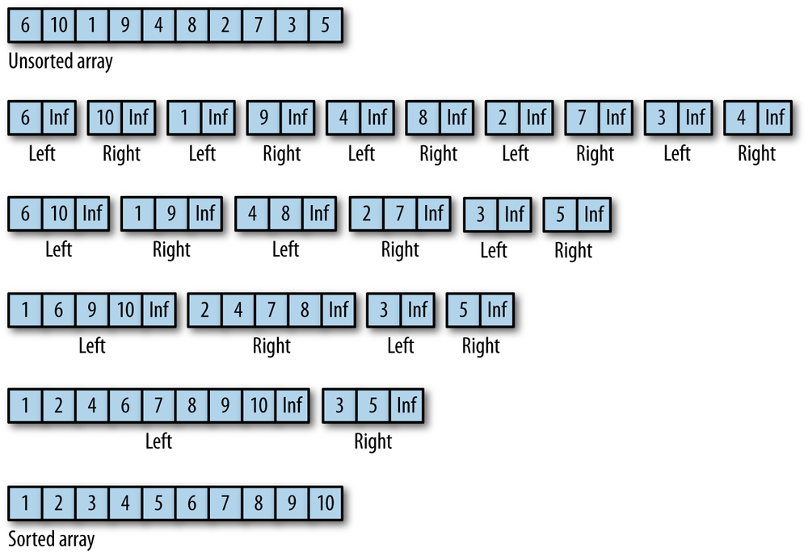

## THE MERGESORT ALGORITHM

The Mergesort algorithm is so named because it works by merging sorted sublists together to form a larger, completely sorted list. In theory, this algorithm should be easy to implement. We need two sorted subarrays and a third array into which we merge the two subarrays by comparing data elements and inserting the smallest element value. In practice, however, Mergesort has some problems because if we are trying to sort a very large data set using the algorithm, the amount of space we need to store the two merged subarrays can be quite large. Since space is not such an issue in these days of inexpensive memory, it is worth implementing Mergesort to see how it compares in efficiency to other sorting algorithms.


### Top-down Mergesort

It is customary, though not necessary, to implement Mergesort as a recursive algorithm. However, it is not possible to do so in JavaScript, as the recursion goes too deep for the language to handle. Instead, we will implement the algorithm in a *nonrecursive way*, using a strategy called **bottom-up Mergesort**.

### Bottom-up Mergesort

The nonrecursive, or iterative, version of Mergesort is referred to as a *bottom-up process*. The algorithm begins by breaking down the data set being sorted into a set of one-element arrays. Then these arrays are slowly merged by creating a set of left and right subarrays, each holding the partially sorted data until all that is left is one array with the data perfectly sorted. Below Figure illustrates how the bottom-up Mergesort algorithm works.



Before we show you the JavaScript code for Mergesort, here is the output from a JavaScript program that uses bottom-up Mergesort to sort an array of 10 integers:
```
    6,10,1,9,4,8,2,7,3,5

    left array -  6,Infinity
    right array -  10,Infinity
    left array -  1,Infinity
    right array -  9,Infinity
    left array -  4,Infinity
    right array -  8,Infinity
    left array -  2,Infinity
    right array -  7,Infinity
    left array -  3,Infinity
    right array -  5,Infinity
    left array -  6,10,Infinity
    right array -  1,9,Infinity
    left array -  4,8,Infinity
    right array -  2,7,Infinity
    left array -  1,6,9,10,Infinity
    right array -  2,4,7,8,Infinity
    left array -  1,2,4,6,7,8,9,10,Infinity
    right array -  3,5,Infinity

    1,2,3,4,5,6,7,8,9,10
```
The value *Infinity* is used as a sentinel value to indicate the end of either the left or right subarray.

Each array element starts out in its own left or right array. Then the two arrays are merged, first into two elements each, then into four elements each, except for 3 and 5, which stay apart until the last iteration, when they are combined into the right array and then merged into the left array to re-form the original array.

Here is the Mergesort JavaScript implementation:
```
    function mergeSort(arr) {
        if(arr.length < 2){
            return;
        }

        var step = 1,
            left, right;

        while (step < arr.length) {
            left = 0;
            right = step;

            while (right + step <= arr.length) {
                mergeArrays(arr, left, left+step, right, right+step);
                left = right + step;
                right = left + step;
            }

            if (right < arr.length) {
                mergeArrays(arr, left, left+step, right, arr.length);
            }

            step *= 2;
        }
    }

    function mergeArrays(arr, startLeft, stopLeft, startRight, stopRight) {
        var rightArr = new Array(stopRight - startRight + 1),
            leftArr = new Array(stopLeft - startLeft + 1),
            k = startRight;
       for (var i = 0; i < (rightArr.length-1); i++) {
          rightArr[i] = arr[k];
          k++;
       }

       k = startLeft;
       for (var i = 0; i < (leftArr.length-1); i++) {
          leftArr[i] = arr[k];
          k++;
       }

       rightArr[rightArr.length-1] = Infinity; // a sentinel value
       leftArr[leftArr.length-1] = Infinity; // a sentinel value

       var m = 0, n = 0;
       for (var k = startLeft; k < stopRight; k++) {
          if (leftArr[m] <= rightArr[n]) {
             arr[k] = leftArr[m];
             m++;
          }
          else {
             arr[k] = rightArr[n];
             n++;
          }
       }
       print("<br />left array - "+ leftArr);
       print("<br />right array - "+ rightArr);
    }
```

The key feature of the mergeSort() function is the step variable, which is used to control the size of the leftArr and rightArr subarrays found in the mergeArrays() function. By controlling the size of the subarrays, the sort process is relatively efficient, since it doesn’t take much time to sort a small array. This makes merging efficient also, since it is much easier to merge data into sorted order when the unmerged data is already sorted.

## Complexity

| Name                  | Best            | Average             | Worst               | Memory    | Stable    | Comments  |
| --------------------- | :-------------: | :-----------------: | :-----------------: | :-------: | :-------: | :-------- |
| **Merge sort**        | n&nbsp;log(n)   | n&nbsp;log(n)       | n&nbsp;log(n)       | n         | Yes       |           |
