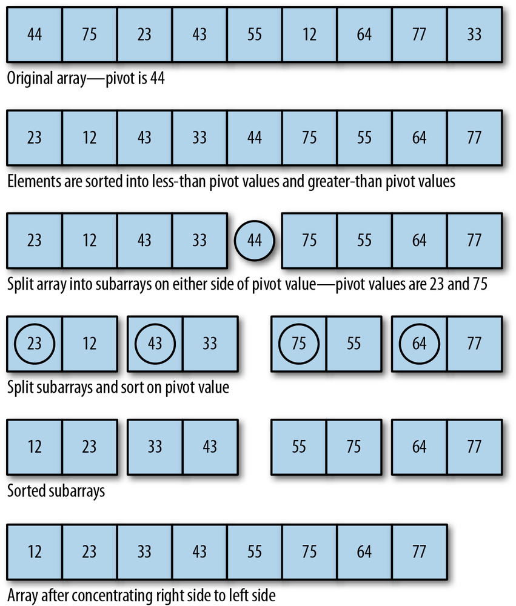

## The Quicksort Algorithm

The **Quicksort algorithm** is one of the fastest sorting algorithms for large data sets. Quicksort is a *divide-and-conquer* algorithm that recursively breaks a list of data into successively smaller sublists consisting of the smaller elements and the larger elements. The algorithm continues this process until all the data in the list is sorted.

The algorithm divides the list into sublists by selecting one element of the list as a **pivot**. Data is sorted around the pivot by moving elements less than the pivot to the bottom of the list and elements that are greater than the pivot to the top of the list.



### Algorithm and pseudocode for the Quicksort algorithm

The algorithm for Quicksort is:
1. Pick a pivot element that divides the list into two sublists.
2. Reorder the list so that all elements less than the pivot element are placed before the pivot and all elements greater than the pivot are placed after it.
3. Repeat steps 1 and 2 on both the list with smaller elements and the list of larger elements.

This algorithm then translates into the following JavaScript program:
```
    function quicksort(arr) {
        if(arr.length < 2){
            return;
        }
        var left = [],
            right = [],
            pivot = arr[0];

        for (var i = 1; i < arr.length; i++) {
            if (arr[i] < pivot) {
                left.push(arr[i])
            }
            else{
                right.push(arr[i])
            }
        }
        return quicksort(left).concat(pivot, quicksort(right))
    }
```

  * The function first tests to see if the array has a length of 0.
  * If so, then the array doesn’t need sorting and the function returns. Otherwise, two arrays are created, one to hold the elements lesser than the pivot and the other to hold the elements greater than the pivot.
  * The pivot is then selected by selecting the first element of the array.
  * Next, the function loops over the array elements and places them in their proper array based on their value relative to the pivot value.
  * The function is then called recursively on both the left array and the right array.
  * When the recursion is complete, the right array is concatenated to the left array to form the sorted array and is returned from the function.

Let’s test the algorithm with some data.
```
    var a = [];
    for (var i = 0; i < 10; ++i) {
       a[i] = Math.floor((Math.random()*100)+1);
    }
    print(a);
    print("<br />");
    print(quicksort(a));
```

The output from this program is:
```
    28,82,64,81,63,7,96,93,15,67
    7,15,28,63,64,67,81,82,93,96
```

The Quicksort algorithm is best to use on large data sets; its performance degrades for smaller data sets.

To better demonstrate how Quicksort works, this next program highlights the pivot as it is chosen and how data is sorted around the pivot:
```
    57,98,50,91,22,10,74,87,27,19
    pivot: 57 current element: 98
    moving 98 to the right
    pivot: 57 current element: 50
    moving 50 to the left
    pivot: 57 current element: 91
    moving 91 to the right
    pivot: 57 current element: 22
    moving 22 to the left
    pivot: 57 current element: 10
    moving 10 to the left
    pivot: 57 current element: 74
    moving 74 to the right
    pivot: 57 current element: 87
    moving 87 to the right
    pivot: 57 current element: 27
    moving 27 to the left
    pivot: 57 current element: 19
    moving 19 to the left
    pivot: 50 current element: 22
    moving 22 to the left
    pivot: 50 current element: 10
    moving 10 to the left
    pivot: 50 current element: 27
    moving 27 to the left
    pivot: 50 current element: 19
    moving 19 to the left
    pivot: 22 current element: 10
    moving 10 to the left
    pivot: 22 current element: 27
    moving 27 to the right
    pivot: 22 current element: 19
    moving 19 to the left
    pivot: 10 current element: 19
    moving 19 to the right
    pivot: 98 current element: 91
    moving 91 to the left
    pivot: 98 current element: 74
    moving 74 to the left
    pivot: 98 current element: 87
    moving 87 to the left
    pivot: 91 current element: 74
    moving 74 to the left
    pivot: 91 current element: 87
    moving 87 to the left
    pivot: 74 current element: 87
    moving 87 to the right
    10,19,22,27,50,57,74,87,91,98
```


## Complexity

| Name                  | Best            | Average             | Worst               | Memory    | Stable    | Comments  |
| --------------------- | :-------------: | :-----------------: | :-----------------: | :-------: | :-------: | :-------- |
| **Quick sort**        | n&nbsp;log(n)   | n&nbsp;log(n)       | n<sup>2</sup>       | log(n)    | No        |  Quicksort is usually done in-place with O(log(n)) stack space |
