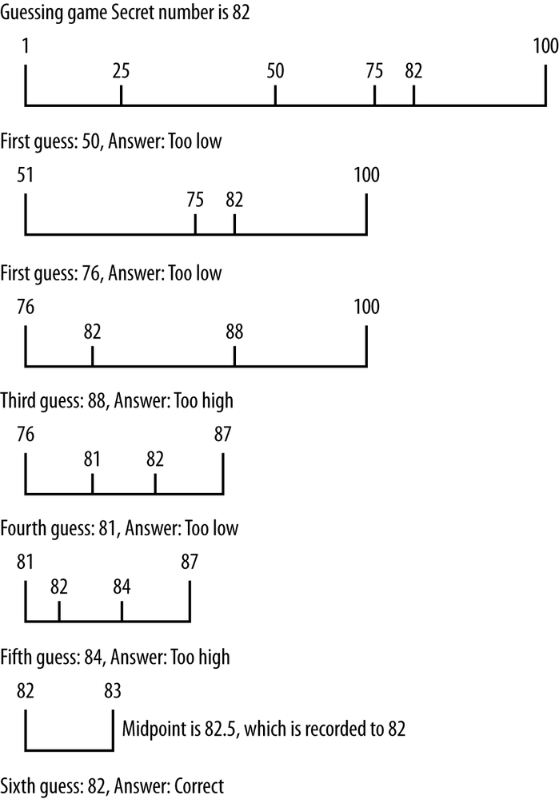

## Binary Search

When the data you are searching for are sorted, a more efficient search than the sequential search is the **binary search**. To understand how binary search works, imagine you are playing a number-guessing game where the possible number is between 1 and 100, and you have to guess the number as chosen by a friend. According to the rules, for every guess you make, your friend has three responses:

1. The guess is correct.
2. The guess is too high.
3. The guess is too low.

Following these rules, the best strategy is to choose the number 50 as your first guess. If that guess is too high, choose 25. If 50 is too low, you should guess 75. For each guess, you choose a midpoint by adjusting the lower range or the upper range of the numbers (depending on whether your guess is too low or too high). This midpoint becomes your new guess. As long as you follow this strategy, you will guess the correct number in the minimum possible number of guesses.



We can implement this strategy as the binary search algorithm. This algorithm only works on a sorted data set.

Here is the algorithm:
1. Set a lower bound to the first position of the array (0).

2. Set an upper bound to the last element of the array (length of array minus 1).

3. While the lower bound is less than or equal to the upper bound, do the following steps:

    1. Set the midpoint as (upper bound minus lower bound) divided by 2.

    2. If the midpoint element is less than the data being searched for, set a new lower bound to the midpoint plus 1.

    3. If the midpoint element is greater than the data being searched for, set a new upper bound to the midpoint minus 1.

    4. Otherwise, return the midpoint as the found element.

> **Note :** Insertion Sort is used to sort the array and then the array is passed to binary search algorithm.

Here is the definition of **binSearch()** function:
```
    function binSearch(arr, data) {
        var upperBound = arr.length - 1;
        var lowerBound = 0;
        while (lowerBound <= upperBound) {
            var mid = Math.floor((upperBound + lowerBound) / 2);
            if(arr[mid] < data){
                lowerBound = mid + 1;
            }
            else if (arr[mid] > data) {
                upperBound = mid-1;
            }
            else {
                return mid;
            }
        }
        return -1;
    }
```

A small program to test the function:
```
    var nums = [];
    for (var i = 0; i < 100; ++i) {
       nums[i] = Math.floor(Math.random() * 101);
    }
    insertionSort(nums);
    dispArr(nums);
    print();
    var val = 37;
    var retVal = binSearch(nums, val);
    if (retVal >= 0) {
       print("Found " + val + " at position " + retVal);
    }
    else {
       print(val + " is not in array.");
    }
```
Here is the output:
```
    0 0 4 4 4 6 6 9 10 10 10
    12 12 12 12 13 13 14 14 16 17
    18 19 20 21 23 23 25 25 26 27
    28 29 29 33 34 37 37 44 44 47
    48 51 51 52 53 54 55 56 56 57
    58 58 59 59 60 61 62 63 64 64
    64 66 66 66 67 69 69 70 70 71
    71 71 72 72 74 74 75 78 79 80
    81 81 81 83 86 86 87 88 88 88
    89 90 92 92 93 96 97 97 99
    Found 37 at position 36
```

### COUNTING OCCURRENCES

When the *binSearch()* function finds a value, if there are other occurrences of the same value in the data set, the function will be positioned in the immediate vicinity of other like values. In other words, *other occurrences* of the same value will either be to the *immediate left* of the found value’s position or to the *immediate right* of the found value’s position.

Here’s an example
```
    0 1 2 3 5 7 7 8 8 9 10
    11 11 13 13 13 14 14 14 15 15
    18 18 19 19 19 19 20 20 20 21
    22 22 22 23 23 24 25 26 26 29
    31 31 33 37 37 37 38 38 43 44
    44 45 48 48 49 51 52 53 53 58
    59 60 61 61 62 63 64 65 68 69
    70 72 72 74 75 77 77 79 79 79
    83 83 84 84 86 86 86 91 92 93
    93 93 94 95 96 96 97 98 100
    Found 37 at position 45
```

If you count the position of each element, the number 37 found by the function is the one that is in the middle of the three occurrences of 37. This is just the nature of how the binSearch() function works.

Here is definition of the **count()** function.
```
    function count(arr, data) {
        var count = 0;
        var position = binSearch(arr, data);
        if (position > -1) {
            count++;
            for (var i = position-1; i > 0; i--) {
                if(arr[i] == data){
                    count++;
                }
                else {
                    break;
                }
            }
            for (var i = position+1; i < arr.length; i++) {
                if (arr[i] == data) {
                    count++;
                }
                else {
                    break;
                }
            }
        }
        return count;
    }
```
The function starts
* by calling the **binSearch()** function to search for the specified value.
* If the value is found in the data set, then the function begins counting occurrences by calling two for loops.
* The first loop works its way down the array, counting occurrences of the found value, stopping when the next value in the array doesn't match the found value.
* The second for loop works its way up the array, counting occurrences and stopping when the next value in the array doesn't match the found value.

Here is a test program:
```
    function count(arr, data) {
        var count = 0;
        var position = binSearch(arr, data);
        if (position > -1) {
            count++;
            for (var i = position-1; i > 0; i--) {
                if(arr[i] == data){
                    count++;
                }
                else {
                    break;
                }
            }
            for (var i = position+1; i < arr.length; i++) {
                if (arr[i] == data) {
                    count++;
                }
                else {
                    break;
                }
            }
        }
        return count;
    }
```

Here is a sample run of the program:
```
    1 1 2 4 4 5 5 6 7 9 10
    10 10 11 13 14 18 19 19 21 22
    23 23 24 26 27 28 30 30 30 33
    34 36 37 39 41 42 42 45 45 45
    45 46 47 49 51 51 52 52 53 53
    53 56 57 57 57 57 58 58 60 61
    62 66 67 68 69 70 70 71 72 73
    74 74 76 77 78 80 80 80 80 83
    84 85 86 88 90 91 92 92 94 94
    95 95 95 95 96 96 98 99 100
    Found 4 occurrences of 45.
```

## Complexity

**Time Complexity**: `O(log(n))` - since we split search area by two for every
next iteration.
