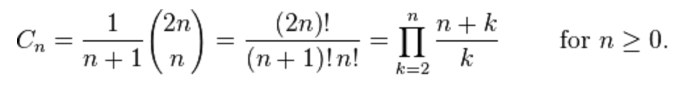

# Generate all balanced bracket combinations

For this popular algorithm interview question, your goal is to print all possible balanced parenthesis combinations up to N. For example:
```
    N = 2
    (()), ()()

    N = 3
    ((())), (()()), (())(), ()(()), ()()()
```

## Algorithm

We will implement a recursive function to solve this challenge. The idea is:
```
    (1) Add a left bracket to a newly created string.
    (2) If a left bracket was added, potentially add a new left bracket and add a right bracket.
    (3) After each of these steps we add the string to an array that stores all bracket combinations.
```

This recursive solution might be hard to see at first, but using N = 2 as an example, the steps taken are:

N = 2
create (
create ()

N = 1
create ((
create ()(

N = 0
add (())
add ()()

Done when N = 0

### Running time

The number of sets that can be generated is related to the Catalan numbers. Therefore, an upper bound on the running time of this algorithm is the following formula plus the time needed to append to a string and push to an array.


