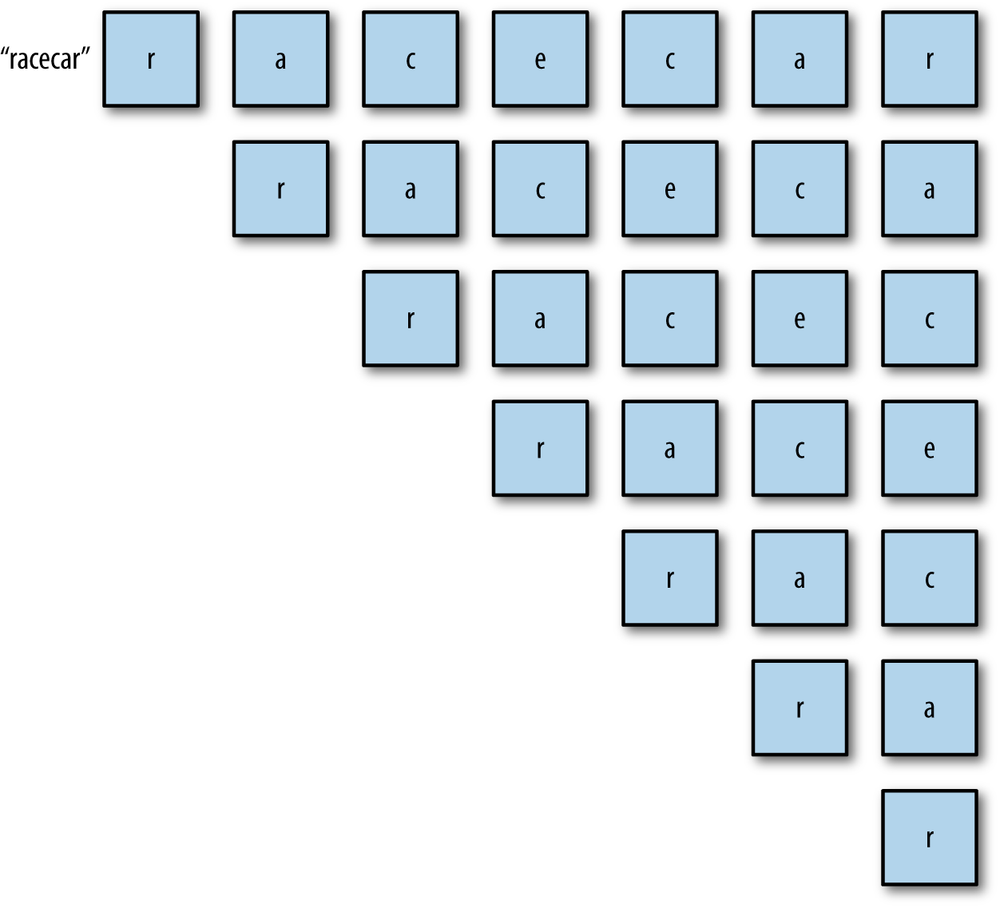

## PALINDROMES

A palindrome is a word, phrase, or number that is spelled the same forward and backward. For example, “dad” is a palindrome; “racecar” is a palindrome; “A man, a plan, a canal: Panama” is a palindrome if you take out the spaces and ignore the punctuation; and 1,001 is a numeric palindrome.

We can use a stack to determine whether or not a given string is a palindrome. We take the original string and push each character onto a stack, moving from left to right. When the end of the string is reached, the stack contains the original string in reverse order, with the last letter at the top of the stack and the first letter at the bottom of the stack, as shown below



Once the complete original string is on the stack, we can create a new string by popping each letter the stack. This process will create the original string in reverse order. We then simply compare the original string with the reversed work, and if they are equal, the string is a palindrome.

```
    function isPalindrome(word) {
        var s = new Stack();

        for (var i = 0; i < word.length; i++) {
            s.push(word[i])
        }

        var reverseWord = "";

        while(s.length() > 0){
            reverseWord += s.pop();
        }

        if(word == reverseWord){
            return true;
        }
        return false;
    }

    var word = "hello";
    if (isPalindrome(word)) {
        print(word + " is a palindrome.");
    }
    else {
        print(word + " is not a palindrome.");
    }
    word = "racecar"
    if (isPalindrome(word)) {
        print(word + " is a palindrome.");
    }
    else {
        print(word + " is not a palindrome.");
    }
```
The output from this program is:
```
    hello is not a palindrome.
    racecar is a palindrome.
```
