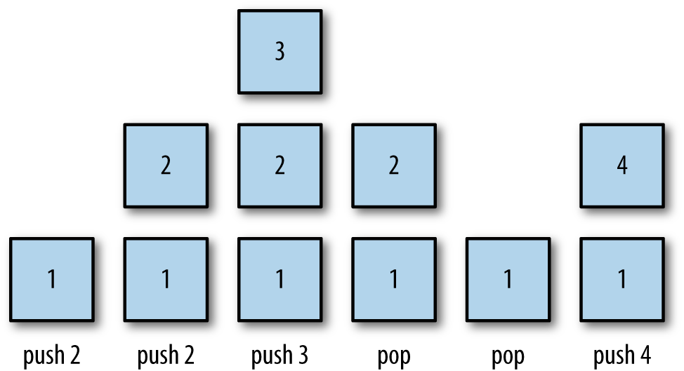

# Stacks

**Stacks** are one of the most common data structures that one can think of. They are ubiquitous in both personal and professional setups. Stacks are a **last in first out (LIFO)** data structure, that provides some common operations, such as push, pop, peek, clear, and size.

## Stack Operations

A stack is a list of elements that are accessible only from one end of the list, which is called the **top**. One common, real-world example of a stack is the stack of trays at a cafeteria. Trays are always removed from the top, and when trays are put back on the stack after being washed, they are placed on the top of the stack. The stack is known as a last-in, first-out (LIFO) data structure.

Because of the last-in, first-out nature of the stack, any element that is not currently at the top of the stack cannot be accessed. To get to an element at the bottom of the stack, you have to dispose of all the elements above it first.

The two primary operations of a stack are adding elements to a stack and taking elements off a stack. Elements are added to a stack using the *push* operation. Elements are taken off a stack using the *pop* operation.

[]

Another common operation on a stack is viewing the element at the top of a stack. The pop operation visits the top element of a stack, but it permanently removes the element from a stack. The *peek* operation returns the value stored at the top of a stack without removing it from the stack.

To keep track of where the top element is, as well as keeping track of where to add a new element, we use a *top* variable that is incremented when we push new elements onto the stack and is decremented when we pop elements off the stack.

While pushing, popping, and peeking are the primary operations associated with a stack, there are other operations we need to perform and properties we need to examine. The *clear* operation removes all the elements from a stack. The *length* property holds the number of elements contained in a stack. We also define an empty property to let us know if a stack has no elements in it, though we can use the length property for this as well.

* [Stack Implementation](01_Stack_Implementation)
