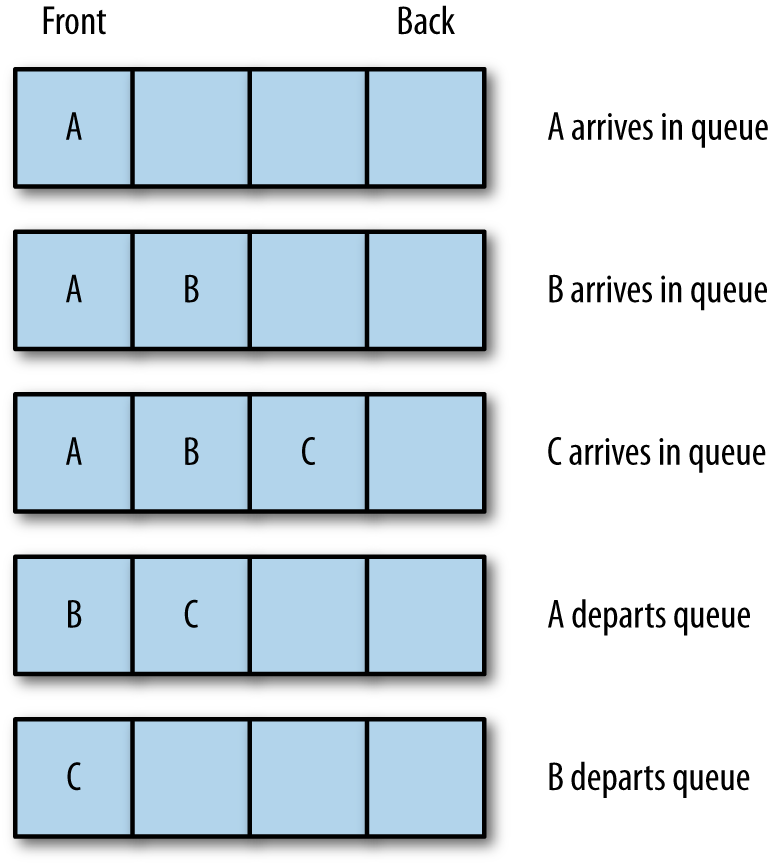

# Queues

A **queue** is a type of list where data are inserted at the end and are removed from the front. Queues are used to store data in the order in which they occur, as opposed to a stack, in which the last piece of data entered is the first element used for processing. Think of a queue like the line at your bank, where the first person into the line is the first person served, and as more customers enter a line, they wait in the back until it is their turn to be served.

A queue is an example of a **first-in, first-out (FIFO)** data structure. Queues are used to order processes submitted to an operating system or a print spooler, and simulation applications use queues to model scenarios such as customers standing in the line at a bank or a grocery store.

## Types of queue

Before we begin understanding queues, let's quickly take a look at the types of queues that we may want to use in our applications:

* **Simple queue**: In a simple FIFO queue, the order is retained and data leaves in the same order in which it comes in
* **Priority queue**: A queue in which the elements are given a predefined priority
* **Circular queue**: Similar to a simple queue, except that the back of the queue is followed by the front of the queue
* **Double ended queue (Dequeue)**: Similar to the simple queue but can add or remove elements from either the front or the back of the queue

## Queue Operations

The two primary operations involving queues are inserting a new element into a queue and removing an element from a queue. The insertion operation is called *enqueue*, and the removal operation is called *dequeue*. The enqueue operation inserts a new element at the end of a queue, and the dequeue operation removes an element from the front of a queue.

> **Note:** An abstract data collection in which the elements can be added to the back called *enqueue* and removed from the front called *dequeue* which makes it a FIFO data structure.

Another important queue operation is viewing the element at the front of a queue. This operation is called **peek**. The peek operation returns the element stored at the front of a queue without removing it from the queue. Besides examining the front element, we also need to know how many elements are stored in a queue, which we can satisfy with the *length* property; and we need to be able to remove all the elements from a queue, which is performed with the *clear* operation.

* [Queue Implementation](01_Queue_Implementation)
* [Using Queue Class](02_Using_Queue_Class)
* [Priority Queues](03_Priority_Queue)
