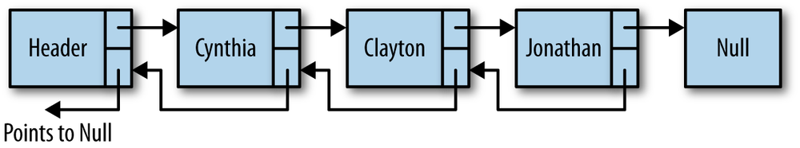
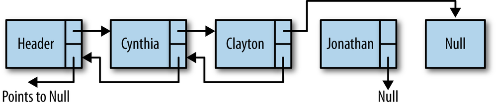

## Doubly Linked Lists

Although traversing a linked list from the first node to the last node is straightforward, it is not as easy to traverse a linked list backward. We can simplify this procedure if we add a property to our Node class that stores a link to the previous node. When we insert a node into the list, we’ll have to perform more operations to assign the proper links for the next and previous nodes, but we gain efficiency when we have to remove a node from the list, since we no longer have to search for the previous node.



Our first task is to assign a *previous property* to our Node class:
```
    function Node(element) {
        this.element = element;
        this.next = null;
        this.previous = null;
    }
```

The **insert()** function for a doubly linked list is similar to the insert() function for the singly linked list, except that we have to set the new node’s previous property to point to the previous node. Here is the definition:
```
    function insert(newElement, item) {
        var newNode = new Node(newElement);
        var current = this.find(item);
        newNode.next = current.next;
        newNode.previous = current;
        current.next = newNode;
    }
```

The **remove()** function for a doubly linked list is more efficient than for a singly linked list because we don’t have to find the previous node. We first need to find the node in the list that is storing the data we want to remove. Then we set that node’s previous property to the node pointed to by the deleted node’s next property. Then we need to redirect the previous property of the node the deleted node points to and point it to the node before the deleted node.



Here is the code for the **remove()** function:
```
    function remove(item) {
        var currNode = this.find(item);
        if(currNode.next != null){
            currNode.previous.next = currNode.next;
            currNode.next.previous = currNode.previous;
            currNode.next = null;
            currNode.previous = null;
        }
    }
```

In order to perform tasks such as displaying a linked list in reverse order, we can use a utility function that finds the last node in a doubly linked list. The following function, **findLast()**, moves us to the last node of a list without going past the end of the list:
```
    function findLast() {
        var currNode = this.head;
        while (currNode.next != null) {
            currNode = currNode.next;
        }
        return currNode;
    }
```

With the *findLast()* function written, we can write a function to display the elements of a doubly linked list in reverse order. Here is the code for the **dispReverse()** function:
```
    function dispReverse() {
        var currNode = this.findLast();
        while (currNode.previous != null) {
            print(currNode.element);
            currNode = currNode.previous;
        }
    }
```

The last task to accomplish is to add these new functions to the constructor function for the doubly linked list class, as well as a short program to test the code.
```
    function DLinkedList() {
        this.head = new Node("head");
        this.find = find;
        this.insert = insert;
        this.remove = remove;
        this.display = display;
        this.findLast = findLast;
        this.dispReverse = dispReverse;
    }
```
```
    var cities = new DLinkedList();
    cities.insert("Conway", "head");
    cities.insert("Russellville", "Conway");
    cities.insert("Carlisle", "Russellville");
    cities.insert("Alma", "Carlisle");
    cities.display();
    print("");
    cities.remove("Carlisle");
    cities.display();
    print("");
    cities.dispReverse();
```
The output is:
```
    Conway
    Russellville
    Carlisle
    Alma

    Conway
    Russellville
    Alma

    Alma
    Russellville
    Conway
```
