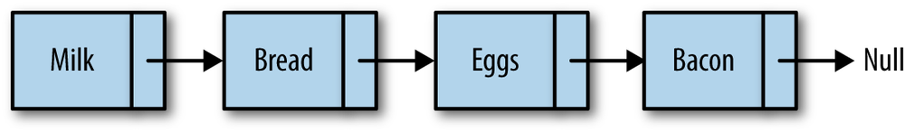
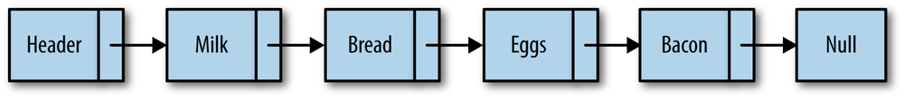
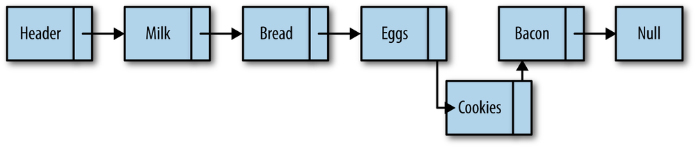
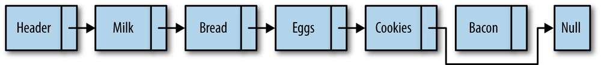

# Linked Lists

A linked list is a collection of objects called **nodes**. Each node is linked to a successor node in the list using an object reference. The reference to another node is called a **link**.

While array elements are referenced by their position, linked list elements are referenced by their relationship to the other elements of the linked list. In figure, we say that “bread” follows “milk”, not that “bread” is in the second position. Moving through a linked list involves following the links of the list from the beginning node to the end node (not including the header node, which is sometimes used as a hook for entry into a linked list). Something else to notice in the figure is that we mark the end of a linked list by pointing to a null node.

Marking the beginning of a linked list can be a problem. Many linked-list implementations include a special node, called the **head**, to denote the beginning of a linked list. The linked list shown in above figure is redesigned in the following figure to include a head node.

Inserting a new node into a linked list is a very efficient task. To insert a new node, the link of the node before the inserted node (the previous node) is changed to point to the new node, and the new node’s link is set to the node the previous node was pointing to before the insertion. The figure illustrates how “cookies” is added to the linked list after “eggs.”

Removing an item from a linked list is also easy to do. The link of the node before the removed node is redirected to point to the node the removed node is pointing to, while also pointing the removed node to null, effectively taking the node out of the linked list. The figure shows how “bacon” is removed from the linked list.

There are other functions we can perform with a linked list, but insertion and removal are the two functions that best describe why linked lists are so useful.

* [An Object-Based Linked List Design](01_Linked_List_Design)
* [Doubly Linked Lists](02_Doubly_Linked_Lists)
* [Circularly Linked Lists](03_Circularly_Linked_Lists)
