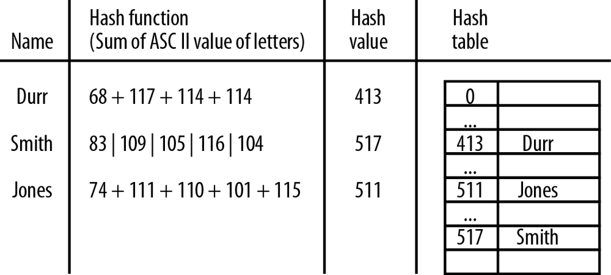

# Hashing

Hashing is a common technique for storing data in such a way that the data can be inserted and retrieved very quickly. Hashing uses a data structure called a *hash table*. Although hash tables provide fast insertion, deletion, and retrieval, they perform poorly for operations that involve searching, such as finding the minimum and maximum values in a data set. For these operations, other data structures such as the binary search tree are more appropriate. We’ll learn how to implement a hash table in this chapter and learn when it’s appropriate to use hashing as a data storage and retrieval technique.

## An Overview of Hashing

The hash table data structure is designed around an array. The array consists of elements 0 through some predetermined size, though we can increase the size when necessary. Each data element is stored in the array based on an associated data element called the *key*, which is similar to the concept of the key we examined with the dictionary data structure. To store a piece of data in a hash table, the key is mapped into a number in the range of 0 through the hash table size, using a *hash function*.

Ideally, the hash function stores each key in its own array element. However, because there are an unlimited number of possible keys and a limited number of array elements (theoretical in JavaScript), a more realistic goal of the hash function is to attempt to distribute the keys as evenly as possible among the elements of the array.

Even with an efficient hash function, it is possible for two keys to hash (the result of the hash function) to the same value. This is called a *collision*, and we need a strategy for handling collisions when they occur. We’ll discuss how to deal with collisions in detail later in the chapter.

The last thing we have to determine when creating a hash function is how large an array to create for the hash table. One constraint usually placed on the array size is that it should be a prime number. We will explain why this number should be prime when we examine the different hash functions. After that, there are several different strategies for determining the correct array size, all of them based on the technique used to handle collisions, so we will examine this issue when we discuss handling collisions. Figure illustrates the concept of hashing using the example of a small phone book.

* [A Hash Table Class](01_Hash_Table_Class)
* [STORING AND RETRIEVING DATA IN A HASH TABLE](02_Store_Retrieve_Data)
* [Handling Collisions](03_Handling_Collisions)
