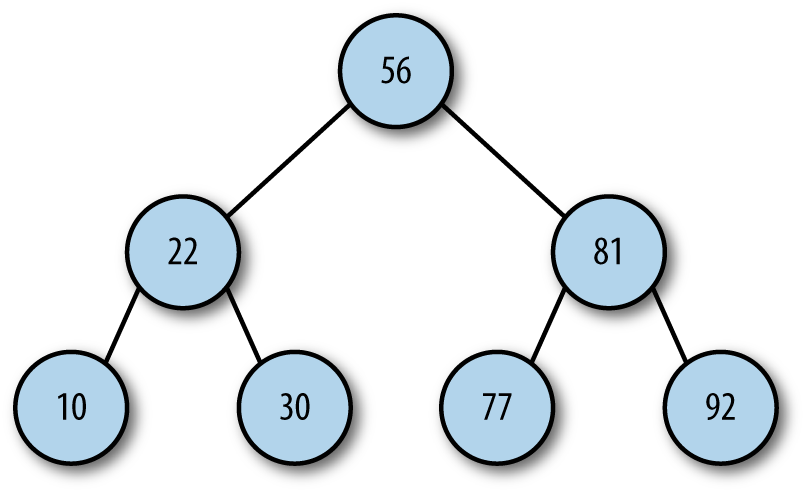
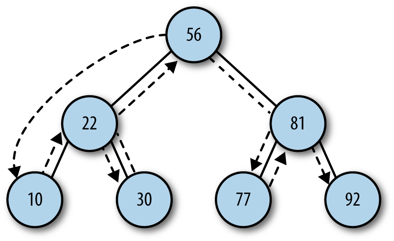
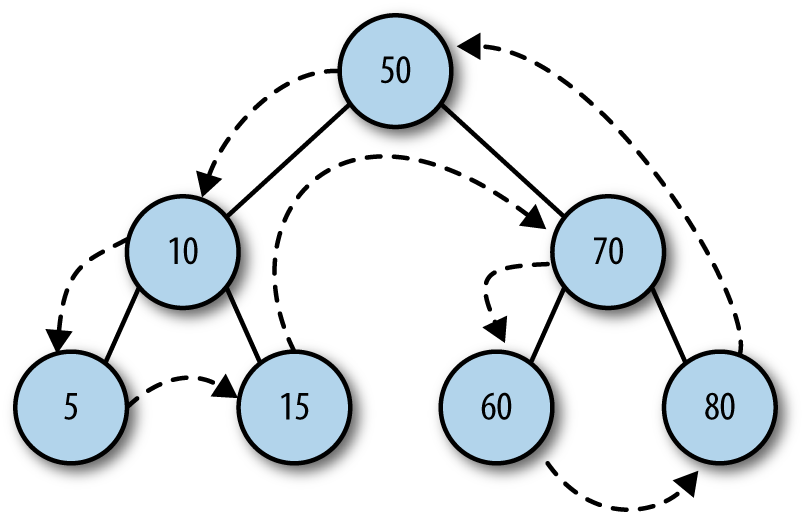
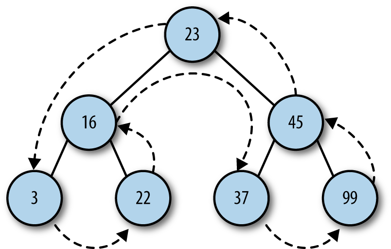

## Binary Trees and Binary Search Trees

As mentioned earlier, a *binary tree* is one where each node can have no more than two children. By limiting the number of children to two, we can write efficient programs for inserting data, searching for data, and deleting data in a tree.

Before we discuss building a binary tree in JavaScript, we need to add two terms to our tree lexicon. The child nodes of a parent node are referred to as the *left node* and the *right node*. For certain binary tree implementations, certain data values can be stored only in left nodes, and other data values must be stored in right nodes. An example binary tree is shown in figure below



Identifying the child nodes is important when we consider a more specific type of binary tree, the *binary search tree*. A binary search tree is a binary tree in which data with lesser values are stored in left nodes and data with greater values are stored in right nodes. This property provides for very efficient searches and holds for both numeric data and non-numeric data, such as words and strings.

### BUILDING A BINARY SEARCH TREE IMPLEMENTATION

A binary search tree is made up of nodes, so the first object we need to create is a Node object, which is similar to the *Node object* we used with linked lists. The definition for the **Node class** is:
```
    function Node(data, left, right) {
        this.data = data;
        this.left = left;
        this.right = right;
        this.show = show;
    }

    function show() {
        return this.data;
    }
```
The Node object stores both data and links to other nodes (left and right). There is also a *show()* function for displaying the data stored in a node.

Now we can build a class to represent a binary search tree (BST). The class consists of just one data member: a Node object that represents the root node of the BST. The constructor for the class sets the root node to null, creating an empty node.

The first function we need for the BST is **insert()**, to add new nodes to the tree. This function is complex and requires explanation.

  * The first step in the function is to create a Node object, passing in the data the node will store.

  * The second step in insertion is to check the BST for a root node. If a root node doesn’t exist, then the BST is new and this node is the root node, which completes the function definition. Otherwise, the function moves to the next step.

  * If the node being inserted is not the root node, then we have to prepare to traverse the BST to find the proper insertion point. This process is similar to traversing a linked list. The function uses a *Node object* that is assigned as the current node as the function moves from level to level in the BST. The function also has to position itself inside the BST at the root node.

  * Once inside the BST, the next step is to determine where to put the node. This is performed inside a loop that breaks once the correct insertion point is determined. The algorithm for determining the correct insertion point for a node is as follows:

      1. Set the root node to be the current node.

      2. If the data value in the inserted node is less than the data value in the current node, set the new current node to be the left  child of the current node. If the data value in the inserted node is greater than the data value in the current node, skip to step 4.

      3. If the value of the left child of the current node is null, insert the new node here and exit the loop. Otherwise, skip to the next iteration of the loop.

      4. Set the current node to be the right child of the current node.

      5. If the value of the right child of the current node is null, insert the new node here and exit the loop. Otherwise, skip to the next iteration of the loop.

  With this algorithm complete, we’re ready to implement this part of the BST class.
```
    function BST() {
        this.root = null;
        this.insert = insert;
        this.inOrder = inOrder;
    }

    function insert(data) {
        var n = new Node(data,null,null);
        if(this.root == null){
            this.root = n;
        }
        else {
            var current = this.root;
            var parent;
            while(true){
                parent = current;
                if(data < current.data){
                    current = current.left;
                    if(current == null){
                        parent.left = n;
                        break;
                    }
                }
                else{
                    current = current.right;
                    if(current == null){
                        parent.right = n;
                        break;
                    }
                }
            }
        }
    }
```

### TRAVERSING A BINARY SEARCH TREE

We now have the beginnings of the BST class, but all we can do is insert nodes into the tree. We need to be able to traverse the BST so that we can display the data in different orders, such as numeric or alphabetic order.

There are three traversal functions used with BSTs: **inorder**, **preorder**, and **postorder**.
> An **inorder traversal** visits all of the nodes of a BST in *ascending order* of the node key values.

> A **preorder traversal** visits the root node first, followed by the nodes in the subtrees under the left child of the root node, followed by the nodes in the subtrees under the right child of the root node.

> A **postorder traversal** visits all of the child nodes of the left subtree up to the root node, and then visits all of the child nodes of the right subtree up to the root node.

Although it’s easy to understand why we would want to perform an inorder traversal, it is less obvious why we need preorder and postorder traversals. We’ll implement all three traversal functions now and explain their uses in a later section.

#### Inorder Traversal

An **inorder traversal** visits all of the nodes of a BST in *ascending order* of the node key values.



The inorder traversal is best written using recursion. Since the function visits each node in ascending order, the function must visit both the left node and the right node of each subtree, following the subtrees under the left child of the root node before following the subtrees under the right child of the root.

Here is the code for the **inorder traversal** function:
```
    function inOrder(node) {
        if(node != null){
            inOrder(node.left);
            print(node.show());
            inOrder(node.right);
        }
    }
```

A short program to test the function.
```
    var nums = new BST();
    nums.insert(23);
    nums.insert(45);
    nums.insert(16);
    nums.insert(37);
    nums.insert(3);
    nums.insert(99);
    nums.insert(22);
    print("Inorder traversal: ");
    inOrder(nums.root);
```
The output is:
```
    Inorder traversal: 3 16 22 23 37 45 99
```

#### Preorder Traversal

A **preorder traversal** visits the root node first, followed by the nodes in the subtrees under the left child of the root node, followed by the nodes in the subtrees under the right child of the root node.



The definition of the **preorder traversal** function is:
```
    function preOrder(node) {
        if(node != null){
            print(node.show());
            preOrder(node.left);
            preOrder(node.right);
        }
    }
```
You’ll notice that the only difference between the inOrder() and preOrder() functions is how the three lines of code inside the if statement are ordered. The call to the show() function is sandwiched between the two recursive calls in the inOrder() function, and the call to show() is before the two recursive calls in the preOrder() function.

If we add a call to preOrder() to the preceding program, we get the following results:
```
    Inorder traversal: 3 16 22 23 37 45 99
    Preorder traversal: 23 16 3 22 45 37 99
```

#### Postorder Traversal

A **postorder traversal** visits all of the child nodes of the left subtree up to the root node, and then visits all of the child nodes of the right subtree up to the root node.



Here is the implementation of the **postOrder()** function:
```
    function postOrder(node) {
        if(node != null){
            postOrder(node.left);
            postOrder(node.right);
            print(node.show());
        }
    }
```

And here is the output when we add the function to our program:
```
    Inorder traversal: 3 16 22 23 37 45 99
    Preorder traversal: 23 16 3 22 45 37 99
    Postorder traversal: 3 22 16 37 99 45 23
```
