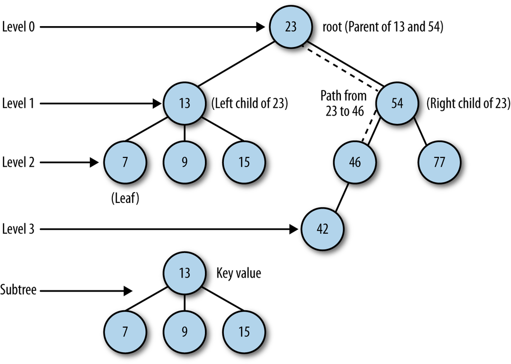

## Removing Nodes from a BST

The most complex operation on a BST is removing a node. The complexity of node removal depends on which node you want to delete. If you want to remove a node with no children, the removal is fairly simple. If the node has just one child node, either left or right, the removal is a little more complex to accomplish. The removal of a node with two children is the most complex removal operation to perform.

To aid in managing the complexity of removal, we remove nodes from a BST recursively. The two functions we will define are *remove()* and *removeNode()*.

The first step to take when removing a node from a BST is to check to see if the current node holds the data we are trying to remove. If so, remove that node. If not, then we compare the data in the current node to the data we are trying to remove. If the data we want to remove is less than the data in the current node, move to the left child of the current node and compare data. If the data we want to remove is greater than the data in the current node, move to the right child of the current node and compare data.

The first case to consider is when the node to be removed is a leaf (a node with no children). Then all we have to do is set the link that is pointing to the node of the parent node to null.

When the node we want to remove has one child, then the the link that is pointing to the node to be removed has to be adjusted to point to the removed node’s child node.

Finally, when the node we want to remove has two children, the correct solution is to either find the largest value in the subtree to the left of the removed node, or to find the smallest value in the subtree to the right of the removed node. We will choose to go to the right.

We need a function that finds the smallest value of a subtree, which we will then use to create a temporary node containing that smallest value. We copy that value into the position of the node we are replacing, and we delete the temporary node to complete the operation. Figure illustrates this scenario.



The node removal process consists of two functions. The **remove()** function simply receives the value to be removed and calls the second function, **removeNode()**, which does all the work.
The definitions of the two functions are shown here:
```
    function remove(data) {
        if(this.find(data) != null){
            root = this.removeNode(this.root, data);
            return true;
        }
        return false;
    }

    function removeNode(node, data) {
        if(node == null){
            return null;
        }
        if(data == node.data){
            //node has no children
            if(node.left == null && node.right == null){
                return null;
            }

            //node has no left children
            if(node.left == null){
                return node.right;
            }

            //node has no right children
            if (node.right == null) {
                return node.left;
            }

            //node has two children
            var tempNode = this.getMin(node.right);
            node.data = tempNode.data;
            node.right = removeNode(node.right, tempNode.data);
            return node;
        }
        else if (data < node.data) {
            node.left = this.removeNode(node.left, data);
            return node;
        }
        else {
            node.right = this.removeNode(node.right, data);
            return node;
        }
    }
```
