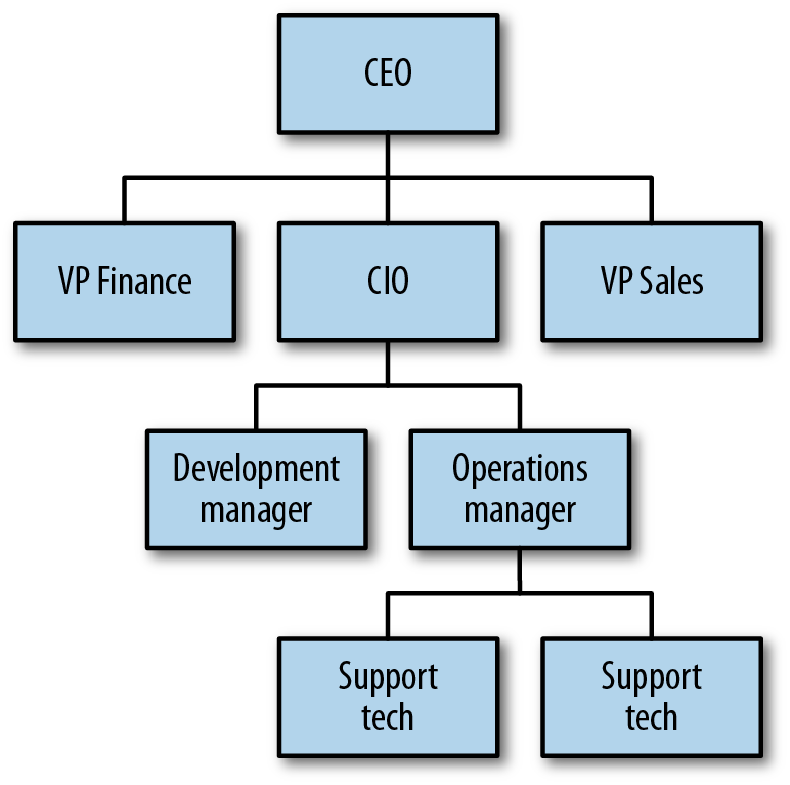
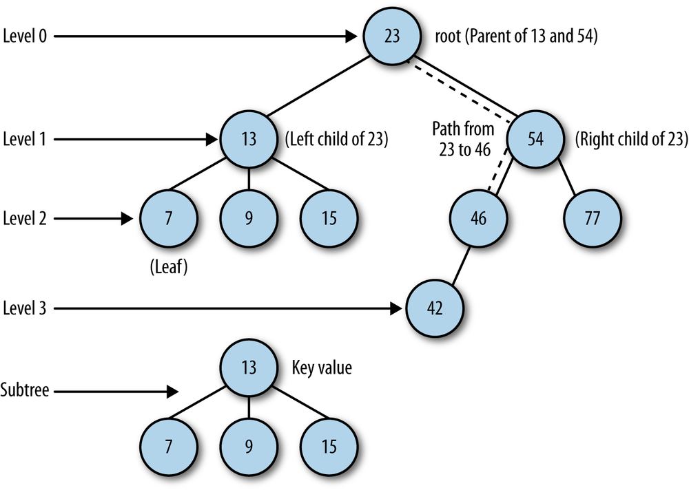

# Binary Trees and Binary Search Trees

Trees are a commonly used data structure in computer science. A *tree* is a nonlinear data structure that is used to store data in a *hierarchical manner*. Tree data structures are used to store hierarchical data, such as the files in a file system, and for storing sorted lists of data. We examine one particular tree structure: *the binary tree*. Binary trees are chosen over other more primary data structures because you can search a binary tree very quickly (as opposed to a linked list, for example) and you can quickly insert and delete data from a binary tree (as opposed to an array).

## Trees Defined

A tree is made up of a set of *nodes* connected by *edges*. An example of a tree is a company’s organizational chart

The purpose of an organizational chart is to communicate the structure of an organization. In above figure , each box is a node, and the lines connecting the boxes are the edges. The nodes represent the positions that make up an organization, and the edges represent the relationships between those positions. For example, the CIO reports directly to the CEO, so there is an edge between those two nodes. The development manager reports to the CIO, so there is an edge connecting those two positions. The VP of Sales and the development manager do not have a direct edge connecting them, so there is not a direct relationship between those two positions.

The above figure displays another tree that defines more of the terms we need when discussing trees. The top node of a tree is called the *root node*. If a node is connected to other nodes below it, the preceding node is called the *parent node*, and the nodes following it are called *child nodes*. A node can have zero, one, or more child nodes connected to it. A node without any child nodes is called a *leaf node*.

Special types of trees, called *binary trees*, restrict the number of child nodes to no more than two. Binary trees have certain computational properties that make them very efficient for many operations. Binary trees are examined extensively in the sections to follow.

Continuing to examine the above figure, you can see that by following certain edges, you can travel from one node to other nodes that are not directly connected. The series of edges you follow to get from one node to another node is called a *path*. Paths are depicted in the figure with dashed lines. Visiting all the nodes in a tree in some particular order is known as a *tree traversal*.

A tree can be broken down into *levels*. The root node is at level 0, its children are at level 1, those nodes’ children are at level 2, and so on. A node at any level is considered the root of a *subtree*, which consists of that root node’s children, its children’s children, and so on. We can define the depth of a tree as the number of layers in the tree.

This concept of the root node being at the top of a tree, while in real life a tree’s root is at the bottom of the tree, is counterintuitive, but it is a time-honored convention in computer science to draw trees with the root at the top. The computer scientist Donald Knuth actually tried to change the convention but gave up after a few months when he discovered that most computer scientists refused to adapt to the natural way of drawing trees.

Finally, each node in a tree has a value associated with it. This value is sometimes referred to as the *key* value.

* [Binary Trees and Binary Search Trees](01_Binary_Tree)
* [BST Searches](02_BST_Searches)
* [Removing Nodes from a BST](03_Removing_Node)
