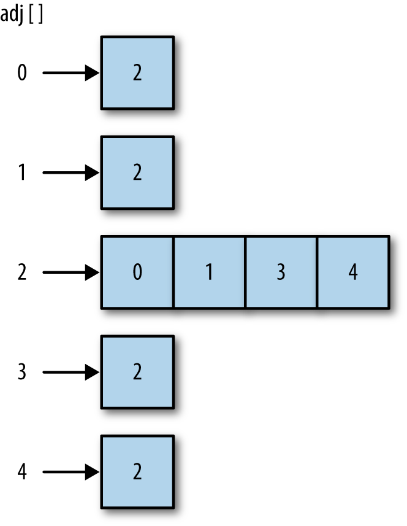

## The Graph Class

At first glance, a graph looks much like a tree or a binary tree, and you might be tempted to try to build a graph class like a tree, using nodes to represent each vertex. There are problems with using an object-based approach like that, however, because graphs can grow quite large. Representing a graph using just objects can quickly become inefficient, so we will look at a different scheme for representing both vertices and edges.

### REPRESENTING VERTICES

The first step in building a Graph class is to build a **Vertex class** to store the vertices of a graph. This class has the same duties that the Node class had with linked lists and binary search trees. The *Vertex class* needs two data members: one for identifying the vertex and the other to store a Boolean value indicating whether or not the vertex has been visited. These members are named *label* and *wasVisited*, respectively. The only function we need for the class is the constructor function that allows us to set the values for a vertex’s data members. Here is the code for the **Vertex class**:
```
    function Vertex(label) {
        this.label = label;
    }
```
We will store the list of vertices in an array and will reference them in the *Graph class* by their position in the array.

### REPRESENTING EDGES

The real information about a graph is stored in the edges, since the edges describe the structure of a graph. As we mentioned earlier, it is tempting to represent a graph as a binary tree, but doing so is a mistake. A binary tree has a mostly fixed representation, since a parent node can have only two child nodes, while a graph structure provides much more flexibility. There can be many edges linked to a single vertex or just one edge, for example.

The method we will use for representing the edges of a graph is called an **adjacency list**, or an **array of adjacency lists**. With this method, the edges are stored as a vertex-indexed array of lists (arrays) of the vertices adjacent to each vertex. Using this scheme, when we reference a vertex in a program, we can efficiently access the list of all the vertices it is connected to. For example, if the vertex 2 is connected to vertices 0, 1, 3, and 4, and is stored in array position 2, accessing this element gives us access to an array stored at array position 2 that consists of the vertices 0, 1, 3, and 4. This is the representation method we choose to use in this chapter and is shown in figure below.



Another method for representing the the edges of a graph is called an **adjacency matrix**. This is a two-dimensional array in which the elements of the array indicate whether an edge exists between two vertices.

### BUILDING A GRAPH

Once the decision is made on how to represent a graph in code, building a class to represent a graph is straightforward. Here is a first definition of a **Graph class**:
```
    function Graph(v) {
        this.vertices = v;
        this.edges = 0;
        this.adj = [];
        for (var i = 0; i < this.vertices; i++) {
            this.adj[i] = [];
            this.adj[i].push("");
        }
        this.addEdge = addEdge;
        this.showGraph = showGraph;
    }
```
The class keeps track of how many edges are represented in a graph, as well as the number of vertices, by utilizing an array whose length is equal to the number of vertices in the graph. In each element of the array, the for loop adds a subarray to store all the adjacent vertices, and it initializes each element to the empty string.

The **addEdge()** function is defined as:
```
    function addEdge(v, w) {
        this.adj[v].push(w);
        this.adj[w].push(v);
        this.edges++;
    }
```
When this function is called with two vertices, A and B, the function finds the adjacency list for vertex A and adds B to the list, then it finds the adjacency list for B and adds A to the list. Finally, the function increments the number of edges by 1.

The **showGraph()** function displays the graph by showing a list of all vertices and the vertices that are adjacent to them:
```
    function showGraph() {
        for (var i = 0; i < this.vertices; i++) {
            print(i + " -> ");
            for (var j = 0; j < this.vertices; j++) {
                if(this.adj[i][j] != undefined){
                    print(this.adj[i][j]);
                }
            }
            print("<br />");
        }
    }
```

Here is a test program that demonstrates how to use the Graph class:
```
    var graph = new Graph(5);
    graph.addEdge(0,1);
    graph.addEdge(0,2);
    graph.addEdge(1,3);
    graph.addEdge(2,4);
    graph.showGraph();
```

The output from this program is:
```
    0 -> 1 2
    1 -> 0 3
    2 -> 0 4
    3 -> 1
    4 -> 2
```
The output shows that vertex 0 has edges to vertices 1 and 2; vertex 1 has edges to vertices 0 and 3; vertex 2 has edges to vertices 0 and 4; vertex 3 has an edge to vertex 1; and vertex 4 has an edge to vertex 2. Of course, there is some redundancy in this display, as an edge between 0 and 1, for example, is the same as an edge between 1 and 0. For just display purposes this is fine, but we will need to modify this output when we start exploring the paths found in a graph.
