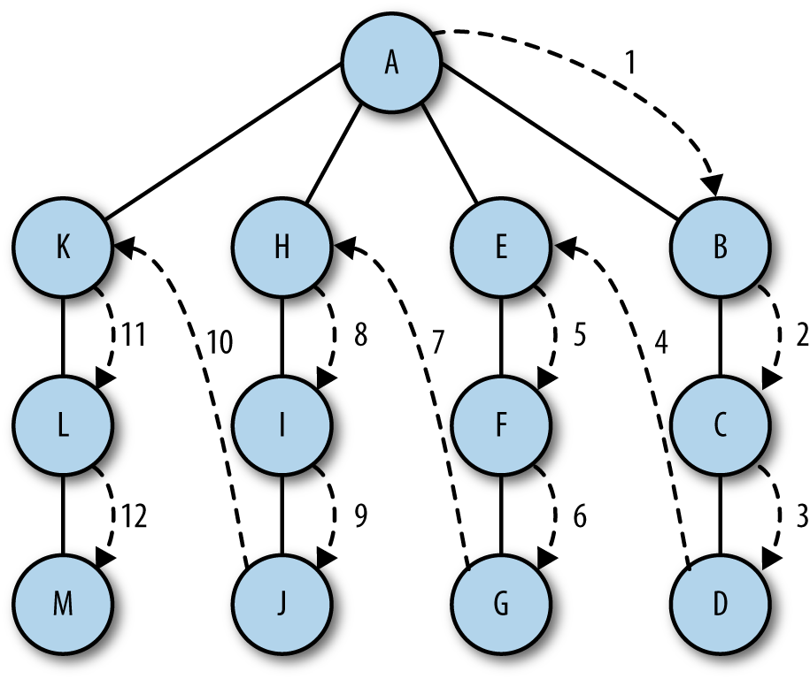

## Depth-First Search

Depth-first search involves following a path from the beginning vertex until it reaches the last vertex, then backtracking and following the next path until it reaches the last vertex, and so on until there are no paths left. Here we are not “searching” for a particular item, but instead searching to see what paths we can follow in a graph.



The algorithm for performing a depth-first search is relatively simple—visit a vertex that has not already been visited, mark it as having been visited, then recursively visit the other unvisited vertices that are in the original vertex’s adjacency list.

To make this algorithm work, we will need to add an array to our Graph class that stores visited vertices and initialize it to all *false* values. Here is a code fragment from the Graph class showing this new array and its initialization:
```
    this.marked = [];
    for (var i = 0; i < this,vertices; i++) {
        marked[i] = false;
    }
```

Now we can write the **depth-first search** function:
```
    function dfs(v) {
        this.marked[v] = true;
        if (this.adj[v] != undefined) {
            print("<br /> Visited Vertex : " + v);
        }
        for (var i = 0; i < this.adj[v].length; i++) {
            var w = this.adj[v][i];
            if(!this.marked[w]){
                this.dfs(w);
            }
        }
    }
```
Notice that I’ve included a *print()* function so we can see the vertices as they’re being visited.

A program that demonstrates the depthFirst function, along with the complete Graph class definition, is
```
    var g = new Graph(5);
    g.addEdge(0,1);
    g.addEdge(0,2);
    g.addEdge(1,3);
    g.addEdge(2,4);
    g.showGraph();
    g.dfs(0);
```

The output from this program is:
```
    0 -> 1 2
    1 -> 0 3
    2 -> 0 4
    3 -> 1
    4 -> 2

    Visited Vertex : 0
    Visited Vertex : 1
    Visited Vertex : 3
    Visited Vertex : 2
    Visited Vertex : 4
```
