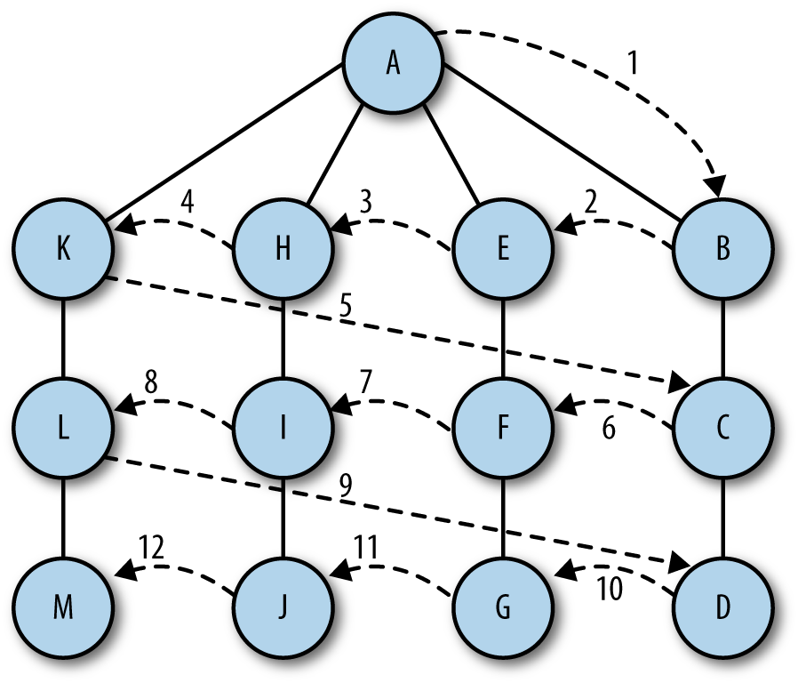

## BREADTH-FIRST SEARCH

A breadth-first search starts at a first vertex and tries to visit vertices as close to the first vertex as possible. In essence, this search moves through a graph layer by layer, first examining layers closer to the first vertex and then moving down to the layers farthest away from the starting vertex.



The algorithm for breadth-first search uses a queue abstraction instead of an array abstraction for storing visited vertices. The algorithm works as follows:

1. Find an unvisited vertex that is adjacent to the current vertex, add it to the list of visited vertices, and add it to the queue.

2. Take the next vertex, v, from the graph and add it to the list of visited vertices.

3. Add all unmarked vertices that are are adjacent to v and add them to the queue.

Here is the definition for the **breadth-first search** function:
```
    function bfs(s) {
        var queue = [];
        this.marked[s] = true;
        queue.push(s); // add to back of queue
        while(queue.length > 0){
            var v = queue.shift(); //remove from front of the queue;
            if(v != undefined){
                print("<br /> Visited Vertex: " + v);
            }
            for (var i = 0; i < this.adj[v].length; i++) {
                var w = this.adj[v][i];
                if(!this.marked[w]){
                    this.marked[w] = true;
                    queue.push(w);
                }
            }
        }
    }
```

A test program for the breadth-first search function is
```
    var g = new Graph(5);
    g.addEdge(0,1);
    g.addEdge(0,2);
    g.addEdge(1,3);
    g.addEdge(2,4);
    g.showGraph();
    g.bfs(0);
```

The output from this program is:
```
    0 -> 1 2
    1 -> 0 3
    2 -> 0 4
    3 -> 1
    4 -> 2

    Visited Vertex: 0
    Visited Vertex: 1
    Visited Vertex: 2
    Visited Vertex: 3
    Visited Vertex: 4
```
