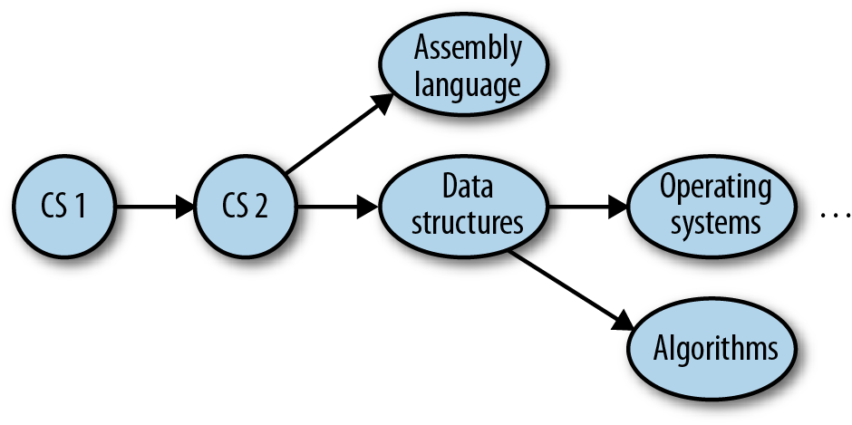

## Topological Sorting

*Topological sorting* puts the vertices of a directed graph into an order such that all the directed edges point from a vertex earlier in the order to a vertex later in the order.



A topological sort of this graph would result in the following sequence:

1. CS 1
2. CS 2
3. Assembly language
4. Data structures
5. Operating systems
6. Algorithms
Courses 3 and 4 can be taken at the same time, as can courses 5 and 6.

This type of problem is called **precedence-constrained scheduling**, and every college student is familiar with it. You can’t take English Composition II until you’ve taken English Composition I.

### AN ALGORITHM FOR TOPOLOGICAL SORTING

The algorithm for topological sorting is similar to the algorithm for depth-first search. However, instead of immediately printing a vertex as it is visited, the algorithm visits all the adjacent vertices to the current vertex, and once that list is exhausted, we push the current vertex onto a stack.

### IMPLEMENTING THE TOPOLOGICAL SORTING ALGORITHM

The topological sort algorithm is broken up into two functions. The first function, **topSort()**, sets up the sorting process and calls a helper function, **topSortHelper()**, and then displays the sorted list of vertices.

The major work is done in the recursive function **topSortHelper()**. This function marks the current vertex as visited and then recursively visits each adjacent vertex in the current vertex’s adjacency list, marking them as visited. Finally, the current vertex is pushed onto a stack.
```
    function topSort() {
        var stack = [];
        var visited = [];
        for (var i = 0; i < this.vertices; i++) {
            visited[i] = false;
        }
        for (var i = 0; i < this.vertices; i++) {
            if(visited[i] == false){
                this.topSortHelper(i, visited, stack);
            }
        }
        for (var i = 0; i < stack.length; i++) {
            if(stack[i] !== undefined && stack[i] !== false){
                print(this.vertexList[stack[i]] + "<br />");
            }
        }
    }

    function topSortHelper(v, visited, stack) {
        visited[v] = true;
        for (var i = 0; i < this.adj[v]; i++) {
            w = this.adj[v][i];
            if(!visited[w]){
                this.topSortHelper(visited[w], visited, stack);
            }
        }
        stack.push(v);
    }
```

The Graph class has also been modified so that we can work with symbolic vertices and not just numbers. Inside the code, each vertex is still only numbered, but we add an array, **vertexList**, which associates each vertex with a symbol (for our example it’s a course name).

To make sure the new definition of the class is clear, we present the full definition, including the functions for topological sorting, below. The definition of the function **showGraph()** has changed so that symbolic names are shown instead of just vertex numbers.
```
    function showGraph() {
        for (var i = 0; i < this.vertices; i++) {
            print(this.vertexList[i] + " -> ");
            for (var j = 0; j < this.vertices; j++) {
                if(this.adj[i][j] != undefined){
                    var w = this.adj[i][j];
                    print(this.vertexList[w]);
                }
            }
            print("<br />");
        }
    }
```

A program that tests our implementation of topological sorting is
```
    var g = new Graph(6);
    g.addEdge(1,2);
    g.addEdge(2,5);
    g.addEdge(1,3);
    g.addEdge(1,4);
    g.addEdge(0,1);
    g.vertexList = ["CS1", "CS2", "Data Structures",
                    "Assembly Language", "Operating Systems",
                    "Algorithms"];
    g.showGraph();
    g.topSort();
```

The output from this program is:
```
    //showGraph()
    CS1 -> CS2
    CS2 -> Data Structures Assembly Language Operating Systems CS1
    Data Structures -> CS2 Algorithms
    Assembly Language -> CS2
    Operating Systems -> CS2
    Algorithms -> Data Structures

    //topSort()
    CS1
    CS2
    Data Structures
    Assembly Language
    Operating Systems
    Algorithms
```
