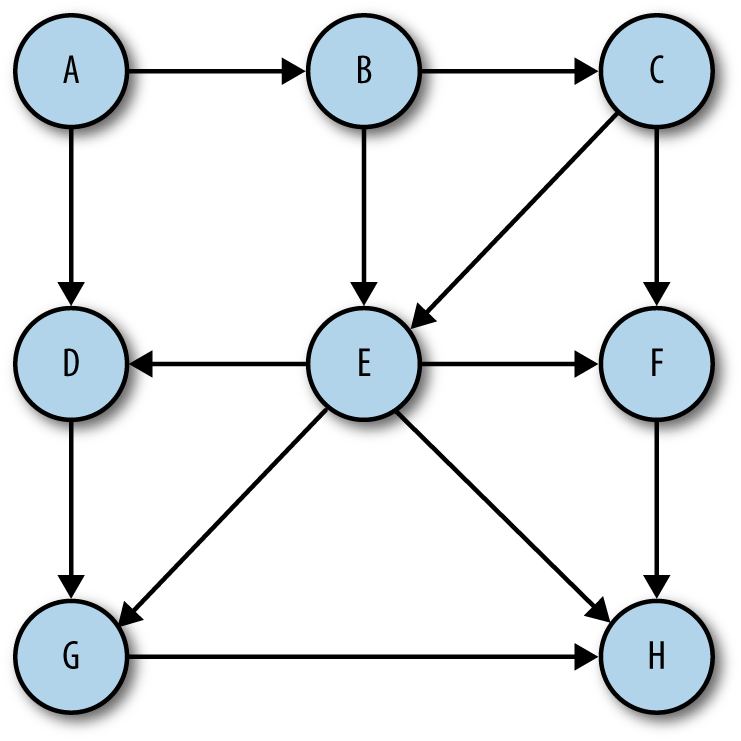
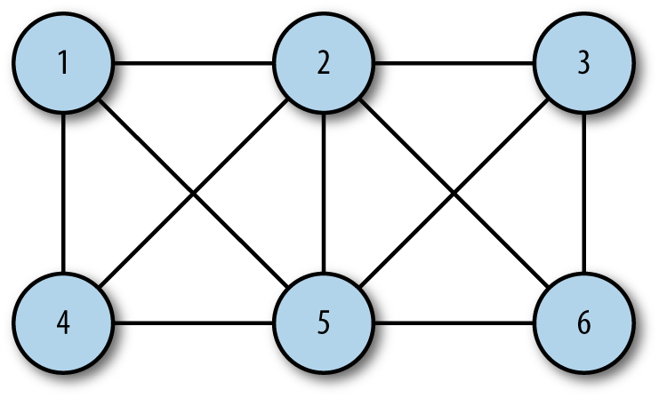

# Graphs and Graph Algorithms

## Graph Definitions

A graph consists of a set of *vertices* and a set of *edges*. Think of a map of a US state. Each town is connected with other towns via some type of road. A map is a type of graph where each town is a *vertex*, and a road that connects two towns is an *edge*. Edges are defined as a pair (v1, v2), where v1 and v2 are two vertices in a graph. A vertex can also have a weight, which is sometimes called a cost. A graph whose pairs are ordered is called a **directed graph**, or just a *digraph*. When pairs are ordered in a directed graph, an arrow is drawn from one pair to another pair. Directed graphs indicate the flow direction from vertex to vertex. A flowchart that indicates the direction of computations in a computer program is an example of a directed graph. A directed graph is shown in figure below.

If a graph is not ordered, it is called an **unordered graph**, or just a *graph*. An example of an unordered graph is shown in figure below.

A **path** is a sequence of vertices in a graph such that all vertices in the path are connected by edges. The length of a path is the number of edges from the first vertex in the path to the last vertex. A path can also consist of a vertex to itself, which is called a **loop**. Loops have a length of 0.

A **cycle** is a path with at least one edge whose first and last vertices are the same. A *simple cycle* is one with no repeated edges or vertices for both directed and undirected graphs. Paths that repeat other vertices besides the first and last vertices are called *general cycles*.

Two vertices are considered *strongly connected* if there is a path from the first vertex to the second vertex, and vice versa. If the graph is a directed graph, and all its vertices are strongly connected, then the directed graph is considered strongly connected.

## Real-World Systems Modeled by Graphs

Graphs are used to model many different types of real-world systems. One example is traffic flow. The vertices represent street intersections, and the edges represent the streets. Weighted edges can be used to represent speed limits or the number of lanes. Modelers can use the system to determine the best routes and the streets most likely to suffer from traffic jams.

Any type of transportation system can be modeled using a graph. For example, an airline can model its flight system using a graph. Each airport is a vertex, and each flight from one vertex to another is an edge. A weighted edge can represent the cost of a flight from one airport to another, or perhaps the distance from one airport to another, depending upon what is being modeled.

Computer networks, including local area networks and much broader networks such as the Internet, are also frequently modeled with graphs. Another example of a real-word system that can be modeled by a graph is a consumer market, where vertices represent both institutions (vendors) and consumers.

* [The Graph Class](01_Graph_Class)
* [Searching a Graph](02_Searching_Graph)
    * [DEPTH-FIRST SEARCH](02_Searching_Graph/01_DEPTH-FIRST_SEARCH)
    * [BREADTH-FIRST SEARCH](02_Searching_Graph/02_BREADTH-FIRST_SEARCH)
* [Finding the Shortest Path](03_Shortest_Path)
* [Topological Sorting](04_Topological_Sorting)
