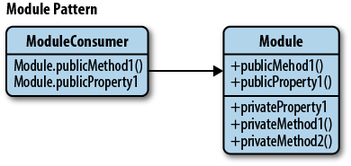

# The Module Pattern

## Modules

Modules are an integral piece of any robust application's architecture and typically help in keeping the units of code for a project both cleanly separated and organized.

In JavaScript, there are several options for implementing modules. These include:

* The Module pattern
* Object literal notation
* AMD modules
* CommonJS modules
* ECMAScript Harmony modules

We will be exploring the latter three of these options later on in the book in the section `Modern Modular JavaScript Design Patterns`.

The Module pattern is based in part on object literals and so it makes sense to refresh our knowledge of them first.

<hr />

## Object Literals

In object literal notation, an object is described as a set of comma-separated `name/value` pairs enclosed in curly braces (`{}`). Names inside the object may be either strings or identifiers that are followed by a colon. There should be no comma used after the final `name/value` pair in the object as this may result in errors.
```
    var myObjectLiteral = {

        variableKey: variableValue,

        functionKey: function () {
          // ...
        }
    };
```
Object literals don't require instantiation using the `new` operator but shouldn't be used at the start of a statement as the opening `{` may be interpreted as the beginning of a block. Outside of an object, new members may be added to it using assignment as follows `myModule.property = "someValue"`;

Below we can see a more complete example of a `module` defined using object literal notation:
```
    var myModule = {
        myProperty: "someValue",
        // object literals can contain properties and methods.
        // e.g we can define a further object for module configuration:
        myConfig: {
          useCaching: true,
          language: "en"
        },
        // a very basic method
        saySomething: function () {
         console.log( "Where in the world is Paul Irish today?" );
        },

        // output a value based on the current configuration
        reportMyConfig: function () {
         console.log( "Caching is: " + ( this.myConfig.useCaching ? "enabled" : "disabled") );
        },
        // override the current configuration
        updateMyConfig: function( newConfig ) {
          if ( typeof newConfig === "object" ) {
            this.myConfig = newConfig;
            console.log( this.myConfig.language );
          }
        }
    };

    // Outputs: Where in the world is Paul Irish today?
    myModule.saySomething();

    // Outputs: Caching is: enabled
    myModule.reportMyConfig();

    // Outputs: fr
    myModule.updateMyConfig({
      language: "fr",
      useCaching: false
    });

    // Outputs: Caching is: disabled
    myModule.reportMyConfig();
```
Using object literals can assist in encapsulating and organizing your code and Rebecca Murphey has previously written about this topic in depth should you wish to read into object literals further.

That said, if we're opting for this technique, we may be equally as interested in the `Module pattern`. It still uses object literals but only as the return value from a scoping function.

<hr />

## The Module Pattern

The **Module pattern** was originally defined as a way to provide both `private` and `public` encapsulation for classes in conventional software engineering.

In JavaScript, the Module pattern is used to further *emulate* the concept of classes in such a way that we're able to include both `public/private` methods and variables inside a single object, thus shielding particular parts from the global scope. What this results in is a reduction in the likelihood of our function names conflicting with other functions defined in additional scripts on the page.



### Privacy

The Module pattern encapsulates `"privacy"`, state and organization using *closures*. It provides a way of wrapping a mix of **public** and **private** methods and variables, protecting pieces from leaking into the global scope and accidentally colliding with another developer's interface. With this pattern, only a public API is returned, keeping everything else within the closure private.

This gives us a clean solution for shielding logic doing the heavy lifting whilst only exposing an interface we wish other parts of our application to use. The pattern utilizes an **immediately-invoked function expression (IIFE)**(see the section on namespacing patterns for more on this) where an object is returned.

It should be noted that there isn't really an explicitly true sense of "privacy" inside JavaScript because unlike some traditional languages, it doesn't have access modifiers. Variables can't technically be declared as being public nor private and so we use function scope to simulate this concept. Within the Module pattern, variables or methods declared are only available inside the module itself thanks to **closure**. Variables or methods defined within the returning object however are available to everyone.

### Examples

Let's begin looking at an implementation of the **Module pattern** by creating a module which is self-contained.
```
    var testModule = (function(){
        var counter = 0;
        return {
          incrementCounter: function(){
              return counter++;
          },
          resetCounter: function(){
              console.log( "counter value prior to reset: " + counter );
              counter = 0;
          }
        };
    })();

    // Increment our counter
    testModule.incrementCounter();

    // Check the counter value and reset
    // Outputs: counter value prior to reset: 1
    testModule.resetCounter();
```
Here, other parts of the code are unable to directly read the value of our `incrementCounter()` or `resetCounter()`. The `counter` variable is actually fully shielded from our global scope so it acts just like a private variable would - its existence is limited to within the module's closure so that the only code able to access its scope are our two functions. Our methods are effectively `namespaced` so in the test section of our code, we need to prefix any calls with the name of the module (e.g. "testModule").

When working with the Module pattern, we may find it useful to define a **simple template** that we use for getting started with it. Here's one that covers `namespacing`, `public` and `private` variables:
```
    var myNamespace = (function(){
        var myPrivateVar, myPrivateMethod;
        //private counter var
        myPrivateVar = 0;

        //private method
        myPrivateMethod = function(foo){
            console.log(foo);
        };

        return {
            //public var
            myPublicVar: 'foo',

            //public method
            myPublicFunction: function(bar){
                // Increment our private counter
                myPrivateVar++;
                // Call our private method using bar
                myPrivateMethod( bar );
            }
        };
    })();
```
Looking at another example, below we can see a shopping basket implemented using this pattern. The module itself is completely self-contained in a global variable called `basketModule`. The `basket` array in the module is kept private and so other parts of our application are unable to directly read it. It only exists with the module's closure and so the only methods able to access it are those with access to its scope (i.e. `addItem()`, `getItemCount()` etc).
```
    var basketModule = (function(){
        //privates
        var basket = [];

        function doSomethingPrivate() {
            //..
        }

        function doSomethingElsePrivate() {
            //..
        }

        // Return an object exposed to the public
        return {
            // Add items to our basket
            addItem: function(values){
                basket.push(values);
            },
            //Get Item count
            getItemCount: function(){
                return basket.length;
            },
            // Public alias to a private function
            doSomething: doSomethingPrivate,
            // Get the total value of items in the basket
            getTotal: function(){
                var q = this.getItemCount(),
                    p = 0;

                while(q--){
                    p += basket[q].price;
                }
                return p;
            }
        };
    })();
```
Inside the module, you may have noticed that we return an `object`. This gets automatically assigned to `basketModule` so that we can interact with it as follows:
```
    basketModule.addItem(
      {
          item: "bread",
          price: 0.5
      }
    );
    basketModule.addItem(
      {
          item: "butter",
          price: 0.3
      }
    );

    // Outputs: 2
    console.log( basketModule.getItemCount() );

    // Outputs: 0.8
    console.log( basketModule.getTotal() );

    // However, the following will not work:

    // Outputs: undefined
    // This is because the basket itself is not exposed as a part of our public API
    console.log( basketModule.basket );

    // This also won't work as it only exists within the scope of our
    // basketModule closure, but not in the returned public object
    console.log( basket );
```
The methods above are effectively namespaced inside `basketModule`.

Notice how the scoping function in the above basket module is wrapped around all of our functions, which we then call and immediately store the return value of. This has a number of advantages including:

* The freedom to have `private functions` and `private members` which can only be consumed by our module. As they aren't exposed to the rest of the page (only our exported API is), they're considered truly private.
* Given that functions are declared normally and are named, it can be easier to show call stacks in a debugger when we're attempting to discover what function(s) threw an exception.
* As T.J Crowder has pointed out in the past, it also enables us to return different functions depending on the environment. In the past, I've seen developers use this to perform UA testing in order to provide a code-path in their module specific to IE, but we can easily opt for feature detection these days to achieve a similar goal.

<hr />

## Module Pattern Variations

### Import mixins

This variation of the pattern demonstrates how globals (e.g jQuery, Underscore) can be passed in as arguments to our module's anonymous function. This effectively allows us to import them and locally alias them as we wish.
```
    //Global Module
    var myModule = (function( jQ, _ ){
        function privateMethod1() {
            jQ(".container").html("test");
        }
        function privateMethod2() {
            console.log(_.min([10, 5, 100, 2, 1000]));
        }
        return {
            publicMethod: function(){
                privateMethod1();
            }
        };
    })( jQuery, _ );

    myModule.publicMethod();
```

### Exports

This next variation allows us to declare globals without consuming them and could similarly support the concept of global imports seen in the last example.
```
    //Global Module
    var myModule = (function(){
        var module = {},
            privateVar = "Hello World";

        function privateMethod() {
            //..
        }

        module.publicProperty = "Foobar";
        module.publicMethod = function(){
            console.log(privateVar);
        };

        return module
    })();
```

<hr />

## Toolkit And Framework-specific Module Pattern Implementations

### jQuery

There are a number of ways in which jQuery code unspecific to plugins can be wrapped inside the `Module pattern`. Ben Cherry previously suggested an implementation where a function wrapper is used around module definitions in the event of there being a number of commonalities between modules.

In the following example, a `library` function is defined which declares a new library and automatically binds up the `init` function to `document.ready` when new libraries (i.e. modules) are created.
```
    function library(module) {
        $(function(){
            if(module.init){
                module.init();
            }
        });
        return module;
    }

    var myLibrary = library(function(){
        return {
            init: function(){
                // module implementation
            }
        }
    }());
```

<hr />

### Advantages

We've seen why the Constructor pattern can be useful, but why is the Module pattern a good choice? For starters, it's a lot cleaner for developers coming from an object-oriented background than the idea of true encapsulation, at least from a JavaScript perspective.

Secondly, it supports private data - so, in the Module pattern, public parts of our code are able to touch the private parts, however the outside world is unable to touch the class's private parts (no laughing! Oh, and thanks to David Engfer for the joke).

### Disadvantages

The disadvantages of the Module pattern are that as we access both public and private members differently, when we wish to change visibility, we actually have to make changes to each place the member was used.

We also can't access private members in methods that are added to the object at a later point. That said, in many cases the Module pattern is still quite useful and when used correctly, certainly has the potential to improve the structure of our application.

Other disadvantages include the inability to create automated unit tests for private members and additional complexity when bugs require hot fixes. It's simply not possible to patch privates. Instead, one must override all public methods which interact with the buggy privates. Developers can't easily extend privates either, so it's worth remembering privates are not as flexible as they may initially appear.

For further reading on the Module pattern, see Ben Cherry's excellent in-depth article on it.
