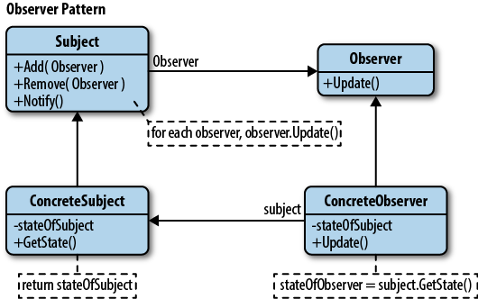
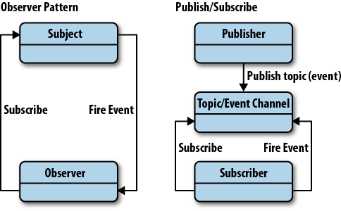

# The Observer Pattern

The **Observer** is a design pattern where an object (known as a subject) maintains a list of objects depending on it (observers), automatically notifying them of **any changes to state**.



When a subject needs to notify observers about something interesting happening, it broadcasts a notification to the observers (which can include specific data related to the topic of the notification).

When we no longer wish for a particular observer to be notified of changes by the subject they are registered with, the subject can remove them from the list of observers.

It's often useful to refer back to published definitions of design patterns that are language agnostic to get a broader sense of their usage and advantages over time. The definition of the Observer pattern provided in the GoF book, Design Patterns: Elements of Reusable Object-Oriented Software, is:

*"One or more observers are interested in the state of a subject and register their interest with the subject by attaching themselves. When something changes in our subject that the observer may be interested in, a notify message is sent which calls the update method in each observer. When the observer is no longer interested in the subject's state, they can simply detach themselves."*

We can now expand on what we've learned to implement the **Observer pattern** with the following components:

* **Subject**: maintains a list of observers, facilitates adding or removing observers
* **Observer**: provides an update interface for objects that need to be notified of a Subject's changes of state
* **ConcreteSubject**: broadcasts notifications to observers on changes of state, stores the state of ConcreteObservers
* **ConcreteObserver**: stores a reference to the ConcreteSubject, implements an update interface for the Observer to ensure state is consistent with the Subject's

First, let's model the list of dependent Observers a subject may have:
```
    function ObserverList() {
        this.observerList = [];
    }

    ObserverList.prototype.add = function(obj){
        return this.observerList.push(obj);
    }

    ObserverList.prototype.count = function(){
        return this.observerList.length;
    }

    ObserverList.prototype.get = function(index){
        if(index > -1 && index < this.observerList.length){
            return this.observerList[index];
        }
    }

    ObserverList.prototype.indexOf = function(obj, startIndex){
        var i = startIndex;

        while (i < this.observerList.length) {
            if(this.observerList[i] == obj){
                return i;
            }
            i++;
        }
        return -1;
    }

    ObserverList.prototype.removeAt = function(index){
        this.observerList.splice(index, 1);
    }
```
Next, let's model the Subject and the ability to add, remove or notify observers on the observer list.
```
    function Subject() {
        this.observers = new ObserverList();
    }

    Subject.prototype.addObserver = function(observer){
        this.observers.add(observer);
    }

    Subject.prototype.removeObserver = function(observer){
        this.observers.removeAt(this.observers.indexOf(observer, 0));
    }

    Subject.prototype.notify = function(context){
        var observerCount = this.observers.count();
        for (var i = 0; i < observerCount; i++) {
            this.observers.get(i).update( context );
        }
    }
```
We then define a skeleton for creating new Observers. The `update` functionality here will be overwritten later with custom behaviour.
```
    // The Observer
    function Observer(){
        this.update = function(){
          // ...
        };
    }
```
In our sample application using the above Observer components, we now define:

* A button for adding new observable checkboxes to the page
* A control checkbox which will act as a subject, notifying other checkboxes they should be checked
* A container for the new checkboxes being added

We then define ConcreteSubject and ConcreteObserver handlers for both adding new observers to the page and implementing the updating interface. See below for inline comments on what these components do in the context of our example.

HTML:
```
    <button id="addNewObserver">Add New Observer checkbox</button>
    <input id="mainCheckbox" type="checkbox"/>
    <div id="observersContainer"></div>
```
Sample script:
```
    // Extend an object with an extension
    function extend( obj, extension ){
        for ( var key in extension ){
          obj[key] = extension[key];
        }
    }

    // References to our DOM elements
    var controlCheckbox = document.getElementById( "mainCheckbox" ),
        addBtn = document.getElementById( "addNewObserver" ),
        container = document.getElementById( "observersContainer" );


    // Concrete Subject
    // Extend the controlling checkbox with the Subject class
    extend( controlCheckbox, new Subject() );

    // Clicking the checkbox will trigger notifications to its observers
    controlCheckbox.onclick = function(){
        controlCheckbox.notify( controlCheckbox.checked );
    };

    addBtn.onclick = addNewObserver;

    // Concrete Observer
    function addNewObserver(){
        // Create a new checkbox to be added
        var check = document.createElement( "input" );
        check.type = "checkbox";
        // Extend the checkbox with the Observer class
        extend( check, new Observer() );
        // Override with custom update behaviour
        check.update = function( value ){
          this.checked = value;
        };

        // Add the new observer to our list of observers
        // for our main subject
        controlCheckbox.addObserver( check );

        // Append the item to the container
        container.appendChild( check );
    }
```
In this example, we looked at how to implement and utilize the Observer pattern, covering the concepts of a `Subject`, `Observer`, `ConcreteSubject` and `ConcreteObserver`. Check the [jsfiddle](https://jsfiddle.net/varun2116/xk6w8zb9/) to see the working.

<hr />

## Differences Between the Observer and Publish/Subscribe Pattern

Whilst the **Observer pattern** is useful to be aware of, quite often in the JavaScript world, we'll find it commonly implemented using a variation known as the **Publish/Subscribe pattern**. Whilst very similar, there are differences between these patterns worth noting.

The **Observer pattern** requires that the observer (or object) wishing to receive topic notifications must subscribe this interest to the object firing the event (the subject).



The **Publish/Subscribe pattern** however uses a topic/event channel which sits between the objects wishing to receive notifications (subscribers) and the object firing the event (the publisher). This event system allows code to define application specific events which can pass custom arguments containing values needed by the subscriber. The idea here is to avoid dependencies between the subscriber and publisher.

This differs from the Observer pattern as it allows any subscriber implementing an appropriate event handler to register for and receive topic notifications broadcast by the publisher.

Here is an example of how one might use the Publish/Subscribe if provided with a functional implementation powering `publish()`,`subscribe()` and `unsubscribe()` behind the scenes:
```
    // A very simple new mail handler

    // A count of the number of messages received
    var mailCounter = 0;

    // Initialize subscribers that will listen out for a topic
    // with the name "inbox/newMessage".

    // Render a preview of new messages
    var subscriber1 = subscribe( "inbox/newMessage", function( topic, data ) {

      // Log the topic for debugging purposes
      console.log( "A new message was received: ", topic );

      // Use the data that was passed from our subject
      // to display a message preview to the user
      $( ".messageSender" ).html( data.sender );
      $( ".messagePreview" ).html( data.body );

    });

    // Here's another subscriber using the same data to perform
    // a different task.

    // Update the counter displaying the number of new
    // messages received via the publisher

    var subscriber2 = subscribe( "inbox/newMessage", function( topic, data ) {

      $('.newMessageCounter').html( ++mailCounter );

    });

    publish( "inbox/newMessage", [{
      sender: "hello@google.com",
      body: "Hey there! How are you doing today?"
    }]);

    // We could then at a later point unsubscribe our subscribers
    // from receiving any new topic notifications as follows:
    // unsubscribe( subscriber1 );
    // unsubscribe( subscriber2 );
```
The general idea here is the promotion of loose coupling. Rather than single objects calling on the methods of other objects directly, they instead subscribe to a specific task or activity of another object and are notified when it occurs.

<hr />

## Advantages
The Observer and Publish/Subscribe patterns encourage us to think hard about the relationships between different parts of our application. They also help us identify what layers containing direct relationships which could instead be replaced with sets of subjects and observers. This effectively could be used to break down an application into smaller, more loosely coupled blocks to improve code management and potentials for re-use.

Further motivation behind using the Observer pattern is where we need to maintain consistency between related objects without making classes tightly coupled. For example, when an object needs to be able to notify other objects without making assumptions regarding those objects.

Dynamic relationships can exist between observers and subjects when using either pattern. This provides a great deal of flexibility which may not be as easy to implement when disparate parts of our application are tightly coupled.

Whilst it may not always be the best solution to every problem, these patterns remain one of the best tools for designing decoupled systems and should be considered an important tool in any JavaScript developer's utility belt.

## Disadvantages
Consequently, some of the issues with these patterns actually stem from their main benefits. In Publish/Subscribe, by decoupling publishers from subscribers, it can sometimes become difficult to obtain guarantees that particular parts of our applications are functioning as we may expect.

For example, publishers may make an assumption that one or more subscribers are listening to them. Say that we're using such an assumption to log or output errors regarding some application process. If the subscriber performing the logging crashes (or for some reason fails to function), the publisher won't have a way of seeing this due to the decoupled nature of the system.

Another draw-back of the pattern is that subscribers are quite ignorant to the existence of each other and are blind to the cost of switching publishers. Due to the dynamic relationship between subscribers and publishers, the update dependency can be difficult to track.

<hr />

## Publish/Subscribe Implementations
